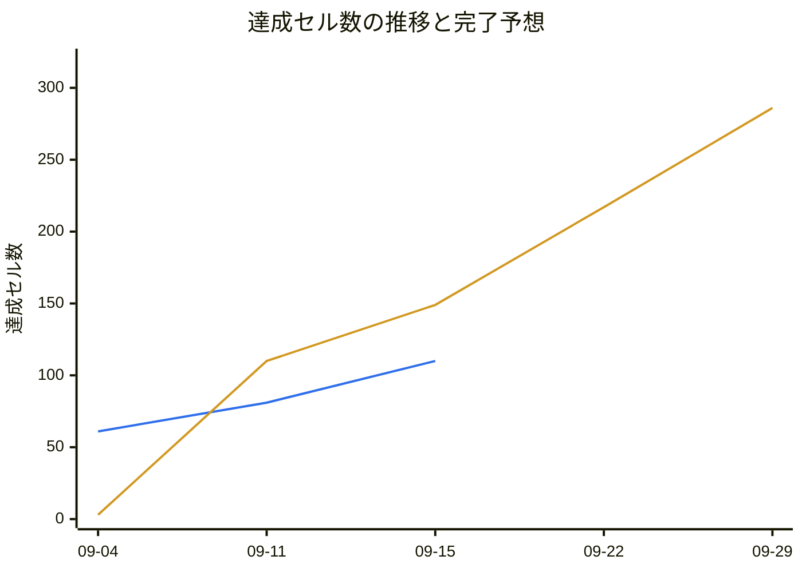

# 進捗一覧の出力

「何がどこまで終わっているか」の材料は分散している。公開モックの画面と機能ブロック、
`src/router/index.js` のルート、`src/components/layout/navigation.js`、`docs/e2e/` と
`docs/unit/` のシナリオ表、`e2e/*.real-api.spec.js` の有無、`git log`。
このスキルはそれを突き合わせて**画面 × 機能の 1 枚の表**にし、`docs/progress.md` に書く。

**分母の正はモック。** 作るべきものの一覧を持っているのはモックであって、`navigation.js` や
`router/index.js` は「そのうちどこまで作ったか」でしかない。食い違ったらモックを正とする
（詳細は手順 3）。

**進捗を記録するだけで、実装もテストの追加もしない。** 材料を都合よく書き換えないこと
（判定対象のファイルを触ると、そのターンの表が自己申告になる）。

## 手順

### 1. 前回の表を読む

`docs/progress.md` があれば Read する。**完了日・更新日・`## 進捗の履歴` の引き継ぎ元は
このファイルだけ**で、git から再計算しない（実行のたびに過去が揺れるのを防ぐ）。
無ければ初回生成として進む。

### 2. モック確認の深さをユーザに確認する

**勝手に全画面を巡回しない。** 15 画面ぶんの遷移で時間がかかる。`AskUserQuestion` で 3 択を出す。

| 選択肢 | やること |
|---|---|
| 全画面を巡回 | 公開モック `https://uspreorder-vmbhej3k.manus.space/` のサイドバー全項目を順に開き、snapshot から画面と機能ブロック（ボタン・タブ・フォーム）を拾う。**画面一覧も機能名の分解もモックを正とする** |
| サイドバーだけ | base URL を 1 回開いて snapshot し、画面一覧（分母）だけ更新する |
| 見ない（既定） | 前回の `docs/progress.md` の行と `docs/mock/` の受領済みモックを分母にする。Docker も MCP も使わない |

「全画面を巡回」「サイドバーだけ」を選ばれたときだけ **Chrome DevTools MCP**
（`mcp__chrome-devtools__*`）を使う。Docker は worktree ごとに分離されているので
（CLAUDE.md の「Docker は worktree ごとに分離」）、他セッションに断る必要はない。
自分の worktree の状態だけ確かめる。

```bash
bash scripts/worktree.sh list
```

- 自分の行の DOCKER 列が `stopped` なら `docker compose up -d frontend` を実行する。
  MCP コンテナは**その worktree の compose ネットワーク**に参加するので、
  frontend が起動していないと MCP サーバ自体が起動しない
  （`scripts/mcp-docker.sh` が理由を stderr に出す。起動後は `/mcp` で繋ぎ直す）
- ローカルイメージが要る。無ければ 1 回だけ焼く（**ビルドは数分かかる**）

  ```bash
  docker image inspect us-stock-order-chrome-devtools-mcp >/dev/null 2>&1 \
    || docker build -t us-stock-order-chrome-devtools-mcp docker/chrome-devtools-mcp
  ```

- 画面を開くのは `mcp__chrome-devtools__navigate_page`、構造を読むのは
  `mcp__chrome-devtools__take_snapshot`。クリック対象は snapshot が返す uid で指す
- `mcp__chrome-devtools__take_screenshot` の `filePath` は**指定しない**。MCP コンテナに
  出力ディレクトリをマウントしていないので、ホストのパスは解決できない。
  省略すれば画像が応答に返る
- Playwright MCP と違い **セッションログのファイルは残らない**。何を見て判断したかの根拠は
  snapshot / screenshot の応答そのものなので、**巡回した画面名を報告に列挙する**
- 見に行くのは**外部の公開モック**であって `http://frontend:5173` ではない。コンテナから外へ出られない
  場合は**手を止めて報告する**。別のツールで取りに行かない

### 3. 画面一覧（分母）を確定する

**モックにある画面が分母。** モックを見た回はその一覧を、見ていない回は前回の
`docs/progress.md` と `docs/mock/` の受領済みモックを分母にする。

- **モックにあって開発環境に無いものは、行として立てる。** `navigation.js` に項目が無い、
  `router/index.js` にルートが無い、view が無い — いずれも「未着手」であって「対象外」ではない。
  実装を `❌` にし、何が足りないかを補足列に書く（例: `navigation.js に項目なし・ルート未定義`）
- **モックに無いものは表に載せない。** 開発環境側にだけ存在する画面・機能（参考実装、
  開発用ページ、実験的な view）は行を作らない。分母にも分子にも入れない
- セクション（`## 顧客` / `## 注文` / `## マスタメンテ`）はモックのサイドバーの区分と並びに合わせる。
  `navigation.js` と食い違ったらモック側を採る
- 画面を持たない区分（共通レイアウト / UI 部品 / マスタ共通部品 / 共通ロジック /
  API クライアント層 / MSW モック基盤）だけは例外で、モックに画面として現れなくても
  `## 共通基盤` に置く。モック画面を成立させる土台なので進捗として数える。
  **画面列にはその区分名を書く**（例: 画面 `共通レイアウト`、機能名 `サイドバー`）
- `## 対象外の画面（集計に含めない）` は、**モックに無いが記録として残したい行**のためだけに使う。
  現在の対象は `/`（注文一覧・実仕様が来たら差し替える参考実装）と `/dev/ui-catalog`
  （開発用ページ）。状態は載せるが**集計の分母には入れない**。原則はモックに無い行を
  載せないことなので、**この節を増やさない**

機能名の分解も、モックを見たならモックの機能ブロック（ボタン・タブ・フォーム）を正とする。
見ていないなら前回の表を引き継ぎ、`docs/e2e/` / `docs/unit/` のシナリオ内容と view / store の
実装で補う（マスタ系なら `一覧・検索` / `新規追加` / `編集` / `削除` が既定の並び）。

### 4. 4 軸の判定材料を集める

```bash
docker compose run --rm frontend npm run check:scenarios
```

シナリオ ID ごとの状態と対応テストファイルが一度に出る。`run --rm` は一時コンテナなので
他 worktree と並行しても安全。ネットワーク作成の競合で稀に落ちるが、**再実行で回復するので
「壊れた」と誤診しない**。あわせて次を読む。

- `src/router/index.js` — ルートの有無 = 画面が到達可能か
- `docs/e2e/*.md` / `docs/unit/*.md` — 冒頭の `- 略号:` / `- 画面:`（Unit は `- 対象:`）/ `- テスト:`
  で画面とファイルを対応づける。`-real-api.md` は E2E(実API) 軸
- Glob で `src/**/*.spec.js` / `e2e/*.spec.js` / `e2e/*.real-api.spec.js`

判定は [criteria.md](criteria.md) を読んで行う。**シナリオ表の「状態」欄だけを見ない**
（理由は criteria.md に書いてある）。

### 5. 進行中の作業を検出する

```bash
git status --porcelain
bash scripts/worktree.sh list
```

`.claude/.sessions/` のファイル更新時刻（直近 2 時間のものが稼働中）とあわせて、
他 worktree・他セッションが仕掛かり中の範囲を**補足列に書く**（例: `feat/order-new で作業中`）。

**コミットされていない作業を「完了」と数えない。** 未コミット差分がある行は
判定を上げずに補足へ回す。

### 6. 日付を決める

[criteria.md](criteria.md) の「日付」節に従う。要点は 2 つ。

- 前回の表に完了日があれば**そのまま引き継ぐ**
- 新たに埋める日付は**パス指定の `git log` から機械的に取る**。コミット件名からの推測に頼らない

### 7. 進捗の履歴を更新し、完了予想を計算する

実績データは `docs/progress.md` の **`## 進捗の履歴`**（実行ごとのスナップショット）。
完了日からは引かない。**完了日は全軸が揃った行にしか付かないので、「実装と単体は入れたが
E2E は後回し」という進み方が 1 ミリも現れない**（この運用が普通に起きる）。
セル単位の達成数を毎回記録すれば、その進み方もそのまま折れ線に乗る。

1. **今回のスナップショットを 1 行追記する。** 列は
   `生成日` / `行数` / `有効セル` / `達成セル` / `進捗率` / `備考`。値は手順 8 の集計と同じもの
   - **過去行は書き換えない**（完了日と同じ引き継ぎ規律。再計算すると過去が毎回揺れる）
   - 同じ日に 2 回走ったらその日の行を上書きする（1 日 1 行）
   - 分母（有効セル）が前回から増えた回は、備考に理由を書く（例: `共通基盤に 4 行追加`）
2. **速度** `v` = （最新の達成セル − 起点の達成セル）÷ **起点から最新までの営業日数**（セル/営業日）。
   **暦日で割らない。土日祝は作業しないので、暦日で割ると速度が実態より遅く出て
   到達予想日が手前へずれる。** 営業日の定義と祝日表は [holidays.md](holidays.md) にある
   （曜日は `date -d 2026-09-21 +%a` で機械的に確かめる。推測しない）。
   **起点は最も古い実測行。** `推定` の行しか過去に無い初回だけ、起点に推定行を使い、
   その旨をグラフ下の注記に書く（推定は部分達成を含まず過小なので速度が甘めに出る）
3. **到達予想日** = 最新の生成日から **`ceil(残セル ÷ v)` 営業日ぶん進めた日**。
   途中の土日祝は飛ばすだけで日数には数えない
4. **実績系列** 履歴テーブルの `達成セル` をそのまま並べる（点の間引きはしない）
5. **予想系列** 同じ x 軸の上に、起点から傾き `v` の直線
   `y = round(起点の達成セル + v × 起点からその日までの営業日数)` を置く。
   有効セルを超えたらそこで止める。未来側の点は最新の生成日から **5 営業日刻み**（およそ 1 週間）で
   到達予想日まで取り、最後の点は必ず到達予想日にする。
   **全体の点数が 20 を超えるなら未来側の刻みを 10 営業日 / 20 営業日 と広げて 20 以下に収める**
   （x 軸ラベルが潰れる）
6. 履歴の行が 1 つしか無い回は **グラフを出さない**（節ごと省き、履歴テーブルだけ残す）

x 軸ラベルは `MM-DD`（年をまたぐなら `YYYY-MM-DD`）。y 軸は `0 --> 有効セル`。
**未来側の点は必ず営業日に落ちる**（土日祝のラベルが x 軸に並ばない）。

**前提を必ず添える。** この予想は「これまでと同じ速度が続き、分母（有効セル）が増えない」場合の
値でしかない。モックの巡回で画面が増えれば分母は増え、到達予想日は後ろへ動く。
**土日祝は作業しない前提で数えている**ことも 1 行で書く（読む側が暦日と取り違えないため）。

### 8. `docs/progress.md` を書く

節の順は `凡例` → `顧客` → `注文` → `マスタメンテ` → `共通基盤` → `対象外の画面` → `集計` →
`進捗の履歴` → `進捗の推移と完了予想`。
冒頭に生成日・生成コマンド・分母・モック確認の深さを箇条書きで置く。列は固定する。

```text
| 画面 | 機能名 | 実装 | UnitTest | E2E(MSW) | E2E(実API) | 完了日 | 更新日 | 補足 |
```

日付が無い欄は `-`。

**進捗は行ではなく「行 × 軸のセル」で数える。** 4 軸すべてが `✅` になって初めて 1 件と数えると、
実装と単体だけ入れて E2E を後回しにした行が 0 のままになり、**手は動いているのに数字が動かない**。
定義は [criteria.md](criteria.md) の「集計の単位はセル」に置いてある。要点だけ再掲する。

- **有効セル** = その行の 4 軸のうち `—` でないセルの数
- **達成セル** = `✅` 1.0 + `🟡` 0.5（`❌` は 0）。小数第 1 位まで出す
- **残セル** = 有効セル − 達成セル、**進捗率** = 達成セル ÷ 有効セル（四捨五入して整数 %）
- **完了行**（`—` を除く全軸 `✅`）は列として残す。「本当に終わった行」の数は捨てない

集計は 2 本の表を出す。

- **区分ごと**

  ```text
  | 区分 | 行数 | 実装 `✅` | UnitTest `✅` | E2E(MSW) `✅` | E2E(実API) `✅` | 有効セル | 達成セル | 残セル | 進捗率 | 完了行 |
  ```

- **軸ごと**

  ```text
  | 軸 | 分母 | `✅` | `🟡` | 達成 | 残 | 進捗率 |
  ```

  **各軸の分母はその軸が `—` の行を除いた数**（対象外を分母に残すと進捗率が実態より低く出る）。
  `達成` = `✅` + 0.5 × `🟡`。

どちらの集計にも `## 対象外の画面` の行は含めない。`docs/progress.md` は `docs/e2e/` でも `docs/unit/` でもないので
`check:scenarios` の検査対象にならない（ID 列の正規表現にも当たらない）。

集計表の直後に **`## 進捗の履歴`** を置く。手順 7 で追記したスナップショットの表で、
**この表だけが折れ線の実績データ**になる。

```text
| 生成日 | 行数 | 有効セル | 達成セル | 進捗率 | 備考 |
```

履歴の直後に **`## 進捗の推移と完了予想`** を置き、手順 7 の 2 系列を mermaid の
折れ線（`xychart-beta`）で出す。凡例の機能が無いので**色を固定し、直下の文で
どちらがどちらかを書く**。

````text

````

- 上の数値は**書式の例**。実際の値は手順 7 で計算したものを入れる
- 1 本目（青 `#2f6feb`）が**実績**（履歴の `達成セル`）、2 本目（橙 `#d29922`）が**完了予想**。
  実績は履歴の点数ぶんしか無いので予想より短くなる（先頭から順に並ぶ）
- x 軸ラベルは `"09-04"` のように**必ずクオートする**（`MM-DD` を裸で書くとパースに失敗する）
- グラフの下に 3 行だけ添える: **達成セル / 有効セル と進捗率**、
  **平均速度**（セル/営業日 と セル/週。週は 5 営業日で換算する）、
  **到達予想日**（残り何営業日かも併記）。
  あわせて手順 7 の前提（速度一定・土日祝は作業しない・分母が増えれば後ろへ動く）を 1 行書く
- 履歴が 1 行しか無い回は、この節ごと省く（履歴テーブルは残す）

### 9. 報告

次の順で報告する。

| # | 項目 | 内容 |
|---|---|---|
| 1 | 生成結果 | **達成セル / 有効セル と進捗率**、`✅` / `🟡` / `❌` / `—` の内訳、完了行（全軸 `✅`）の数 |
| 1b | 完了予想 | 前回スナップショットからの増分（セル数）、平均速度（セル/週）、到達予想日。前回の予想からどれだけ動いたかも 1 行で |
| 2 | 前回からの差分 | `git diff --stat docs/progress.md`。判定が上がった行・下がった行を一覧にする。初回ならその旨 |
| 3 | 判定できなかった行 | 材料が足りず `❌` にした行と、その理由（シナリオ文書が無い / ルートが無い / `navigation.js` に項目が無い） |
| 4 | 進行中の作業 | 他 worktree・未コミット差分で仕掛かり中の範囲 |
| 5 | 次の手順 | 最も安く埋まる軸を 1〜3 件だけ挙げる（例: シナリオ文書はあるがテストが無い行）。**実装の提案はしない** |

## やらないこと

- **`src/` / `e2e/` / `docs/e2e/` / `docs/unit/` を編集しない。** 判定材料を書き換えると、
  その表は事実の記録ではなく自己申告になる
- テストを追加・実行して通す作業をしない。それは `unit-test-author` / `e2e-test-author` /
  `real-api-e2e-author` の担当（このスキルは記録であって実装ではない）
- **コミットしない。** 差分を見てから呼び出し側が行う
- **材料の無い軸を推測で埋めない。** `❌` か `—` にし、根拠を補足列に書く
- `docs/api/openapi.json` を触らない
- Docker の `down` / `down -v` / `restart` をしない（`down -v` は共有の `node_modules` ボリュームを消す）
- Chrome DevTools MCP を、他 worktree が Docker を持っている間に起動しない
- **モックに無い画面・機能の行を新たに足さない。** 分母が実装側に引きずられ、
  「作るべきものの総量」が見えなくなる
