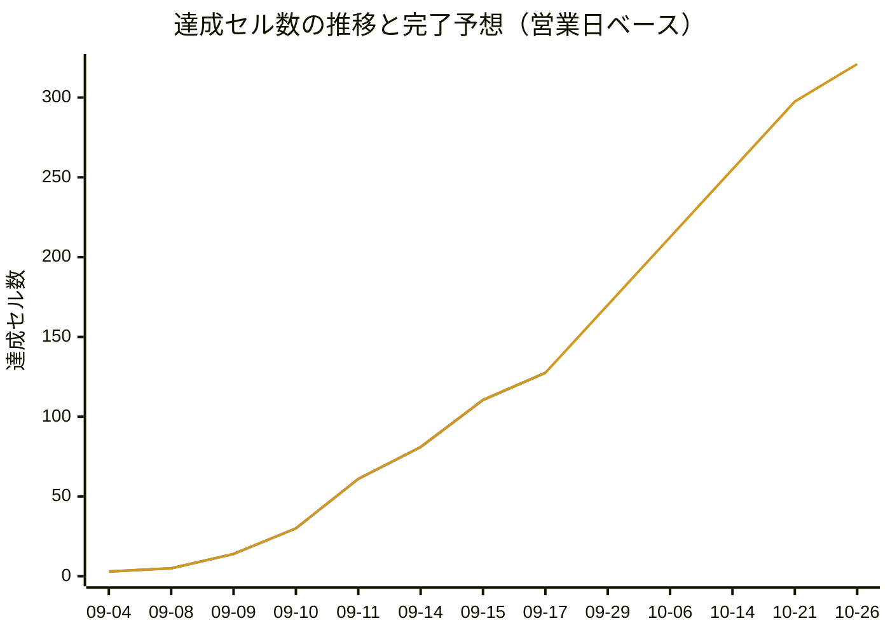

# 進捗一覧

- 生成: 2026-09-17 / `/progress-report`
- 分母: **モックリポジトリ** `../premarket-order-202609`（FastAPI + Jinja2。`python_app/templates/`）
- モック差分: 2026-09-17 まで確認済み / `f7e6f31`（モックのコミット日 2026-09-15）
- 判定基準: [.claude/skills/progress-report/criteria.md](../.claude/skills/progress-report/criteria.md)

**このファイルは `/progress-report` の出力。** 手で直してもよいが、次の実行で
完了日・更新日・`## 進捗の履歴` 以外は上書きされる。

## モックと開発環境の食い違い（分母はモック）

モックのサイドバーは **4 区分 21 項目**で、`src/components/layout/navigation.js` の 15 項目と次の差がある。

| 種別 | 対象 |
|---|---|
| モックにあり `navigation.js` に無い | `権限マスタ` / `手数料優遇マスタ` / `みずほ注文締` / 区分「運用管理」の 4 項目（`お知らせ管理` / `滞留注文抽出` / `操作ログ` / `障害管理`） |
| モックのサイドバーに無いがモックに画面がある | `新規注文`（`/orders/new`）/ `顧客詳細`（`/customers/{id}/summary`・`/customers/{id}/orders`）/ `仮計算`（顧客詳細のタブ）/ 注文の確認・完了・訂正・取消（`/orders/{id}/amend` ほか）/ CSV の確認・完了 |
| `navigation.js` にありモックに無い | なし（`ユーザマスタ` は 2026-09-17 に削除した。ユーザ情報は Entra ID 側で持つため画面が不要になった） |
| パスがずれている | 受注不可日マスタ: モック `/masters/blocked-dates` / 実装 `/masters/blackout-dates`（API の命名に合わせた）。約定照会: モック `/executions/` / 実装 `/executions` |

**今回から分母をモックの git（`python_app/templates` / `python_app/routers`）に切り替えた。**
これに伴い、モックに実体が無い 2 区分を分母から外している。

| 外した区分 | 理由 |
|---|---|
| `## 認証`（2 行） | モックに認証画面・導線が無い。`/` は `/customers/search` へ 302 で、ルータのコメントも「当面は認証を挟まず」。要件・モックが出たら行を立て直す |
| `## レスポンシブ対応`（4 行） | モックの画面ではなく横断の非機能要件。**サイドメニューの押し出し式開閉は `共通レイアウト / サイドメニュー` に取り込んだ**（`LAY-05〜09` / `UST-01〜07`）ので、達成は失われていない |

## モック差分（前回確認以降）

前回確認以降の変更なし（BASE = HEAD = `f7e6f31`）。

## 凡例

| 記号 | 意味 | 集計での重み |
|---|---|---|
| `✅` | 完了。シナリオが全て `実装済` で、対応するテストがある | 1.0 |
| `🟡` | 一部のみ。機能の一部だけ実装、またはシナリオの一部が未着手 / 保留 | 0.5 |
| `❌` | 未着手。シナリオ文書もテストも無い | 0 |
| `—` | 対象外。分母から除外する | — |

完了日は `—` を除く 4 軸が全て `✅` になった最初の日。更新日はその後の改修で再び全軸が揃った日。

## 顧客

| 画面 | 機能名 | 実装 | UnitTest | E2E(MSW) | E2E(実API) | 完了日 | 更新日 | 補足 |
|---|---|---|---|---|---|---|---|---|
| 顧客検索 | 検索・結果一覧 | ❌ | ❌ | ❌ | ❌ | - | - | ルート未定義（`NotFoundView` に落ちる）。`navigation.js` に項目あり |
| 預り検索 | 検索・結果一覧 | ❌ | ❌ | ❌ | ❌ | - | - | ルート未定義。モックは受領済（`docs/mock/customers-holdings/`） |
| 預り検索 | 直接発注導線（買い / 売り） | ❌ | ❌ | ❌ | ❌ | - | - | 一覧の「操作」列から `/orders/new` へ銘柄・売買区分・口座区分をクエリで渡す |
| 預り検索 | 仮計算の導線 | ❌ | ❌ | ❌ | ❌ | - | - | 同じ「操作」列の 3 つめのボタン。顧客詳細の仮計算タブへ渡る |
| 顧客詳細 | 資産状況サマリ | ❌ | ❌ | ❌ | ❌ | - | - | モックの `/customers/{id}/summary`。サイドバー外（顧客マスタ・顧客検索から到達） |
| 顧客詳細 | 外株預りタブ（保有一覧） | ❌ | ❌ | ❌ | ❌ | - | - | CA 発生中の銘柄がある場合の警告表示を含む |
| 顧客詳細 | 注文入力タブ | ❌ | ❌ | ❌ | ❌ | - | - | 顧客を固定したまま注文入力へ入る |
| 顧客詳細 | 注文照会タブ | ❌ | ❌ | ❌ | ❌ | - | - | モックの `/customers/{id}/orders`。その顧客の注文だけを表示する |
| 顧客詳細 | 仮計算タブ | ❌ | ❌ | ❌ | ❌ | - | - | 発注前の概算（`provisional_calculation.html`）。独立画面ではなくタブ |

## 注文・照会

| 画面 | 機能名 | 実装 | UnitTest | E2E(MSW) | E2E(実API) | 完了日 | 更新日 | 補足 |
|---|---|---|---|---|---|---|---|---|
| 新規注文（外株注文入力） | 注文入力フォーム | ❌ | ❌ | ❌ | ❌ | - | - | ルート未定義。モックは受領済（`docs/mock/orders-new/`）。**モックは項目名を「ティッカーコード」へ変更済み** |
| 新規注文（外株注文入力） | 注文の送信 | ❌ | ❌ | ❌ | ❌ | - | - | 確認（`order_confirm`）→ 完了（`order_complete`）の 2 段階。強制承認フラグを伴う |
| CSV一括注文 | CSV ファイルの取込 | ❌ | ❌ | ❌ | ❌ | - | - | ルート未定義。モックは受領済（`docs/mock/orders-csv-upload/`）。部品の `FileDropZone` は実装・単体済 |
| CSV一括注文 | 取込内容の確認 | ❌ | ❌ | ❌ | ❌ | - | - | `order_csv_preview` → `order_csv_complete` |
| CSV一括注文 | テンプレートのダウンロード | ❌ | ❌ | ❌ | ❌ | - | - | モックは `/orders/csv/template` を返す |
| 注文照会 | 検索・結果一覧 | ❌ | ❌ | ❌ | ❌ | - | - | ルート未定義。出来状況で絞り込み。サイドバーに失敗件数のバッジが出る |
| 注文照会 | 注文訂正 | ❌ | ❌ | ❌ | ❌ | - | - | モックは `/orders/{id}/amend` の別画面 |
| 注文照会 | 注文取消 | ❌ | ❌ | ❌ | ❌ | - | - | モックは `/orders/{id}/cancel` の別画面 |
| Dream登録状況 | 検索・一覧 | ❌ | ❌ | ❌ | ❌ | - | - | ルート未定義。登録状況 / 登録日時 / Dream受付番号 / エラー内容で絞り込み |
| Dream登録状況 | STS変更 | ❌ | ❌ | ❌ | ❌ | - | - | 行ごとのプルダウンで登録待ち / 登録済み / 登録エラー / 取消済を切り替える |
| 約定照会 | 検索・結果一覧 | ❌ | ❌ | ❌ | ❌ | - | - | ルート未定義。一部出来 / 全部出来 / 取消済（出来有）だけを表示する |
| 約定照会 | CSV 出力 | ❌ | ❌ | ❌ | ❌ | - | - | モックは `/executions/export/csv` |
| みずほ注文締 | 検索・結果一覧 | ❌ | ❌ | ❌ | ❌ | - | - | `navigation.js` に項目なし・ルート未定義。約定照会と同じ列を預託先で絞る |
| みずほ注文締 | 注文締め・締め解除 | ❌ | ❌ | ❌ | ❌ | - | - | **`f7e6f31` で追加**。受付中／締め済の状態表示・確認ダイアログ・直近 3 件の履歴 |
| みずほ注文締 | CSV 出力 | ❌ | ❌ | ❌ | ❌ | - | - | モックは `/executions/mizuho-operations/export/csv` |

## マスタメンテ

| 画面 | 機能名 | 実装 | UnitTest | E2E(MSW) | E2E(実API) | 完了日 | 更新日 | 補足 |
|---|---|---|---|---|---|---|---|---|
| 顧客マスタ | 一覧・検索 | ✅ | ✅ | ✅ | ❌ | - | - | `CU-01〜15` / `CLV` / `CUS` / `CUA` / `CDA` / `CDS`。実 API E2E のシナリオが未作成。米国株評価額 / 評価損益は API に項目が無く常に `—` |
| 顧客マスタ | 新規登録 | ❌ | ❌ | ❌ | ❌ | - | - | 画面はいま読むだけ（`CU-11`）。モックには導線がある |
| 顧客マスタ | 編集 | ❌ | ❌ | ❌ | ❌ | - | - | 同上。削除の導線はモックに無い |
| 権限マスタ | ロール別権限一覧 | ❌ | ❌ | ❌ | ❌ | - | - | **`navigation.js` に項目なし**・ルート未定義 |
| 権限マスタ | 権限の編集・保存 | ❌ | ❌ | ❌ | ❌ | - | - | 発注権限 / マスタ更新権限 / 発注停止権限の 3 つ。更新は管理責任者だけ |
| 銘柄マスタ | 一覧・検索 | ✅ | ✅ | ✅ | ❌ | - | - | `SM-01〜12` / `STV` / `STS` / `STA` / `STT`。実 API E2E のシナリオが未作成。検索欄は銘柄コード / Ticker にだけ当たる |
| 銘柄マスタ | 新規追加 | ✅ | ✅ | ✅ | ❌ | - | - | `SM-13〜20` / `STV`。2026-09-15 に実装。実 API E2E のシナリオが未作成 |
| 銘柄マスタ | 編集 | ✅ | ✅ | ✅ | ❌ | - | - | `SM-21〜27`。2026-09-16 に実装。主キーは `id`。実 API E2E のシナリオが未作成 |
| 銘柄マスタ | 削除 | ✅ | ✅ | ✅ | ❌ | - | - | `SM-30〜34`。2026-09-16 に実装。実 API E2E のシナリオが未作成 |
| 為替マスタ | 現在レートの表示 | ❌ | ❌ | ❌ | ❌ | - | - | ルート未定義。USD/JPY の現在レート・取込日時・適用日 |
| 為替マスタ | レート更新 | ❌ | ❌ | ❌ | ❌ | - | - | ルート未定義。レート / 適用日 / 備考 |
| 手数料優遇マスタ | 一覧の表示枠 | ❌ | ❌ | ❌ | ❌ | - | - | モック自体が「設定内容は要件整理中」で、一覧・検索・登録・編集は要件確定後に追加される。`navigation.js` に項目なし・ルート未定義 |
| スライス基準マスタ | 現在値の表示 | ✅ | ✅ | ✅ | ✅ | 2026-09-11 | - | `SC-01/02` / `SCV` / `SCS` / `SCR-01/02`。**実 API に接続済み** |
| スライス基準マスタ | 設定の保存 | ✅ | ✅ | ✅ | ✅ | 2026-09-11 | - | `SC-03/04` / `SCR-03〜07`。**実 API に接続済み** |
| CAマスタ | 一覧・検索 | ✅ | ✅ | ✅ | ❌ | - | - | `CA-01〜10` / `CAV` / `CAS` / `CAA` / `CAT`。実 API E2E のシナリオが未作成。**ステータス列は 2026-09-16 にいったん入れて取り消した**（API に項目が無い） |
| CAマスタ | 新規追加 | ✅ | ✅ | ✅ | ❌ | - | - | `CA-11〜17`。実 API E2E のシナリオが未作成 |
| CAマスタ | 編集 | ✅ | ✅ | ✅ | ❌ | - | - | `CA-18〜21`。全項目を変更でき、更新日時による楽観的ロック付き。実 API E2E のシナリオが未作成 |
| CAマスタ | 削除 | ✅ | ✅ | ✅ | ❌ | - | - | `CA-22〜27`。論理削除（取消区分）。実 API E2E のシナリオが未作成 |
| 受注不可日マスタ | 一覧・検索 | ✅ | ✅ | ✅ | ✅ | 2026-09-11 | - | `BD-01〜10` / `BDL` / `BDS` / `BDR-01〜03`。**実 API に接続済み** |
| 受注不可日マスタ | 新規追加 | ✅ | ✅ | ✅ | ✅ | 2026-09-11 | - | `BD-11〜18` / `BDR-04/05/09`。事前検証の 3 系統のエラー出し分けまで担保 |
| 受注不可日マスタ | 編集 | ✅ | ✅ | ✅ | 🟡 | - | - | `BD-24〜30` / `BDR-06`。実 API 側は `BDR-07`（日付の変更）が **保留**のため 4 軸が揃わない |
| 受注不可日マスタ | 削除 | ✅ | ✅ | ✅ | ✅ | 2026-09-11 | - | `BD-19〜23` / `BDR-08`。**実 API に接続済み** |
| 海外休場日マスタ | 一覧・検索 | ✅ | ✅ | ✅ | ✅ | 2026-09-10 | - | `MH-01〜07/17〜21` / `MR-01〜03` / `MHT`。**実 API に接続済み**。モックに無い「休場区分」も実装済み |
| 海外休場日マスタ | 新規追加（再有効化を含む） | ✅ | ✅ | ✅ | ✅ | 2026-09-10 | - | `MH-08〜11/22/23` / `MR-04/05/07/08` |
| 海外休場日マスタ | 削除 | ✅ | ✅ | ✅ | ✅ | 2026-09-10 | - | `MH-12〜16` / `MR-06` |
| 残高補正 | 保有残高の一覧・検索 | ❌ | ❌ | ❌ | ❌ | - | - | ルート未定義 |
| 残高補正 | 残高を補正（数量の加算） | ❌ | ❌ | ❌ | ❌ | - | - | 確認 → 確定の 2 段階 |
| 残高補正 | 新規保有を追加 | ❌ | ❌ | ❌ | ❌ | - | - | 顧客・ティッカー・口座区分・加算数量を指定 |

## 運用管理

モックのサイドバーにある区分。**`navigation.js` に区分そのものが無い。**
4 画面とも別 worktree で着手済みだが、**いずれも未コミットのため判定は上げていない**。

| 画面 | 機能名 | 実装 | UnitTest | E2E(MSW) | E2E(実API) | 完了日 | 更新日 | 補足 |
|---|---|---|---|---|---|---|---|---|
| お知らせ管理 | お知らせの更新（表示切替・本文） | ❌ | ❌ | ❌ | ❌ | - | - | `claude/announcements-screen-ui-06c368` で作業中（未コミット 9 件） |
| お知らせ管理 | 更新履歴 | ❌ | ❌ | ❌ | ❌ | - | - | 変更前 / 変更後 / 更新者の履歴表 |
| 滞留注文抽出 | 検索・一覧 | ❌ | ❌ | ❌ | ❌ | - | - | `claude/stalled-order-extraction-ui-4261c4` で作業中（未コミット 14 件） |
| 滞留注文抽出 | 滞留注文の CSV 出力 | ❌ | ❌ | ❌ | ❌ | - | - | 検索条件を引き継いで TWS 手動投入用の CSV を出す |
| 滞留注文抽出 | TWS投入CSV サンプルのダウンロード | ❌ | ❌ | ❌ | ❌ | - | - | 書式確認用の固定サンプル |
| 滞留注文抽出 | コンファメーションCSV の取込 | ❌ | ❌ | ❌ | ❌ | - | - | 取込して注文照会へ反映する |
| 滞留注文抽出 | コンファメーションCSV サンプルのダウンロード | ❌ | ❌ | ❌ | ❌ | - | - | 取込側の書式確認用 |
| 操作ログ | 一覧・検索 | ❌ | ❌ | ❌ | ❌ | - | - | `claude/operations-activity-logs-ui-77349d` で作業中（未コミット 9 件）。モックは期間 / 操作者 / 操作区分 / 対象機能 / 結果で絞り込む |
| 障害管理 | 発注停止 | ❌ | ❌ | ❌ | ❌ | - | - | `claude/incident-management-ui-8d1a06` で作業中（未コミット 8 件）。確認チェック付き |
| 障害管理 | 発注再開 | ❌ | ❌ | ❌ | ❌ | - | - | 停止中のみ現れる操作。現在の運用状態の表示を伴う |
| 障害管理 | 障害対応履歴 | ❌ | ❌ | ❌ | ❌ | - | - | 変更前 / 変更後 / 更新者の履歴表 |

## 共通基盤

画面を持たない区分。画面列には区分名を入れている。

| 画面 | 機能名 | 実装 | UnitTest | E2E(MSW) | E2E(実API) | 完了日 | 更新日 | 補足 |
|---|---|---|---|---|---|---|---|---|
| 共通レイアウト | サイドメニュー | ✅ | ✅ | ✅ | — | 2026-09-09 | 2026-09-16 | `LAY-01/03〜09` / `ASB` / `UST`。**押し出し式の開閉を 2026-09-16 に追加**（幅・再読み込み後の保持・フォーカス制御まで E2E 済み） |
| 共通レイアウト | ヘッダの画面見出し | ✅ | ✅ | ✅ | — | 2026-09-09 | - | `LAY-02` / `AHD`。`router` の `meta.title` 由来 |
| 共通レイアウト | 市場ステータス表示 | ✅ | ✅ | ✅ | — | 2026-09-09 | 2026-09-15 | `AHD` / `MKS` / `UMS`。`useMarketStatus` + `utils/marketStatus` |
| 共通レイアウト | 市場取引時間の表示 | ❌ | ❌ | ❌ | — | - | - | ヘッダに米国市場の取引時間帯（プレマーケット / レギュラー / アフター）を現地時刻と日本時刻で出す。既存の `市場ステータス表示` は開場 / 閉場の状態だけで、時間帯そのものは未表示。要件指示（モック外） |
| アクセス制御 | 権限によるアクセス制限 | ❌ | ❌ | ❌ | ❌ | - | - | ロール（発注権限 / マスタ更新権限 / 発注停止権限）でメニュー・ルート・操作ボタンを出し分ける。`権限マスタ` の実装と対。権限外は画面を開けない。要件指示（モック外） |
| 共通レイアウト | 読み込みオーバーレイ | ✅ | ✅ | ❌ | — | - | - | `AppLoadingOverlay.vue` と `docs/unit/components-layout-app-loading-overlay.md`。E2E の受け入れ条件がまだ無い |
| UI 部品 | `components/ui/` の 15 部品 | ✅ | ✅ | ✅ | — | 2026-09-04 | 2026-09-16 | 15 本すべてに spec と `docs/unit/` があり 4 軸の状態が同じなので 1 行に畳んである。E2E はカタログが開けることのみ |
| マスタ共通部品 | 検索カード（`MasterSearchCard`） | ✅ | ✅ | — | — | 2026-09-17 | - | `MSC`。2026-09-17 にシナリオとテストが入った（`6385886`） |
| マスタ共通部品 | 一覧カード（`MasterListCard`） | ✅ | ✅ | — | — | 2026-09-17 | - | `MLC`。同上 |
| マスタ共通部品 | 追加・編集ダイアログ（`MasterFormDialog`） | ✅ | ✅ | — | — | 2026-09-17 | - | `MFD`。同上 |
| マスタ共通部品 | 削除確認（`ConfirmDeleteDialog`） | ✅ | ✅ | — | — | 2026-09-17 | - | `CDD-01〜13`。同上 |
| 共通ロジック | `useAsync` | ✅ | ✅ | — | — | 2026-09-14 | - | `UAS-01〜17` |
| 共通ロジック | `useCrudList` | ✅ | ✅ | — | — | 2026-09-14 | - | `UCL-01〜43`。受注不可日・海外休場日・CA・銘柄の 4 画面で共用 |
| 共通ロジック | `useListQuery` | ✅ | ✅ | — | — | 2026-09-14 | - | `ULQ-01〜19`。URL クエリと一覧状態の同期 |
| 共通ロジック | `useMarketStatus` | ✅ | ✅ | — | — | 2026-09-15 | - | `UMS-01〜06` |
| 共通ロジック | `useSidebarToggle` | ✅ | ✅ | — | — | 2026-09-16 | - | `UST-01〜07`。開閉状態の保持。**今回の新規行** |
| ユーティリティ | `utils/format.js` | ✅ | ✅ | — | — | 2026-09-14 | - | `FMT-01〜11` |
| ユーティリティ | `utils/marketStatus.js` | ✅ | ✅ | — | — | 2026-09-08 | - | `MKS-01〜13` |
| ユーティリティ | `utils/queryParams.js` | ✅ | ✅ | — | — | 2026-09-11 | - | `QRY-01〜08` |
| ユーティリティ | `utils/marketHolidayTypes.js` | ✅ | ✅ | — | — | 2026-09-10 | - | `MHT-01〜07` |
| ユーティリティ | `utils/caTypes.js` | ✅ | ✅ | — | — | 2026-09-11 | - | `CAT` |
| ユーティリティ | `utils/symbolTypes.js` | ✅ | ✅ | — | — | 2026-09-14 | - | `STT-01〜05` |
| ユーティリティ | `utils/apiEnums.js` | ✅ | ✅ | — | — | 2026-09-15 | - | OpenAPI の区分値 21 種の写し。`openapi.json` と突き合わせるテスト付き。**今回の新規行** |
| API クライアント層 | `api/client.js` | ✅ | ✅ | — | — | 2026-09-14 | - | `CLA-01〜16`。`normalizeError` を含む |
| API クライアント層 | `api/orders.js` | ✅ | ✅ | — | — | 2026-09-14 | - | `ORA-01〜10`。`toOrder()` の変換を担保 |
| API クライアント層 | `api/blackoutDates.js` | ✅ | ✅ | — | — | 2026-09-11 | - | `BDA` |
| API クライアント層 | `api/sliceCriteria.js` | ✅ | ✅ | — | — | 2026-09-11 | - | `SCA` |
| API クライアント層 | `api/marketHolidays.js` | ✅ | ✅ | — | — | 2026-09-10 | - | `MHA` |
| API クライアント層 | `api/ca.js` | ✅ | ✅ | — | — | 2026-09-11 | - | `CAA` |
| API クライアント層 | `api/codes.js` | ✅ | ✅ | — | — | 2026-09-14 | - | `CDA-01〜07` |
| API クライアント層 | `api/customers.js` | ✅ | ✅ | — | — | 2026-09-14 | - | `CUA-01〜14` |
| API クライアント層 | `api/symbols.js` | ✅ | ✅ | — | — | 2026-09-14 | 2026-09-16 | `STA-01〜12`。`symbol` クエリ名と `id` 主キーへの追随を含む |
| MSW モック基盤 | handlers / fixtures | ✅ | — | — | — | 2026-09-11 | 2026-09-16 | ブラウザ・単体・E2E で共用。API が実装されたら該当ハンドラを削除する。単体・E2E の直接の対象ではないため `—` で、実装のみで完了とみなす |

## 対象外の画面（集計に含めない）

**モックに無い画面。納品対象ではないので進捗の分母から外す。**

| 画面 | 機能名 | 実装 | UnitTest | E2E(MSW) | E2E(実API) | 完了日 | 更新日 | 補足 |
|---|---|---|---|---|---|---|---|---|
| 注文一覧（`/`） | 一覧表示 | ✅ | ✅ | ✅ | ❌ | - | - | 縦串の参考実装で、実仕様が来たら差し替える前提のため対象外。`OL` / `OLV` / `OST` |
| UI カタログ（`/dev/ui-catalog`） | 部品の一覧表示 | ✅ | ❌ | ✅ | — | - | - | 開発用ページ（業務画面ではない）のため対象外。`UC-01/02` |

## 集計

**進捗は行ではなく「行 × 軸のセル」で数える。**

- **有効セル** = その行の 4 軸のうち `—`（対象外）でないセルの数
- **達成セル** = `✅` 1.0 + `🟡` 0.5（`❌` は 0）
- **残セル** = 有効セル − 達成セル、**進捗率** = 達成セル ÷ 有効セル
- **完了行** = `—` を除く全軸が `✅` の行

「対象外の画面」の 2 行は行ごと数えない。

| 区分 | 行数 | 実装 `✅` | UnitTest `✅` | E2E(MSW) `✅` | E2E(実API) `✅` | 有効セル | 達成セル | 残セル | 進捗率 | 完了行 |
|---|---|---|---|---|---|---|---|---|---|---|
| 顧客 | 9 | 0 | 0 | 0 | 0 | 36 | 0.0 | 36.0 | 0% | 0 |
| 注文・照会 | 14 | 0 | 0 | 0 | 0 | 56 | 0.0 | 56.0 | 0% | 0 |
| マスタメンテ | 28 | 18 | 18 | 18 | 8 | 112 | 62.5 | 49.5 | 56% | 8 |
| 運用管理 | 11 | 0 | 0 | 0 | 0 | 44 | 0.0 | 44.0 | 0% | 0 |
| 共通基盤 | 33 | 31 | 30 | 4 | 0 | 73 | 65.0 | 8.0 | 89% | 30 |
| **合計** | **95** | **49** | **48** | **22** | **8** | **321** | **127.5** | **193.5** | **40%** | **38** |

軸ごとの進捗率。**分母はその軸が `—` の行を除いた数**、`達成` = `✅` + 0.5 × `🟡`。

| 軸 | 分母 | `✅` | `🟡` | 達成 | 残 | 進捗率 |
|---|---|---|---|---|---|---|
| 実装 | 95 | 49 | 0 | 49.0 | 46.0 | 52% |
| UnitTest | 94 | 48 | 0 | 48.0 | 46.0 | 51% |
| E2E(MSW) | 69 | 22 | 0 | 22.0 | 47.0 | 32% |
| E2E(実API) | 63 | 8 | 1 | 8.5 | 54.5 | 13% |

## 進捗の履歴

実行ごとのスナップショット。**過去行は書き換えない**（次の実行はここに 1 行足すだけ）。
下の折れ線はこの表だけを実績データにしている。

| 生成日 | 行数 | 有効セル | 達成セル | 進捗率 | 備考 |
|---|---|---|---|---|---|
| 2026-09-04 | - | - | 3.0 | - | 推定（完了日から遡って算出） |
| 2026-09-08 | - | - | 5.0 | - | 推定 |
| 2026-09-09 | - | - | 14.0 | - | 推定 |
| 2026-09-10 | - | - | 30.0 | - | 推定 |
| 2026-09-11 | - | - | 61.0 | - | 推定 |
| 2026-09-14 | 91 | - | 81.0 | - | 推定（当時の集計は行ベース 21/91 行） |
| 2026-09-15 | 95 | 321 | 110.5 | 34% | 実測（セル単位の集計を導入した初回） |
| 2026-09-17 | 93 | 314 | 127.5 | 41% | 実測。分母をモックの git 差分へ切替（認証 2 行・レスポンシブ 4 行を除外、みずほ注文締と Dream STS変更で +2 行、共通基盤 +3 行）で **有効セルは 321 → 314**。マスタ共通部品 4 本の単体テストが入り +4.0 セル |

**`推定` の行は完了日から遡って作った種で、部分達成を数えていないため過小。**
速度は実測行（2026-09-15 以降）だけで取る。

## 進捗の推移と完了予想

**速度も予想も営業日で数える**（土日祝は作業しない）。営業日の定義と祝日表は
[.claude/skills/progress-report/holidays.md](../.claude/skills/progress-report/holidays.md)。
x 軸の未来側の点はすべて営業日で、9/21（敬老の日）・9/22（国民の休日）・9/23（秋分の日）、
10/12（スポーツの日）は飛ばしてある。

1 本目（青 `#2f6feb`）が**実績**（`## 進捗の履歴` の達成セル）、
2 本目（橙 `#d29922`）が**完了予想**。**橙は 09-17 までは実績と重なっており、外挿はそれ以降だけ**。

- 現在: **127.5 / 321 セル**（40%）。うち完了行は 38 / 95 行
- 平均速度: **8.5 セル/営業日 ≒ 42.5 セル/週**（起点 2026-09-15(火) から **2 営業日**で 17.0 セル）
- 到達予想日: **2026-10-26（月）** — 残 193.5 セル ÷ 8.5 = **23 営業日**。
  暦日では 39 日先で、その間に土日 12 日と祝日 4 日がある

この予想は「これまでと同じ速度が続き、分母 314 セルが増えない」場合の値でしかない。
モックの差分で画面が増えれば分母は増え、到達予想日は後ろへ動く。
**2026-09-17 に 2 行（`共通レイアウト / 市場取引時間の表示`・`アクセス制御 / 権限によるアクセス制限`）を
手で追加したため、分母は 314 → 321 セルに増えている**（モックの差分由来ではない）。
**土日祝は作業しない前提で数えている。**
**速度の実測点はまだ 2 点（09-15 / 09-17）しかなく、振れやすい。**
起点と最新の 2 点だけで傾きを取っているため、まとまったテストが 1 本入った日の直後は
速度が跳ね上がる（今回がそれで、同じ日の先の実行より 8.5 セル/営業日へ上振れしている）。
次回以降の実測で落ち着く。

## 次に安く埋まるところ

材料の有無だけで見た順。実装の要否はここでは判断しない。

1. **`BDR-07`（受注不可日マスタの編集・日付変更）の保留を外す** — 残り 1 シナリオで
   `受注不可日マスタ / 編集` が完了に到達する（`real-api-e2e-author` の担当）
2. **銘柄マスタ・CAマスタの実 API E2E** — `docs/e2e/symbols-real-api.md` / `ca-real-api.md` を書けば
   合わせて **8 行**が一気に完了へ動く。画面・単体・MSW E2E はすべて揃っている
3. **`共通レイアウト / 読み込みオーバーレイ` の E2E(MSW)** — 共通基盤で唯一残ったセル。
   `docs/e2e/layout.md` に受け入れ条件を 1 本足せば共通基盤が 100% になる
