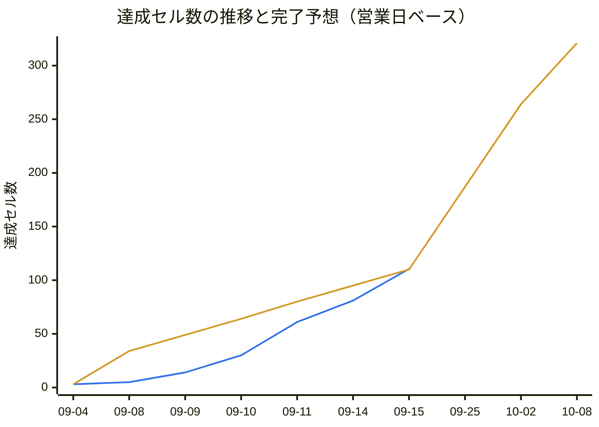

# 進捗一覧

- 生成: 2026-09-15 / `/progress-report`
- 分母: **公開モック**（<https://uspreorder-vmbhej3k.manus.space/>）の画面と機能ブロック + 共通基盤 + 認証 + レスポンシブ対応
- モック確認: **見ない**（前回 2026-09-14 の巡回結果と `docs/mock/` の受領済みモックを分母に引き継いだ）
- 判定基準: [.claude/skills/progress-report/criteria.md](../.claude/skills/progress-report/criteria.md)

**このファイルは `/progress-report` の出力。** 手で直してもよいが、次の実行で
完了日・更新日以外は上書きされる（完了日・更新日は引き継がれる）。

## モックと開発環境の食い違い（分母はモック）

モックのサイドバーは **4 区分 21 項目**で、`src/components/layout/navigation.js` の 16 項目と次の差がある。

| 種別 | 対象 |
|---|---|
| モックにあり `navigation.js` に無い | `権限マスタ` / `手数料優遇マスタ` / `みずほ証券向け業務` / 区分「運用管理」の 4 項目（`お知らせ管理` / `滞留注文抽出` / `操作ログ` / `障害管理`） |
| モックのサイドバーに無いがモックに画面がある | `新規注文`（`/orders/new`。預り検索・顧客詳細の「買い / 売り」から到達）/ `顧客詳細`（`/customers/:id/summary`） |
| `navigation.js` にありモックに無い | `ユーザマスタ`（`/masters/users`）。モックでは `顧客マスタ` と `権限マスタ` に分かれている |
| パスがずれている | 受注不可日マスタ: モック `/masters/blocked-dates` / 実装 `/masters/blackout-dates`（API の命名に合わせた）。約定照会: モック `/executions/` / 実装 `/executions` |

`顧客マスタ` は 2026-09-14 に `navigation.js` とルートが入ったのでこの表から外れた。

**`手数料優遇マスタ`（`/masters/fee-preferences`）は 2026-09-14 の巡回で現れた画面。**
モック自体が「設定内容は要件整理中」のプレースホルダで、一覧の表示枠しか持たない。

**認証（ログイン / ログアウト）はモックに画面・導線が無い**（`/login` は 404、
利用者は `as_user` クエリで切り替える作り）。システムとしては必要な機能なので、
`## 認証` として分母に含めている。要件・モックが出たら機能名を割り直す。

**レスポンシブ対応は PC とタブレットのみが対象で、スマホ表示は対象外。**
画面ごとの行にはせず、横断の非機能要件として `## レスポンシブ対応` にまとめている。

## 凡例

| 記号 | 意味 | 集計での重み |
|---|---|---|
| `✅` | 完了。シナリオが全て `実装済` で、対応するテストがある | 1.0 |
| `🟡` | 一部のみ。機能の一部だけ実装、またはシナリオの一部が未着手 / 保留 | 0.5 |
| `❌` | 未着手。シナリオ文書もテストも無い | 0 |
| `—` | 対象外。分母から除外する | — |

完了日は `—` を除く 4 軸が全て `✅` になった最初の日。更新日はその後の改修で再び全軸が揃った日。

## 認証

| 画面 | 機能名 | 実装 | UnitTest | E2E(MSW) | E2E(実API) | 完了日 | 更新日 | 補足 |
|---|---|---|---|---|---|---|---|---|
| ログイン | 認証・セッション開始 | ❌ | ❌ | ❌ | ❌ | - | - | モックに画面が無い（`/login` は 404）。`navigation.js` にも `router` にも定義なし |
| ログアウト | セッション終了 | ❌ | ❌ | ❌ | ❌ | - | - | モックのヘッダ・サイドバーに導線なし。利用者切替は `as_user` クエリで代用されている |

## 顧客

| 画面 | 機能名 | 実装 | UnitTest | E2E(MSW) | E2E(実API) | 完了日 | 更新日 | 補足 |
|---|---|---|---|---|---|---|---|---|
| 顧客検索 | 検索・結果一覧 | ❌ | ❌ | ❌ | ❌ | - | - | ルート未定義（`NotFoundView` に落ちる）。`navigation.js` に項目あり。モック未受領 |
| 預り検索 | 検索・結果一覧 | ❌ | ❌ | ❌ | ❌ | - | - | ルート未定義。モックは受領済（`docs/mock/customers-holdings/`） |
| 預り検索 | 直接発注導線（買い / 売り） | ❌ | ❌ | ❌ | ❌ | - | - | 一覧の「操作」列から `/orders/new` へ銘柄・売買区分・口座区分をクエリで渡す |
| 預り検索 | 仮計算の導線 | ❌ | ❌ | ❌ | ❌ | - | - | 同じ「操作」列の 3 つめのボタン。顧客詳細の仮計算タブへ渡る |
| 顧客詳細 | 資産状況サマリ | ❌ | ❌ | ❌ | ❌ | - | - | モックの `/customers/:id/summary`。サイドバー外（顧客マスタ・顧客検索から到達） |
| 顧客詳細 | 外株預りタブ（保有一覧） | ❌ | ❌ | ❌ | ❌ | - | - | CA 発生中の銘柄がある場合の警告表示を含む |
| 顧客詳細 | 注文入力タブ | ❌ | ❌ | ❌ | ❌ | - | - | 顧客を固定したまま注文入力へ入る |
| 顧客詳細 | 注文照会タブ | ❌ | ❌ | ❌ | ❌ | - | - | その顧客の注文だけを表示する |
| 顧客詳細 | 仮計算タブ | ❌ | ❌ | ❌ | ❌ | - | - | 発注前の概算。独立画面ではなくタブ |

## 注文・照会

| 画面 | 機能名 | 実装 | UnitTest | E2E(MSW) | E2E(実API) | 完了日 | 更新日 | 補足 |
|---|---|---|---|---|---|---|---|---|
| 新規注文（外株注文入力） | 注文入力フォーム | ❌ | ❌ | ❌ | ❌ | - | - | ルート未定義。モックは受領済（`docs/mock/orders-new/`）。売買 / 成行指値 / 円決外決 / 口座区分 / 勧誘 / 資金性格 / 執行方法 等の切替を持つ |
| 新規注文（外株注文入力） | 注文の送信 | ❌ | ❌ | ❌ | ❌ | - | - | 「送信」ボタン。強制承認フラグ（`forced_approval`）を伴う |
| CSV一括注文 | CSV ファイルの取込 | ❌ | ❌ | ❌ | ❌ | - | - | ルート未定義。モックは受領済（`docs/mock/orders-csv-upload/`）。部品の `FileDropZone` は実装・単体済 |
| CSV一括注文 | 取込内容の確認 | ❌ | ❌ | ❌ | ❌ | - | - | 「内容を確認する」で確認画面へ進む |
| CSV一括注文 | テンプレートのダウンロード | ❌ | ❌ | ❌ | ❌ | - | - | モックは `/orders/csv/template` を返す |
| 注文照会 | 検索・結果一覧 | ❌ | ❌ | ❌ | ❌ | - | - | ルート未定義。出来状況で絞り込み。サイドバーに失敗件数のバッジが出る |
| 注文照会 | 注文訂正 | ❌ | ❌ | ❌ | ❌ | - | - | モックは `/orders/:id/amend` の別画面 |
| 注文照会 | 注文取消 | ❌ | ❌ | ❌ | ❌ | - | - | モックは `/orders/:id/cancel` の別画面 |
| Dream登録状況 | 検索・一覧 | ❌ | ❌ | ❌ | ❌ | - | - | ルート未定義。登録状況 / 登録日時 / Dream受付番号 / エラー内容で絞り込み |
| 約定照会 | 検索・結果一覧 | ❌ | ❌ | ❌ | ❌ | - | - | ルート未定義。モック未受領 |
| 約定照会 | CSV 出力 | ❌ | ❌ | ❌ | ❌ | - | - | モックは `/executions/export/csv` |
| みずほ証券向け業務 | 検索・結果一覧 | ❌ | ❌ | ❌ | ❌ | - | - | `navigation.js` に項目なし・ルート未定義。約定照会と同じ列を預託先で絞る |
| みずほ証券向け業務 | CSV 出力 | ❌ | ❌ | ❌ | ❌ | - | - | モックは `/executions/mizuho-operations/export/csv?depositary=みずほ証券` |

## マスタメンテ

| 画面 | 機能名 | 実装 | UnitTest | E2E(MSW) | E2E(実API) | 完了日 | 更新日 | 補足 |
|---|---|---|---|---|---|---|---|---|
| 顧客マスタ | 一覧・検索 | ✅ | ✅ | ✅ | ❌ | - | - | `CU-01〜15` / `CLV` / `CUS` / `CUA` / `CDA` / `CDS`。2026-09-14 に実装。実 API E2E のシナリオが未作成。米国株評価額 / 評価損益は API に項目が無く常に `—` |
| 顧客マスタ | 新規登録 | ❌ | ❌ | ❌ | ❌ | - | - | 画面はいま読むだけ（`CU-11`）。モックには導線がある |
| 顧客マスタ | 編集 | ❌ | ❌ | ❌ | ❌ | - | - | 同上。削除の導線はモックに無い |
| 権限マスタ | ロール別権限一覧 | ❌ | ❌ | ❌ | ❌ | - | - | **`navigation.js` に項目なし**・ルート未定義 |
| 権限マスタ | 権限の編集・保存 | ❌ | ❌ | ❌ | ❌ | - | - | 発注権限 / マスタ更新権限 / 発注停止権限の 3 つ |
| 銘柄マスタ | 一覧・検索 | ✅ | ✅ | ✅ | ❌ | - | - | `SM-01〜12` / `STV` / `STS` / `STA` / `STT`。2026-09-14 に実装。実 API E2E のシナリオが未作成。検索欄は銘柄コード / Ticker にだけ当たる |
| 銘柄マスタ | 新規追加 | ❌ | ❌ | ❌ | ❌ | - | - | 画面はいま読むだけ（`SM-10`） |
| 銘柄マスタ | 編集 | ❌ | ❌ | ❌ | ❌ | - | - | 同上 |
| 銘柄マスタ | 削除 | ❌ | ❌ | ❌ | ❌ | - | - | 同上。モックは削除確認ダイアログを持つ |
| 為替マスタ | 現在レートの表示 | ❌ | ❌ | ❌ | ❌ | - | - | ルート未定義。USD/JPY の現在レート・取込日時・適用日 |
| 為替マスタ | レート更新 | ❌ | ❌ | ❌ | ❌ | - | - | ルート未定義。レート / 適用日 / 備考 |
| 手数料優遇マスタ | 一覧の表示枠 | ❌ | ❌ | ❌ | ❌ | - | - | モック自体が「設定内容は要件整理中」で、一覧・検索・登録・編集は要件確定後に追加される。`navigation.js` に項目なし・ルート未定義 |
| ハードリミットマスタ | 現在値の表示 | ✅ | ✅ | ✅ | ✅ | 2026-09-11 | - | `HL-01/02` / `HLV` / `HLS` / `HR-01/02`。**実 API に接続済み** |
| ハードリミットマスタ | 設定の保存 | ✅ | ✅ | ✅ | ✅ | 2026-09-11 | - | `HL-03/04` / `HR-03〜07`。**実 API に接続済み** |
| CAマスタ | 一覧・検索 | ✅ | ✅ | ✅ | ❌ | - | - | `CA-01〜10` / `CAV` / `CAS` / `CAA` / `CAT`。実 API E2E のシナリオが未作成。ステータス列・権利確定日はモックにあるが API に項目が無く出していない |
| CAマスタ | 新規追加 | ✅ | ✅ | ✅ | ❌ | - | - | `CA-11〜17`。2026-09-14 に実装。実 API E2E のシナリオが未作成 |
| CAマスタ | 編集 | ✅ | ✅ | ✅ | ❌ | - | - | `CA-18〜21`。全項目を変更でき、更新日時による楽観的ロック付き。実 API E2E のシナリオが未作成 |
| CAマスタ | 削除 | ✅ | ✅ | ✅ | ❌ | - | - | `CA-22〜27`。論理削除（取消区分）。実 API E2E のシナリオが未作成 |
| 受注不可日マスタ | 一覧・検索 | ✅ | ✅ | ✅ | ✅ | 2026-09-11 | - | `BD-01〜10` / `BDL` / `BDS` / `BDR-01〜03`。**実 API に接続済み** |
| 受注不可日マスタ | 新規追加 | ✅ | ✅ | ✅ | ✅ | 2026-09-11 | - | `BD-11〜18` / `BDR-04/05/09`。事前検証の 3 系統のエラー出し分けまで担保 |
| 受注不可日マスタ | 編集 | ✅ | ✅ | ✅ | 🟡 | - | - | `BD-24〜30` / `BDR-06`。実 API 側は `BDR-07`（日付の変更）が **保留**のため 4 軸が揃わない |
| 受注不可日マスタ | 削除 | ✅ | ✅ | ✅ | ✅ | 2026-09-11 | - | `BD-19〜23` / `BDR-08`。**実 API に接続済み** |
| 海外休場日マスタ | 一覧・検索 | ✅ | ✅ | ✅ | ✅ | 2026-09-10 | - | `MH-01〜07/17〜21` / `MR-01〜03` / `MHT`。**実 API に接続済み**。モックに無い「休場区分」（列・検索条件・新規追加）も実装済み |
| 海外休場日マスタ | 新規追加（再有効化を含む） | ✅ | ✅ | ✅ | ✅ | 2026-09-10 | - | `MH-08〜11/22/23` / `MR-04/05/07/08` |
| 海外休場日マスタ | 削除 | ✅ | ✅ | ✅ | ✅ | 2026-09-10 | - | `MH-12〜16` / `MR-06` |
| 残高補正 | 保有残高の一覧・検索 | ❌ | ❌ | ❌ | ❌ | - | - | ルート未定義。モック未受領 |
| 残高補正 | 残高を補正（数量の加算） | ❌ | ❌ | ❌ | ❌ | - | - | 確認 → 確定の 2 段階 |
| 残高補正 | 新規保有を追加 | ❌ | ❌ | ❌ | ❌ | - | - | 顧客・ティッカー・口座区分・加算数量を指定 |

## 運用管理

モックのサイドバーにある区分。**`navigation.js` に区分そのものが無い。**

| 画面 | 機能名 | 実装 | UnitTest | E2E(MSW) | E2E(実API) | 完了日 | 更新日 | 補足 |
|---|---|---|---|---|---|---|---|---|
| お知らせ管理 | お知らせの更新（表示切替・本文） | ❌ | ❌ | ❌ | ❌ | - | - | 表示の ON/OFF と本文は 1 つの「お知らせを更新」で保存される。`navigation.js` に項目なし・ルート未定義 |
| お知らせ管理 | 更新履歴 | ❌ | ❌ | ❌ | ❌ | - | - | 変更前 / 変更後 / 更新者の履歴表 |
| 滞留注文抽出 | 検索・一覧 | ❌ | ❌ | ❌ | ❌ | - | - | 注文中のまま滞留した注文の抽出。`navigation.js` に項目なし・ルート未定義 |
| 滞留注文抽出 | 滞留注文の CSV 出力 | ❌ | ❌ | ❌ | ❌ | - | - | 検索条件を引き継いで TWS 手動投入用の CSV を出す |
| 滞留注文抽出 | TWS投入CSV サンプルのダウンロード | ❌ | ❌ | ❌ | ❌ | - | - | 書式確認用の固定サンプル |
| 滞留注文抽出 | コンファメーションCSV の取込 | ❌ | ❌ | ❌ | ❌ | - | - | 取込して注文照会へ反映する |
| 滞留注文抽出 | コンファメーションCSV サンプルのダウンロード | ❌ | ❌ | ❌ | ❌ | - | - | 取込側の書式確認用 |
| 操作ログ | 一覧・検索 | ❌ | ❌ | ❌ | ❌ | - | - | `navigation.js` に項目なし・ルート未定義。**モックは権限ガードで閲覧できず（`as_user=005/006` とも「管理者・管理責任者のみ閲覧できます」）、機能ブロックは未確認** |
| 障害管理 | 発注停止 | ❌ | ❌ | ❌ | ❌ | - | - | 確認チェック付き。新規発注・訂正・取消をすべて止める。`navigation.js` に項目なし・ルート未定義 |
| 障害管理 | 発注再開 | ❌ | ❌ | ❌ | ❌ | - | - | 停止中のみ現れる操作。現在の運用状態の表示を伴う |
| 障害管理 | 障害対応履歴 | ❌ | ❌ | ❌ | ❌ | - | - | 変更前 / 変更後 / 更新者の履歴表 |

## 共通基盤

画面を持たない区分。画面列には区分名を入れている。

| 画面 | 機能名 | 実装 | UnitTest | E2E(MSW) | E2E(実API) | 完了日 | 更新日 | 補足 |
|---|---|---|---|---|---|---|---|---|
| 共通レイアウト | サイドメニュー | ✅ | ✅ | ✅ | — | 2026-09-09 | 2026-09-14 | `LAY-01/03/04` / `ASB`。モックの 21 項目に対し `navigation.js` は 16 項目で、うち遷移先があるのは 6 項目 |
| 共通レイアウト | ヘッダの画面見出し | ✅ | ✅ | ✅ | — | 2026-09-09 | - | `LAY-02` / `AHD`。`router` の `meta.title` 由来 |
| 共通レイアウト | 市場ステータス表示 | ✅ | ✅ | ✅ | — | 2026-09-09 | 2026-09-15 | `AHD` / `MKS` / `UMS`。`useMarketStatus` + `utils/marketStatus` |
| UI 部品 | `components/ui/` の 14 部品 | ✅ | ✅ | ✅ | — | 2026-09-04 | 2026-09-11 | 14 本すべてに spec と `docs/unit/` があり 4 軸の状態が同じなので 1 行に畳んである。E2E はカタログが開けることのみ。**`feat/loading-spinner` が `BaseSpinner` を追加中（未コミット）** |
| マスタ共通部品 | 検索カード（`MasterSearchCard`） | ✅ | ❌ | — | — | - | - | spec も `docs/unit/` も無い。挙動は各マスタ画面の E2E・単体を通じて担保されている。**`feat/loading-spinner` が改修中（未コミット）** |
| マスタ共通部品 | 一覧カード（`MasterListCard`） | ✅ | ❌ | — | — | - | - | 同上 |
| マスタ共通部品 | 追加・編集ダイアログ（`MasterFormDialog`） | ✅ | ❌ | — | — | - | - | 同上 |
| マスタ共通部品 | 削除確認（`ConfirmDeleteDialog`） | ✅ | ❌ | — | — | - | - | 同上 |
| 共通ロジック | `useAsync` | ✅ | ✅ | — | — | 2026-09-14 | - | `UAS-01〜17`。2026-09-14 にシナリオとテストが入った |
| 共通ロジック | `useCrudList` | ✅ | ✅ | — | — | 2026-09-14 | - | `UCL-01〜43`。受注不可日・海外休場日・CA の 3 画面で共用 |
| 共通ロジック | `useListQuery` | ✅ | ✅ | — | — | 2026-09-14 | - | `ULQ-01〜19`。URL クエリと一覧状態の同期 |
| 共通ロジック | `useMarketStatus` | ✅ | ✅ | — | — | 2026-09-15 | - | `UMS-01〜06` |
| ユーティリティ | `utils/format.js` | ✅ | ✅ | — | — | 2026-09-14 | - | `FMT-01〜11` |
| ユーティリティ | `utils/marketStatus.js` | ✅ | ✅ | — | — | 2026-09-08 | - | `MKS-01〜13`。行の分割に伴う初回計上（最新コミット日） |
| ユーティリティ | `utils/queryParams.js` | ✅ | ✅ | — | — | 2026-09-11 | - | `QRY-01〜08`。行の分割に伴う初回計上 |
| ユーティリティ | `utils/marketHolidayTypes.js` | ✅ | ✅ | — | — | 2026-09-10 | - | `MHT-01〜07`。行の分割に伴う初回計上 |
| ユーティリティ | `utils/caTypes.js` | ✅ | ✅ | — | — | 2026-09-11 | - | `CAT`。行の分割に伴う初回計上 |
| ユーティリティ | `utils/stockTypes.js` | ✅ | ✅ | — | — | 2026-09-14 | - | `STT-01〜05`。銘柄マスタ一覧に伴い追加 |
| API クライアント層 | `api/client.js` | ✅ | ✅ | — | — | 2026-09-14 | - | `CLA-01〜16`。`normalizeError` を含む |
| API クライアント層 | `api/orders.js` | ✅ | ✅ | — | — | 2026-09-14 | - | `ORA-01〜10`。`toOrder()` の変換を担保 |
| API クライアント層 | `api/blackoutDates.js` | ✅ | ✅ | — | — | 2026-09-11 | - | `BDA`。行の分割に伴う初回計上 |
| API クライアント層 | `api/hardLimits.js` | ✅ | ✅ | — | — | 2026-09-11 | - | `HLA`。行の分割に伴う初回計上 |
| API クライアント層 | `api/marketHolidays.js` | ✅ | ✅ | — | — | 2026-09-10 | - | `MHA`。行の分割に伴う初回計上 |
| API クライアント層 | `api/ca.js` | ✅ | ✅ | — | — | 2026-09-11 | - | `CAA`。行の分割に伴う初回計上 |
| API クライアント層 | `api/codes.js` | ✅ | ✅ | — | — | 2026-09-14 | - | `CDA-01〜07`。顧客マスタ一覧に伴い追加 |
| API クライアント層 | `api/customers.js` | ✅ | ✅ | — | — | 2026-09-14 | - | `CUA-01〜14`。顧客マスタ一覧に伴い追加 |
| API クライアント層 | `api/stocks.js` | ✅ | ✅ | — | — | 2026-09-14 | - | `STA-01〜12`。銘柄マスタ一覧に伴い追加 |
| MSW モック基盤 | handlers / fixtures | ✅ | — | — | — | 2026-09-11 | 2026-09-14 | ブラウザ・単体・E2E で共用。API が実装されたら該当ハンドラを削除する（`marketHolidays` / `blackoutDates` / `hardLimits` は削除済）。単体・E2E の直接の対象ではないため `—` で、実装のみで完了とみなす |

## レスポンシブ対応

**対象は PC とタブレットのみ。スマホ表示は対象外**なので行を立てない
（`FormGrid` にある `max-width: 600px` はモック原本から引き継いだもので、この分母には数えない）。
画面ごとではなく横断の非機能要件として数える。E2E(実API) は表示の話で API に依存しないため全行 `—`。

| 画面 | 機能名 | 実装 | UnitTest | E2E(MSW) | E2E(実API) | 完了日 | 更新日 | 補足 |
|---|---|---|---|---|---|---|---|---|
| レスポンシブ対応 | ブレークポイントの定義（PC / タブレット） | ❌ | — | — | — | - | - | `tokens.css` に breakpoint のトークンが無い。実装済みの箇所は `max-width: 900px` を直値で書いている。CSS のみで検証対象が無いため単体・E2E は `—` |
| レスポンシブ対応 | 共通レイアウトのタブレット表示（サイドバー / ヘッダ） | ❌ | ❌ | ❌ | — | - | - | `AppLayout.vue` / `AppSidebar.vue` / `AppHeader.vue` に `@media` が 1 つも無く、サイドバー幅は `--layout-sidebar-width: 220px` の固定 |
| レスポンシブ対応 | 一覧テーブルのタブレット表示 | ✅ | ❌ | ❌ | — | - | - | `DataTable.vue` の `overflow-x: auto` で横スクロールに逃がしている。シナリオ文書もテストも無い |
| レスポンシブ対応 | 入力フォームのタブレット表示 | ✅ | ❌ | ❌ | — | - | - | `FormGrid.vue` と `HardLimitMasterView.vue` が `max-width: 900px` で段組みを落とす。シナリオ文書もテストも無い。`playwright.config.js` の project は `Desktop Chrome` だけで、タブレット幅の実行環境自体が無い |

## 対象外の画面（集計に含めない）

**モックに無い画面。納品対象ではないので進捗の分母から外す。**
状態は参考として載せるが、下の集計には数えない。

| 画面 | 機能名 | 実装 | UnitTest | E2E(MSW) | E2E(実API) | 完了日 | 更新日 | 補足 |
|---|---|---|---|---|---|---|---|---|
| 注文一覧（`/`） | 一覧表示 | ✅ | ✅ | ✅ | ❌ | - | - | 縦串の参考実装で、実仕様が来たら差し替える前提のため対象外。`OL` / `OLV` / `OST` |
| UI カタログ（`/dev/ui-catalog`） | 部品の一覧表示 | ✅ | ❌ | ✅ | — | - | - | 開発用ページ（業務画面ではない）のため対象外。`UC-01/02`。`UiCatalogView.vue` に spec 無し |

## 集計

**進捗は行ではなく「行 × 軸のセル」で数える。** 4 軸が揃って初めて 1 件とすると、
実装と単体だけ入れて E2E を後回しにした行が 0 のままになり、手が動いているのに数字が動かない。

- **有効セル** = その行の 4 軸のうち `—`（対象外）でないセルの数
- **達成セル** = `✅` 1.0 + `🟡` 0.5（`❌` は 0）
- **残セル** = 有効セル − 達成セル、**進捗率** = 達成セル ÷ 有効セル（小数第 1 位を四捨五入）
- **完了行** = `—` を除く全軸が `✅` の行。納品の判断はこちらを見る

「対象外の画面」の 2 行は行ごと数えない。

| 区分 | 行数 | 実装 `✅` | UnitTest `✅` | E2E(MSW) `✅` | E2E(実API) `✅` | 有効セル | 達成セル | 残セル | 進捗率 | 完了行 |
|---|---|---|---|---|---|---|---|---|---|---|
| 認証 | 2 | 0 | 0 | 0 | 0 | 8 | 0.0 | 8.0 | 0% | 0 |
| 顧客 | 9 | 0 | 0 | 0 | 0 | 36 | 0.0 | 36.0 | 0% | 0 |
| 注文・照会 | 13 | 0 | 0 | 0 | 0 | 52 | 0.0 | 52.0 | 0% | 0 |
| マスタメンテ | 28 | 15 | 15 | 15 | 8 | 112 | 53.5 | 58.5 | 48% | 8 |
| 運用管理 | 11 | 0 | 0 | 0 | 0 | 44 | 0.0 | 44.0 | 0% | 0 |
| 共通基盤 | 28 | 28 | 23 | 4 | 0 | 59 | 55.0 | 4.0 | 93% | 24 |
| レスポンシブ対応 | 4 | 2 | 0 | 0 | 0 | 10 | 2.0 | 8.0 | 20% | 0 |
| **合計** | **95** | **45** | **38** | **19** | **8** | **321** | **110.5** | **210.5** | **34%** | **32** |

軸ごとの進捗率。**分母はその軸が `—` の行を除いた数**、`達成` = `✅` + 0.5 × `🟡`。

| 軸 | 分母 | `✅` | `🟡` | 達成 | 残 | 進捗率 |
|---|---|---|---|---|---|---|
| 実装 | 95 | 45 | 0 | 45.0 | 50.0 | 47% |
| UnitTest | 93 | 38 | 0 | 38.0 | 55.0 | 41% |
| E2E(MSW) | 70 | 19 | 0 | 19.0 | 51.0 | 27% |
| E2E(実API) | 63 | 8 | 1 | 8.5 | 54.5 | 13% |

## 進捗の履歴

実行ごとのスナップショット。**過去行は書き換えない**（次の実行はここに 1 行足すだけ）。
下の折れ線はこの表だけを実績データにしている。

| 生成日 | 行数 | 有効セル | 達成セル | 進捗率 | 備考 |
|---|---|---|---|---|---|
| 2026-09-04 | - | - | 3.0 | - | 推定（完了日から遡って算出） |
| 2026-09-08 | - | - | 5.0 | - | 推定 |
| 2026-09-09 | - | - | 14.0 | - | 推定 |
| 2026-09-10 | - | - | 30.0 | - | 推定 |
| 2026-09-11 | - | - | 61.0 | - | 推定 |
| 2026-09-14 | 91 | - | 81.0 | - | 推定（前回生成日。当時の集計は行ベース 21/91 行） |
| 2026-09-15 | 95 | 321 | 110.5 | 34% | 実測（セル単位の集計を導入した初回） |

**`推定` の行は完了日から遡って作った種で、部分達成を数えていないため過小。**
そのため 09-14（81.0）と 09-15（110.5）の間に段差が出る。差の 29.5 セルは
「4 軸は揃っていないが一部の軸は終わっている」ぶんで、実際には 09-14 以前から積み上がっていた。
次回以降は実測行だけで速度を取る。

## 進捗の推移と完了予想

**速度も予想も営業日で数える**（土日祝は作業しない）。営業日の定義と祝日表は
[.claude/skills/progress-report/holidays.md](../.claude/skills/progress-report/holidays.md)。
x 軸の未来側の点はすべて営業日で、9/21（敬老の日）・**9/22（国民の休日）**・9/23（秋分の日）の
3 連休は飛ばしてある。

1 本目（青 `#2f6feb`）が**実績**（`## 進捗の履歴` の達成セル）、
2 本目（橙 `#d29922`）が**完了予想**（起点から平均速度で引いた直線。09-15 から先が外挿）。

- 現在: **110.5 / 321 セル**（34%）。うち完了行は 32 / 95 行
- 平均速度: **15.4 セル/営業日 ≒ 76.8 セル/週**（起点 2026-09-04 から **7 営業日**で 107.5 セル。
  暦日では 11 日だが、土日 4 日を除いている）
- 到達予想日: **2026-10-08（木）** — 残 210.5 セル ÷ 15.4 = **14 営業日**。
  暦日では 23 日先で、その間に土日 6 日と祝日 3 日
  （9/21 敬老の日・9/22 国民の休日・9/23 秋分の日）がある

この予想は「これまでと同じ速度が続き、分母 321 セルが増えない」場合の値でしかない。
モックの巡回で画面が増えれば分母は増え、到達予想日は後ろへ動く。
**今回の速度は起点に推定行（部分達成を数えていない過小な値）を使っているため甘めに出ている。**
次回以降は実測のスナップショットだけで取り直すので、到達予想日は後ろへ動く見込み。

## 次に安く埋まるところ

材料の有無だけで見た順。実装の要否はここでは判断しない。

1. **`BDR-07`（受注不可日マスタの編集・日付変更）の保留を外す** — 残り 1 シナリオで
   `受注不可日マスタ / 編集` が完了に到達する（`real-api-e2e-author` の担当）
2. **CAマスタの実 API E2E** — `docs/e2e/ca-real-api.md` を書けば `CAマスタ` の 4 行が
   まとめて完了へ動く。画面・単体・MSW E2E は揃っている
3. **マスタ共通部品 4 本の単体テスト** — 実装済みで `docs/unit/` もテストも無い唯一のまとまり。
   書けば共通基盤の残り 4 行が解消する（`feat/loading-spinner` が同じファイルを
   改修中なので、取り込み後が安全）
