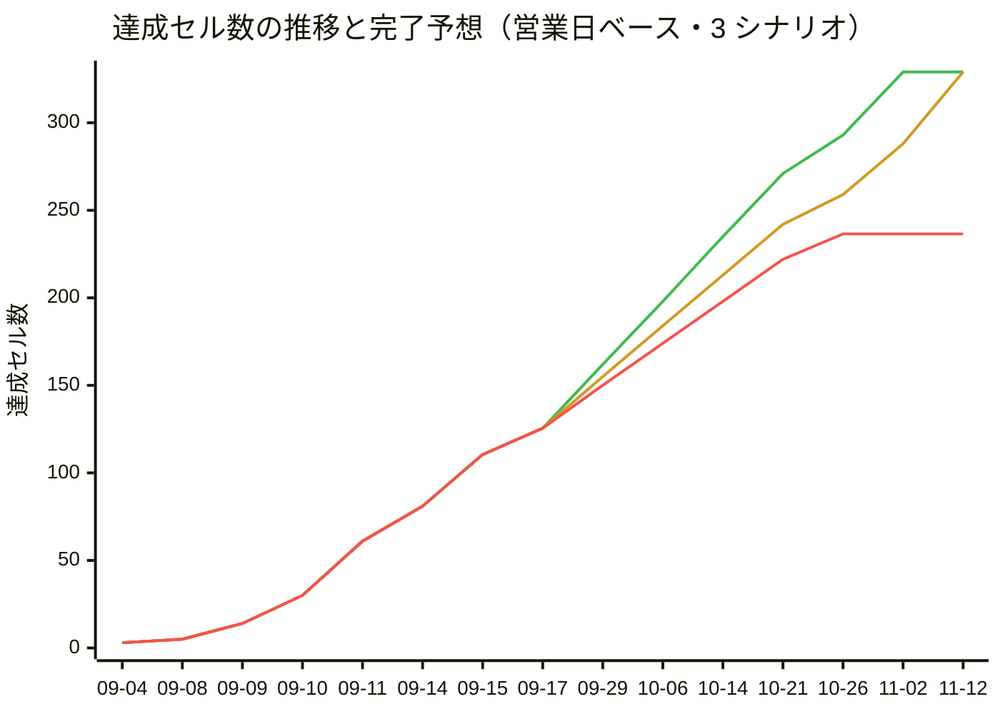

# 進捗一覧

- 生成: 2026-09-17 / `/progress-report`
- 分母: **モックリポジトリ** `../premarket-order-202609`（FastAPI + Jinja2。`python_app/templates/`）
- モック差分: 2026-09-17 まで確認済み / `aeda755`（モックのコミット日 2026-09-17）
- 判定基準: [.claude/skills/progress-report/criteria.md](../.claude/skills/progress-report/criteria.md)

**このファイルは `/progress-report` の出力。** 手で直してもよいが、次の実行で
完了日・更新日・`## 進捗の履歴` 以外は上書きされる。

## モックと開発環境の食い違い（分母はモック）

モックのサイドバーは **4 区分 21 項目**で、`src/components/layout/navigation.js` の 15 項目と次の差がある。

| 種別 | 対象 |
|---|---|
| モックにあり `navigation.js` に無い | `権限マスタ` / `手数料優遇マスタ` / `みずほ注文締` / 区分「運用管理」の 4 項目（`お知らせ管理` / `滞留注文抽出` / `操作ログ` / `障害管理`） |
| モックのサイドバーに無いがモックに画面がある | `新規注文`（`/orders/new`）/ `顧客詳細`（`/customers/{id}/summary`・`/customers/{id}/orders`）/ `仮計算`（顧客詳細のタブ）/ 注文の確認・完了・訂正・取消（`/orders/{id}/amend` ほか）/ CSV の確認・完了 |
| `navigation.js` にありモックに無い | なし（`ユーザマスタ` は 2026-09-17 に削除した。ユーザ情報は Entra ID 側で持つため画面が不要になった） |
| パスがずれている | 受注不可日マスタ: モック `/masters/blocked-dates` / 実装 `/masters/blackout-dates`（API の命名に合わせた）。約定照会: モック `/executions/` / 実装 `/executions` |

**今回から分母をモックの git（`python_app/templates` / `python_app/routers`）に切り替えた。**
これに伴い、モックに実体が無い 2 区分を分母から外している。

| 外した区分 | 理由 |
|---|---|
| `## 認証`（2 行） | モックに認証画面・導線が無い。`/` は `/customers/search` へ 302 で、ルータのコメントも「当面は認証を挟まず」。要件・モックが出たら行を立て直す |
| `## レスポンシブ対応`（4 行） | モックの画面ではなく横断の非機能要件。**サイドメニューの押し出し式開閉は `共通レイアウト / サイドメニュー` に取り込んだ**（`LAY-05〜09` / `UST-01〜07`）ので、達成は失われていない |

## モック差分（前回確認以降）

`f7e6f31` → `aeda755`（10 コミット / 29 ファイル）。**画面の増減は無く、すべて既存画面の変更。**

| 変更 | 画面 | モックでの変更内容 | いまの判定 | 対応 |
|---|---|---|---|---|
| 改名 | 残高補正 → 残高マスタ | サイドバー表記の変更 | ❌ | 行名を改名 |
| 追加 | 残高マスタ | 保有銘柄単位の「売却可へ / 売却不可へ」切替と操作ログ記録 | ❌ | **行を 1 本追加**（+4 セル） |
| 変更 | 障害管理 | 「発注停止 / 発注再開」を **IB送信制御 / 注文入力制御**の 2 ボタンに分離。状態遷移は現段階では実装しない旨を明記 | ❌ | 行名を改名（行数は同じ） |
| 変更 | 受注不可日マスタ / 海外休場日マスタ | From/To の**期間登録**（日別に展開）と操作列の縮小 | ✅ | モック更新あり・追随未確認 |
| 変更 | 銘柄マスタ | 銘柄コードを `A0001` 形式へ統一 | ✅ | モック更新あり・追随未確認 |
| 変更 | 権限マスタ | 操作ログ閲覧・管理者機能の権限を追加 | ❌ | 未実装のため注記のみ |
| 変更 | 注文照会 / 顧客別注文照会 | 「注文失敗」→「注文エラー」へ統一、エラー理由のホバー表示、送信日時列の追加 | ❌ | 未実装のため注記のみ |
| 変更 | 預り検索 / 顧客詳細 | 売却不可銘柄の売りボタン無効化とホバー説明、参考為替（USD/JPY）の表示、列順の入れ替え | ❌ | 未実装のため注記のみ |
| 変更 | 約定照会 | 元注文数量を一覧と CSV に追加 | ❌ | 未実装のため注記のみ |
| 変更 | 滞留注文抽出 | 注文エラー（別システム発注対象）と注文中を分離 | ❌ | 未実装のため注記のみ |
| 変更 | Dream登録状況 | 検索操作なしでも全明細を初期表示 | ❌ | 未実装のため注記のみ |

**実装済み（`✅`）の行はモックが変わっていても判定を下げない。** 実装が実際に古いかは
コードを読まないと判らず、自動で下げると進捗率が根拠なく揺れる。

## 凡例

| 記号 | 意味 | 集計での重み |
|---|---|---|
| `✅` | 完了。シナリオが全て `実装済` で、対応するテストがある | 1.0 |
| `🟡` | 一部のみ。機能の一部だけ実装、またはシナリオの一部が未着手 / 保留 | 0.5 |
| `❌` | 未着手。シナリオ文書もテストも無い | 0 |
| `—` | 対象外。分母から除外する | — |

完了日は `—` を除く 4 軸が全て `✅` になった最初の日。更新日はその後の改修で再び全軸が揃った日。

## 顧客

| 画面 | 機能名 | 実装 | UnitTest | E2E(MSW) | E2E(実API) | 完了日 | 更新日 | 補足 |
|---|---|---|---|---|---|---|---|---|
| 顧客検索 | 検索・結果一覧 | ❌ | ❌ | ❌ | ❌ | - | - | ルート未定義（`NotFoundView` に落ちる）。`navigation.js` に項目あり |
| 預り検索 | 検索・結果一覧 | ❌ | ❌ | ❌ | ❌ | - | - | ルート未定義。モックは受領済（`docs/mock/customers-holdings/`） |
| 預り検索 | 直接発注導線（買い / 売り） | ❌ | ❌ | ❌ | ❌ | - | - | 一覧の「操作」列から `/orders/new` へ銘柄・売買区分・口座区分をクエリで渡す |
| 預り検索 | 仮計算の導線 | ❌ | ❌ | ❌ | ❌ | - | - | 同じ「操作」列の 3 つめのボタン。顧客詳細の仮計算タブへ渡る |
| 顧客詳細 | 資産状況サマリ | ❌ | ❌ | ❌ | ❌ | - | - | モックの `/customers/{id}/summary`。サイドバー外（顧客マスタ・顧客検索から到達） |
| 顧客詳細 | 外株預りタブ（保有一覧） | ❌ | ❌ | ❌ | ❌ | - | - | CA 発生中の銘柄がある場合の警告表示を含む |
| 顧客詳細 | 注文入力タブ | ❌ | ❌ | ❌ | ❌ | - | - | 顧客を固定したまま注文入力へ入る |
| 顧客詳細 | 注文照会タブ | ❌ | ❌ | ❌ | ❌ | - | - | モックの `/customers/{id}/orders`。その顧客の注文だけを表示する |
| 顧客詳細 | 仮計算タブ | ❌ | ❌ | ❌ | ❌ | - | - | 発注前の概算（`provisional_calculation.html`）。独立画面ではなくタブ |

## 注文・照会

| 画面 | 機能名 | 実装 | UnitTest | E2E(MSW) | E2E(実API) | 完了日 | 更新日 | 補足 |
|---|---|---|---|---|---|---|---|---|
| 新規注文（外株注文入力） | 注文入力フォーム | ❌ | ❌ | ❌ | ❌ | - | - | ルート未定義。モックは受領済（`docs/mock/orders-new/`）。**モックは項目名を「ティッカーコード」へ変更済み** |
| 新規注文（外株注文入力） | 注文の送信 | ❌ | ❌ | ❌ | ❌ | - | - | 確認（`order_confirm`）→ 完了（`order_complete`）の 2 段階。強制承認フラグを伴う |
| CSV一括注文 | CSV ファイルの取込 | ❌ | ❌ | ❌ | ❌ | - | - | ルート未定義。モックは受領済（`docs/mock/orders-csv-upload/`）。部品の `FileDropZone` は実装・単体済 |
| CSV一括注文 | 取込内容の確認 | ❌ | ❌ | ❌ | ❌ | - | - | `order_csv_preview` → `order_csv_complete` |
| CSV一括注文 | テンプレートのダウンロード | ❌ | ❌ | ❌ | ❌ | - | - | モックは `/orders/csv/template` を返す |
| 注文照会 | 検索・結果一覧 | ❌ | ❌ | ❌ | ❌ | - | - | ルート未定義。出来状況で絞り込み。サイドバーに失敗件数のバッジが出る |
| 注文照会 | 注文訂正 | ❌ | ❌ | ❌ | ❌ | - | - | モックは `/orders/{id}/amend` の別画面 |
| 注文照会 | 注文取消 | ❌ | ❌ | ❌ | ❌ | - | - | モックは `/orders/{id}/cancel` の別画面 |
| Dream登録状況 | 検索・一覧 | ❌ | ❌ | ❌ | ❌ | - | - | ルート未定義。登録状況 / 登録日時 / Dream受付番号 / エラー内容で絞り込み |
| Dream登録状況 | STS変更 | ❌ | ❌ | ❌ | ❌ | - | - | 行ごとのプルダウンで登録待ち / 登録済み / 登録エラー / 取消済を切り替える |
| 約定照会 | 検索・結果一覧 | ❌ | ❌ | ❌ | ❌ | - | - | ルート未定義。一部出来 / 全部出来 / 取消済（出来有）だけを表示する |
| 約定照会 | CSV 出力 | ❌ | ❌ | ❌ | ❌ | - | - | モックは `/executions/export/csv` |
| みずほ注文締 | 検索・結果一覧 | ❌ | ❌ | ❌ | ❌ | - | - | `navigation.js` に項目なし・ルート未定義。約定照会と同じ列を預託先で絞る |
| みずほ注文締 | 注文締め・締め解除 | ❌ | ❌ | ❌ | ❌ | - | - | **`f7e6f31` で追加**。受付中／締め済の状態表示・確認ダイアログ・直近 3 件の履歴 |
| みずほ注文締 | CSV 出力 | ❌ | ❌ | ❌ | ❌ | - | - | モックは `/executions/mizuho-operations/export/csv` |

## マスタメンテ

| 画面 | 機能名 | 実装 | UnitTest | E2E(MSW) | E2E(実API) | 完了日 | 更新日 | 補足 |
|---|---|---|---|---|---|---|---|---|
| 顧客マスタ | 一覧・検索 | ✅ | ✅ | ✅ | ❌ | - | - | `CU-01〜15` / `CLV` / `CUS` / `CUA` / `CDA` / `CDS`。実 API E2E のシナリオが未作成。米国株評価額 / 評価損益は API に項目が無く常に `—` |
| 顧客マスタ | 新規登録 | ❌ | ❌ | ❌ | ❌ | - | - | 画面はいま読むだけ（`CU-11`）。モックには導線がある |
| 顧客マスタ | 編集 | ❌ | ❌ | ❌ | ❌ | - | - | 同上。削除の導線はモックに無い |
| 権限マスタ | ロール別権限一覧 | ❌ | ❌ | ❌ | ❌ | - | - | **`navigation.js` に項目なし**・ルート未定義 |
| 権限マスタ | 権限の編集・保存 | ❌ | ❌ | ❌ | ❌ | - | - | 発注権限 / マスタ更新権限 / 発注停止権限の 3 つ。更新は管理責任者だけ |
| 銘柄マスタ | 一覧・検索 | ✅ | ✅ | ✅ | ❌ | - | - | `SM-01〜12` / `STV` / `STS` / `STA` / `STT`。実 API E2E のシナリオが未作成。検索欄は銘柄コード / Ticker にだけ当たる |
| 銘柄マスタ | 新規追加 | ✅ | ✅ | ✅ | ❌ | - | - | `SM-13〜20` / `STV`。2026-09-15 に実装。実 API E2E のシナリオが未作成 |
| 銘柄マスタ | 編集 | ✅ | ✅ | ✅ | ❌ | - | - | `SM-21〜27`。2026-09-16 に実装。主キーは `id`。実 API E2E のシナリオが未作成 |
| 銘柄マスタ | 削除 | ✅ | ✅ | ✅ | ❌ | - | - | `SM-30〜34`。2026-09-16 に実装。実 API E2E のシナリオが未作成 |
| 為替マスタ | 現在レートの表示 | ❌ | ❌ | ❌ | ❌ | - | - | ルート未定義。USD/JPY の現在レート・取込日時・適用日 |
| 為替マスタ | レート更新 | ❌ | ❌ | ❌ | ❌ | - | - | ルート未定義。レート / 適用日 / 備考 |
| 手数料優遇マスタ | 一覧の表示枠 | ❌ | ❌ | ❌ | ❌ | - | - | モック自体が「設定内容は要件整理中」で、一覧・検索・登録・編集は要件確定後に追加される。`navigation.js` に項目なし・ルート未定義 |
| スライス基準マスタ | 現在値の表示 | ✅ | ✅ | ✅ | ✅ | 2026-09-11 | - | `SC-01/02` / `SCV` / `SCS` / `SCR-01/02`。**実 API に接続済み** |
| スライス基準マスタ | 設定の保存 | ✅ | ✅ | ✅ | ✅ | 2026-09-11 | - | `SC-03/04` / `SCR-03〜07`。**実 API に接続済み** |
| CAマスタ | 一覧・検索 | ✅ | ✅ | ✅ | ❌ | - | - | `CA-01〜10` / `CAV` / `CAS` / `CAA` / `CAT`。実 API E2E のシナリオが未作成。**ステータス列は 2026-09-16 にいったん入れて取り消した**（API に項目が無い） |
| CAマスタ | 新規追加 | ✅ | ✅ | ✅ | ❌ | - | - | `CA-11〜17`。実 API E2E のシナリオが未作成 |
| CAマスタ | 編集 | ✅ | ✅ | ✅ | ❌ | - | - | `CA-18〜21`。全項目を変更でき、更新日時による楽観的ロック付き。実 API E2E のシナリオが未作成 |
| CAマスタ | 削除 | ✅ | ✅ | ✅ | ❌ | - | - | `CA-22〜27`。論理削除（取消区分）。実 API E2E のシナリオが未作成 |
| 受注不可日マスタ | 一覧・検索 | ✅ | ✅ | ✅ | ✅ | 2026-09-11 | - | `BD-01〜10` / `BDL` / `BDS` / `BDR-01〜03`。**実 API に接続済み** |
| 受注不可日マスタ | 新規追加 | ✅ | ✅ | ✅ | 🟡 | 2026-09-11 | - | `BD-11〜18` / `BDR-04/05/09`。事前検証の 3 系統のエラー出し分けまで担保。**実 API 側は `BDR-04/05/09` が保留**（API が id を返さず行を特定できない）ため一度揃った 4 軸が崩れた。完了日は残す |
| 受注不可日マスタ | 編集 | ✅ | ✅ | ✅ | 🟡 | - | - | `BD-24〜30`。実 API 側は `BDR-06/07` とも **保留**（`BDR-07` は日付変更、`BDR-06` は id 未返却） |
| 受注不可日マスタ | 削除 | ✅ | ✅ | ✅ | 🟡 | 2026-09-11 | - | `BD-19〜23`。実 API 側は `BDR-08` が **保留**（id 未返却）。完了日は残す |
| 海外休場日マスタ | 一覧・検索 | ✅ | ✅ | ✅ | ✅ | 2026-09-10 | - | `MH-01〜07/17〜21` / `MR-01〜03` / `MHT`。**実 API に接続済み**。モックに無い「休場区分」も実装済み |
| 海外休場日マスタ | 新規追加（再有効化を含む） | ✅ | ✅ | ✅ | 🟡 | 2026-09-10 | - | `MH-08〜11/22/23`。実 API 側は `MR-04/05/07/08` が **保留**（id 未返却）。完了日は残す |
| 海外休場日マスタ | 削除 | ✅ | ✅ | ✅ | 🟡 | 2026-09-10 | - | `MH-12〜16`。実 API 側は `MR-06` が **保留**（id 未返却）。完了日は残す |
| 残高マスタ | 保有残高の一覧・検索 | ❌ | ❌ | ❌ | ❌ | - | - | ルート未定義 |
| 残高マスタ | 残高を補正（数量の加算） | ❌ | ❌ | ❌ | ❌ | - | - | 確認 → 確定の 2 段階 |
| 残高マスタ | 新規保有を追加 | ❌ | ❌ | ❌ | ❌ | - | - | 顧客・ティッカー・口座区分・加算数量を指定 |
| 残高マスタ | 売却不可区分の切替 | ❌ | ❌ | ❌ | ❌ | - | - | **モックの `9b0762d` で追加**。保有銘柄単位に「売却可へ / 売却不可へ」を切り替え、操作ログに残す。売却不可の銘柄は顧客詳細・預り検索で売りボタンが無効になる |

## 運用管理

モックのサイドバーにある区分。**`navigation.js` に区分そのものが無い。**
4 画面とも別 worktree で着手済みだが、**いずれも未コミットのため判定は上げていない**。

| 画面 | 機能名 | 実装 | UnitTest | E2E(MSW) | E2E(実API) | 完了日 | 更新日 | 補足 |
|---|---|---|---|---|---|---|---|---|
| お知らせ管理 | お知らせの更新（表示切替・本文） | ❌ | ❌ | ❌ | ❌ | - | - | `claude/announcements-screen-ui-06c368` で作業中（未コミット 9 件） |
| お知らせ管理 | 更新履歴 | ❌ | ❌ | ❌ | ❌ | - | - | 変更前 / 変更後 / 更新者の履歴表 |
| 滞留注文抽出 | 検索・一覧 | ❌ | ❌ | ❌ | ❌ | - | - | `claude/stalled-order-extraction-ui-4261c4` で作業中（未コミット 14 件） |
| 滞留注文抽出 | 滞留注文の CSV 出力 | ❌ | ❌ | ❌ | ❌ | - | - | 検索条件を引き継いで TWS 手動投入用の CSV を出す |
| 滞留注文抽出 | TWS投入CSV サンプルのダウンロード | ❌ | ❌ | ❌ | ❌ | - | - | 書式確認用の固定サンプル |
| 滞留注文抽出 | コンファメーションCSV の取込 | ❌ | ❌ | ❌ | ❌ | - | - | 取込して注文照会へ反映する |
| 滞留注文抽出 | コンファメーションCSV サンプルのダウンロード | ❌ | ❌ | ❌ | ❌ | - | - | 取込側の書式確認用 |
| 操作ログ | 一覧・検索 | ❌ | ❌ | ❌ | ❌ | - | - | `claude/operations-activity-logs-ui-77349d` で作業中（未コミット 9 件）。モックは期間 / 操作者 / 操作区分 / 対象機能 / 結果で絞り込む |
| 障害管理 | IB送信制御 | ❌ | ❌ | ❌ | ❌ | - | - | `claude/incident-management-ui-8d1a06` で作業中（未コミット）。**モックの `9b0762d` で「発注停止 / 発注再開」から改まった**。現段階では状態遷移を実装しない旨がモックに明記 |
| 障害管理 | 注文入力制御 | ❌ | ❌ | ❌ | ❌ | - | - | 同上。IB送信制御とは別ボタンに分かれた |
| 障害管理 | 障害対応履歴 | ❌ | ❌ | ❌ | ❌ | - | - | 変更前 / 変更後 / 更新者の履歴表 |

## 共通基盤

画面を持たない区分。画面列には区分名を入れている。

| 画面 | 機能名 | 実装 | UnitTest | E2E(MSW) | E2E(実API) | 完了日 | 更新日 | 補足 |
|---|---|---|---|---|---|---|---|---|
| 共通レイアウト | サイドメニュー | ✅ | ✅ | ✅ | — | 2026-09-09 | 2026-09-16 | `LAY-01/03〜09` / `ASB` / `UST`。**押し出し式の開閉を 2026-09-16 に追加**（幅・再読み込み後の保持・フォーカス制御まで E2E 済み） |
| 共通レイアウト | ヘッダの画面見出し | ✅ | ✅ | ✅ | — | 2026-09-09 | - | `LAY-02` / `AHD`。`router` の `meta.title` 由来 |
| 共通レイアウト | 市場ステータス表示 | ✅ | ✅ | ✅ | — | 2026-09-09 | 2026-09-15 | `AHD` / `MKS` / `UMS`。`useMarketStatus` + `utils/marketStatus` |
| 共通レイアウト | 市場取引時間の表示 | ❌ | ❌ | ❌ | — | - | - | ヘッダに米国市場の取引時間帯（プレマーケット / レギュラー / アフター）を現地時刻と日本時刻で出す。既存の `市場ステータス表示` は開場 / 閉場の状態だけで、時間帯そのものは未表示。要件指示（モック外） |
| アクセス制御 | 権限によるアクセス制限 | ❌ | ❌ | ❌ | ❌ | - | - | ロール（発注権限 / マスタ更新権限 / 発注停止権限）でメニュー・ルート・操作ボタンを出し分ける。`権限マスタ` の実装と対。権限外は画面を開けない。要件指示（モック外） |
| 共通レイアウト | 読み込みオーバーレイ | ✅ | ✅ | ❌ | — | - | - | `AppLoadingOverlay.vue` と `docs/unit/components-layout-app-loading-overlay.md`。E2E の受け入れ条件がまだ無い |
| UI 部品 | `components/ui/` の 15 部品 | ✅ | ✅ | ✅ | — | 2026-09-04 | 2026-09-16 | 15 本すべてに spec と `docs/unit/` があり 4 軸の状態が同じなので 1 行に畳んである。E2E はカタログが開けることのみ |
| マスタ共通部品 | 検索カード（`MasterSearchCard`） | ✅ | ✅ | — | — | 2026-09-17 | - | `MSC`。2026-09-17 にシナリオとテストが入った（`6385886`） |
| マスタ共通部品 | 一覧カード（`MasterListCard`） | ✅ | ✅ | — | — | 2026-09-17 | - | `MLC`。同上 |
| マスタ共通部品 | 追加・編集ダイアログ（`MasterFormDialog`） | ✅ | ✅ | — | — | 2026-09-17 | - | `MFD`。同上 |
| マスタ共通部品 | 削除確認（`ConfirmDeleteDialog`） | ✅ | ✅ | — | — | 2026-09-17 | - | `CDD-01〜13`。同上 |
| 共通ロジック | `useAsync` | ✅ | ✅ | — | — | 2026-09-14 | - | `UAS-01〜17` |
| 共通ロジック | `useCrudList` | ✅ | ✅ | — | — | 2026-09-14 | - | `UCL-01〜43`。受注不可日・海外休場日・CA・銘柄の 4 画面で共用 |
| 共通ロジック | `useListQuery` | ✅ | ✅ | — | — | 2026-09-14 | - | `ULQ-01〜19`。URL クエリと一覧状態の同期 |
| 共通ロジック | `useMarketStatus` | ✅ | ✅ | — | — | 2026-09-15 | - | `UMS-01〜06` |
| 共通ロジック | `useSidebarToggle` | ✅ | ✅ | — | — | 2026-09-16 | - | `UST-01〜07`。開閉状態の保持。**今回の新規行** |
| ユーティリティ | `utils/format.js` | ✅ | ✅ | — | — | 2026-09-14 | - | `FMT-01〜11` |
| ユーティリティ | `utils/marketStatus.js` | ✅ | ✅ | — | — | 2026-09-08 | - | `MKS-01〜13` |
| ユーティリティ | `utils/queryParams.js` | ✅ | ✅ | — | — | 2026-09-11 | - | `QRY-01〜08` |
| ユーティリティ | `utils/marketHolidayTypes.js` | ✅ | ✅ | — | — | 2026-09-10 | - | `MHT-01〜07` |
| ユーティリティ | `utils/caTypes.js` | ✅ | ✅ | — | — | 2026-09-11 | - | `CAT` |
| ユーティリティ | `utils/symbolTypes.js` | ✅ | ✅ | — | — | 2026-09-14 | - | `STT-01〜05` |
| ユーティリティ | `utils/apiEnums.js` | ✅ | ✅ | — | — | 2026-09-15 | - | OpenAPI の区分値 21 種の写し。`openapi.json` と突き合わせるテスト付き。**今回の新規行** |
| API クライアント層 | `api/client.js` | ✅ | ✅ | — | — | 2026-09-14 | - | `CLA-01〜16`。`normalizeError` を含む |
| API クライアント層 | `api/orders.js` | ✅ | ✅ | — | — | 2026-09-14 | - | `ORA-01〜10`。`toOrder()` の変換を担保 |
| API クライアント層 | `api/blackoutDates.js` | ✅ | ✅ | — | — | 2026-09-11 | - | `BDA` |
| API クライアント層 | `api/sliceCriteria.js` | ✅ | ✅ | — | — | 2026-09-11 | - | `SCA` |
| API クライアント層 | `api/marketHolidays.js` | ✅ | ✅ | — | — | 2026-09-10 | - | `MHA` |
| API クライアント層 | `api/ca.js` | ✅ | ✅ | — | — | 2026-09-11 | - | `CAA` |
| API クライアント層 | `api/codes.js` | ✅ | ✅ | — | — | 2026-09-14 | - | `CDA-01〜07` |
| API クライアント層 | `api/customers.js` | ✅ | ✅ | — | — | 2026-09-14 | - | `CUA-01〜14` |
| API クライアント層 | `api/symbols.js` | ✅ | ✅ | — | — | 2026-09-14 | 2026-09-16 | `STA-01〜12`。`symbol` クエリ名と `id` 主キーへの追随を含む |
| MSW モック基盤 | handlers / fixtures | ✅ | — | — | — | 2026-09-11 | 2026-09-16 | ブラウザ・単体・E2E で共用。API が実装されたら該当ハンドラを削除する。単体・E2E の直接の対象ではないため `—` で、実装のみで完了とみなす |

## 対象外の画面（集計に含めない）

**モックに無い画面。納品対象ではないので進捗の分母から外す。**

| 画面 | 機能名 | 実装 | UnitTest | E2E(MSW) | E2E(実API) | 完了日 | 更新日 | 補足 |
|---|---|---|---|---|---|---|---|---|
| 注文一覧（`/`） | 一覧表示 | ✅ | ✅ | ✅ | ❌ | - | - | 縦串の参考実装で、実仕様が来たら差し替える前提のため対象外。`OL` / `OLV` / `OST` |
| UI カタログ（`/dev/ui-catalog`） | 部品の一覧表示 | ✅ | ❌ | ✅ | — | - | - | 開発用ページ（業務画面ではない）のため対象外。`UC-01/02` |

## 集計

**進捗は行ではなく「行 × 軸のセル」で数える。**

- **有効セル** = その行の 4 軸のうち `—`（対象外）でないセルの数
- **達成セル** = `✅` 1.0 + `🟡` 0.5（`❌` は 0）
- **残セル** = 有効セル − 達成セル、**進捗率** = 達成セル ÷ 有効セル
- **完了行** = `—` を除く全軸が `✅` の行

「対象外の画面」の 2 行は行ごと数えない。

| 区分 | 行数 | 実装 `✅` | UnitTest `✅` | E2E(MSW) `✅` | E2E(実API) `✅` | 有効セル | 達成セル | 残セル | 進捗率 | 完了行 |
|---|---|---|---|---|---|---|---|---|---|---|
| 顧客 | 9 | 0 | 0 | 0 | 0 | 36 | 0.0 | 36.0 | 0% | 0 |
| 注文・照会 | 15 | 0 | 0 | 0 | 0 | 60 | 0.0 | 60.0 | 0% | 0 |
| マスタメンテ | 29 | 18 | 18 | 18 | 4 | 116 | 60.5 | 55.5 | 52% | 4 |
| 運用管理 | 11 | 0 | 0 | 0 | 0 | 44 | 0.0 | 44.0 | 0% | 0 |
| 共通基盤 | 33 | 31 | 30 | 4 | 0 | 73 | 65.0 | 8.0 | 89% | 30 |
| **合計** | **97** | **49** | **48** | **22** | **4** | **329** | **125.5** | **203.5** | **38%** | **34** |

軸ごとの進捗率。**分母はその軸が `—` の行を除いた数**、`達成` = `✅` + 0.5 × `🟡`。

| 軸 | 分母 | `✅` | `🟡` | 達成 | 残 | 進捗率 |
|---|---|---|---|---|---|---|
| 実装 | 97 | 49 | 0 | 49.0 | 48.0 | 51% |
| UnitTest | 96 | 48 | 0 | 48.0 | 48.0 | 50% |
| E2E(MSW) | 71 | 22 | 0 | 22.0 | 49.0 | 31% |
| E2E(実API) | 65 | 4 | 5 | 6.5 | 58.5 | 10% |

4 軸の分母を足すと有効セルになる（97 + 96 + 71 + 65 = 329）。**合わない回は
どこかの区分合計が古い。**

> **達成セルが前回より 2.0 減っている。** 実 API E2E の書き込み系 11 本
> （`BDR-04〜09` / `MR-04〜08`）が **1 つの原因**でまとめて `保留` になったため
> （実 API が `BlackoutDateItem` / `HolidayItem` に id を返さない）。
> **フロントの手が止まったのではない。** 完了日は criteria.md に従って残してある。

## 残作業の内訳

**残セルは 1 つずつ中身が違うので、そのまま速度で割れない。** 残セルを持つ行に
作業類型（過去の実績が使えるか）とバックエンド成熟度（そもそも着手できるか）を付ける。
定義は [criteria.md](../.claude/skills/progress-report/criteria.md) の「残作業の分類」。

成熟度は `A` 確定 / `B` 型のみ / `C` 中身が未定義 / `D` パス無し / `—` API 不要。
`C` `D`・要件未確定・`## バックエンド待ち` に載っている行が**ブロック残**。

| 画面 / 機能 | 残セル | 類型 | 根拠 | 成熟度 | 引き当てたパス | ブロック理由 |
|---|---|---|---|---|---|---|
| 顧客検索 / 検索・結果一覧 | 4.0 | 検索一覧 | 実測 | B | `/masters/customers`・`/branches`・`/handlers` | - |
| 預り検索 / 一覧と操作列の導線（3 行） | 12.0 | 検索一覧 | 実測 | B | `/holdings` | - |
| 顧客詳細 / サマリ・外株預り・仮計算（3 行） | 12.0 | タブ詳細 | **仮定** | B | `/balances/{account_no}`・`/holdings`・`/calculations` | - |
| 顧客詳細 / 注文入力タブ | 4.0 | 入力フォーム | **仮定** | C | `GET /customers`・`/codes` | レスポンス未定義 |
| 顧客詳細 / 注文照会タブ | 4.0 | タブ詳細 | **仮定** | C | `GET /orders/{order_id}` | レスポンス未定義 |
| 新規注文 / 注文入力フォーム | 4.0 | 入力フォーム | **仮定** | C | `GET /customers`・`/codes` | レスポンス未定義 |
| 新規注文 / 注文の送信 | 4.0 | 入力フォーム | **仮定** | B | `POST /orders`・`/orders/validate` | - |
| CSV一括注文 / 取込・確認・テンプレDL（3 行） | 12.0 | ファイル取込 | **仮定** | B | `/orders/validate-csv`・`/orders/bulk-create`・`/orders/csv-template` | - |
| 注文照会 / 検索・結果一覧 | 4.0 | 検索一覧 | 実測 | B | `GET /orders` | - |
| 注文照会 / 注文取消 | 4.0 | 運用操作 | **仮定** | B | `/orders/{order_id}/cancel` | - |
| 注文照会 / 注文訂正 | 4.0 | 運用操作 | **仮定** | D | 該当なし（`/orders/{order_id}/dream-correct` は Dream 用） | パス無し |
| Dream登録状況 / 検索・一覧 | 4.0 | 検索一覧 | 実測 | B | `/orders/dream-status` | - |
| Dream登録状況 / STS変更 | 4.0 | 運用操作 | **仮定** | B | `/orders/dream-status/{order_id}` | - |
| 約定照会 / 検索・結果一覧 | 4.0 | 検索一覧 | 実測 | D | 該当なし（`/executions` 系が無い） | パス無し |
| 約定照会 / CSV 出力 | 4.0 | ファイル取込 | **仮定** | D | 該当なし | パス無し |
| みずほ注文締 / 検索・結果一覧 | 4.0 | 検索一覧 | 実測 | C | `/mizuho/orders` | レスポンス未定義 |
| みずほ注文締 / 注文締め・締め解除 | 4.0 | 運用操作 | **仮定** | B | `/closing/status`・`/closing/mizuho`・`/closing/mizuho/reset` | - |
| みずほ注文締 / CSV 出力 | 4.0 | ファイル取込 | **仮定** | C | `/mizuho/export-orders` | レスポンス未定義 |
| 顧客マスタ / 一覧・検索の実 API E2E | 1.0 | 実API追加 | 実測 | A | `/masters/customers` | - |
| CAマスタ / 実 API E2E（4 行） | 4.0 | 実API追加 | 実測 | A | `/masters/ca` | - |
| 銘柄マスタ / 一覧・新規追加の実 API E2E（2 行） | 2.0 | 実API追加 | 実測 | A | `/masters/symbols` | - |
| 銘柄マスタ / 編集・削除の実 API E2E（2 行） | 2.0 | 実API追加 | 実測 | B | `/masters/symbols/{symbol}` | **バックエンド待ち**（id 主キー・部分更新） |
| 受注不可日マスタ / 新規追加・編集・削除の実 API E2E（3 行） | 1.5 | 実API追加 | 実測 | B | `/masters/blackout-dates` 配下 | **バックエンド待ち**（id 未返却・`BDR-04〜09`） |
| 海外休場日マスタ / 新規追加・削除の実 API E2E（2 行） | 1.0 | 実API追加 | 実測 | B | `/masters/market-holidays` 配下 | **バックエンド待ち**（id 未返却・`MR-04〜08`） |
| 顧客マスタ / 新規登録・編集（2 行） | 8.0 | CRUDマスタ | 実測 | A | `POST /masters/customers`・`PUT /masters/customers/{account_no}` | - |
| 為替マスタ / 表示・更新（2 行） | 8.0 | CRUDマスタ | 実測 | A | `/masters/fx`・`/masters/fx/latest` | - |
| 残高マスタ / 一覧・補正・新規・売却不可区分（4 行） | 16.0 | CRUDマスタ | 実測 | A | `/masters/balance-adjustments` | - |
| 権限マスタ / 一覧・編集（2 行） | 8.0 | CRUDマスタ | 実測 | D | 該当なし（権限・ロールのパスが無い） | パス無し |
| 手数料優遇マスタ / 一覧の表示枠 | 4.0 | CRUDマスタ | 実測 | A | `/masters/fee-preferences` | **要件未確定**（モックが「要件整理中」） |
| 操作ログ / 一覧・検索 | 4.0 | 検索一覧 | 実測 | B | `/operations/activity-logs`・`/operations/activity-logs/targets` | - |
| 滞留注文抽出 / コンファメーションCSV の取込 | 4.0 | ファイル取込 | **仮定** | C | `/mizuho/import-confirmation`・`/mizuho/validate-confirmation` | レスポンス未定義 |
| 滞留注文抽出 / 検索・一覧 | 4.0 | 検索一覧 | 実測 | D | 該当なし | パス無し |
| 滞留注文抽出 / CSV 出力・サンプル 2 種（3 行） | 12.0 | ファイル取込 | **仮定** | D | 該当なし | パス無し |
| お知らせ管理 / 更新・履歴（2 行） | 8.0 | 運用操作 | **仮定** | D | 該当なし | パス無し |
| 障害管理 / IB送信制御・注文入力制御・履歴（3 行） | 12.0 | 運用操作 | **仮定** | D | 該当なし（発注停止のパスが無い） | パス無し |
| 共通レイアウト / 市場取引時間の表示 | 3.0 | 共通部品 | 実測 | — | API 不要（クライアント側で算出） | - |
| 共通レイアウト / 読み込みオーバーレイの E2E(MSW) | 1.0 | 共通部品 | 実測 | — | API 不要 | - |
| アクセス制御 / 権限によるアクセス制限 | 4.0 | 運用操作 | **仮定** | D | 該当なし（権限 API が無い） | パス無し |

### 2 通りの割り方

どちらの合計も `## 集計` の残セル **203.5** と一致する。

| 割り方 | 内訳 | セル | 割合 |
|---|---|---|---|
| 着手可能残 | `A` / `B` / `—` かつ 要件確定・待ち無し | **111.0** | 55% |
| ブロック残 | `C` / `D` + 要件未確定 + バックエンド待ち | **92.5** | **45%** |
| 実測系 | 根拠が `実測` の類型（実API追加 / CRUDマスタ / 検索一覧 / 共通部品） | 99.5 | 49% |
| 仮定系 | 根拠が `仮定` の類型（入力フォーム / タブ詳細 / ファイル取込 / 運用操作） | 104.0 | 51% |

**残りの 45% はいま人を増やしても消化できない。** ブロック残 92.5 セルの最大は
運用管理 40.0（お知らせ管理・障害管理・滞留注文の API が `openapi.json` に無い）、
次が 注文・照会 24.0（約定照会の `/executions` 系が無い、`GET /orders/{order_id}` と
`/mizuho/*` の中身が未定義）、マスタメンテ 16.5。

**マスタメンテのブロック残 16.5 のうち 4.5 は「一度 `✅` にした行が待ちで戻ったぶん」**
（受注不可日 1.5 / 海外休場日 1.0 / 銘柄 2.0）。いずれも id 未返却という**同じ 1 つの原因**。

### 手戻りの実測（予想には足さない）

仕様の取り込みで**既に `✅` のセルを作り直した**量。行の粒度で数えた概算。

| 取り込み | 追随コミット | 作り直したセル | その時の達成セル | 手戻り率 |
|---|---|---|---|---|
| 2026-09-15（`/masters/` パス移行・クエリ名の日本語→英語） | `f7ed2c5` / `d9f191b` / `ac3a924` / `b20c24a` | 約 33.0（API クライアント層 6 行 12.0 + マスタ 6 画面の一覧・検索 約 21.0） | 110.5 | **約 30%** |
| 2026-09-16（`stock_code` → `symbol`・CA ステータス項目の取り消し） | `13184a6` / `073dead` | 7.0（`api/ca.js` 2.0 + `api/symbols.js` 2.0 + CAマスタ 一覧・検索 3.0） | 約 123.5 | **約 6%** |
| 2026-09-17（主キーの id 化） | `baabd84` / `91467de` | 判定が下がったのは 2.0 セルだが、**作り直しは 6 画面ぶん**（主キーの付け替えは全実装済みマスタに及ぶ） | 127.5 | 計測中 |

`c0f873a`（CAマスタにステータス項目を追加）→ `073dead`（同じ日に取り消し）は、
**API にその項目が無いために作って壊した**純粋な手戻り。

**この量を完了予想に別枠で足していない。** 下の速度 `v` は 2026-09-15 → 09-17 の実績で、
この期間に上の手戻りが含まれている。足すと二重計上になる。

## 進捗の履歴

実行ごとのスナップショット。**過去行は書き換えない**（次の実行はここに 1 行足すだけ）。
下の折れ線はこの表だけを実績データにしている。

| 生成日 | 行数 | 有効セル | 達成セル | 進捗率 | 備考 |
|---|---|---|---|---|---|
| 2026-09-04 | - | - | 3.0 | - | 推定（完了日から遡って算出） |
| 2026-09-08 | - | - | 5.0 | - | 推定 |
| 2026-09-09 | - | - | 14.0 | - | 推定 |
| 2026-09-10 | - | - | 30.0 | - | 推定 |
| 2026-09-11 | - | - | 61.0 | - | 推定 |
| 2026-09-14 | 91 | - | 81.0 | - | 推定（当時の集計は行ベース 21/91 行） |
| 2026-09-15 | 95 | 321 | 110.5 | 34% | 実測（セル単位の集計を導入した初回） |
| 2026-09-17 | 97 | 329 | 125.5 | 38% | 実測。モックの `aeda755` まで取り込み（残高補正→残高マスタ改称・売却不可区分で +1 行、障害管理のボタン分離で改名）。**実 API E2E の書き込み系 11 本が id 未返却で一斉に保留になり、達成セルは 127.5 → 125.5 へ後退**（同日 2 回目の実行のため上書き） |

**`推定` の行は完了日から遡って作った種で、部分達成を数えていないため過小。**
速度は実測行（2026-09-15 以降）だけで取る。

## バックエンド待ち

**フロントの手では動かせない依存。** 発生日・解消日は完了日と同じ引き継ぎ規律で、
過去行は書き換えない。ここに載っている行は `## 残作業の内訳` で**ブロック残**に入れる。

| 発生日 | 解消日 | 影響する行 | 内容 | 状態 |
|---|---|---|---|---|
| 2026-09-11 | - | 受注不可日マスタ / 編集 | 編集で日付を変えても API 側が元の `受注不可日` を上書きするため、備考しか変更できない（`BDR-07` 保留） | 待ち |
| 2026-09-16 | - | 銘柄マスタ / 編集・削除 | 主キーが `id` になったが実 API の詳細照会・更新履歴は `/masters/symbols/{symbol}` のまま。`id` が空の行を編集・削除できない | 待ち |
| 2026-09-16 | - | 銘柄マスタ / 編集 | 更新で送らなかった項目（`市場名` / `前日出来高` / `Pre区分`）を保つかがバックエンドで**確認中**（`docs/e2e/symbols.md`）。2026-09-16 の取り込みで `*UpdateRequest`（部分更新）が入っており、解消している可能性があるが未確認 | 待ち |
| 2026-09-17 | - | 受注不可日マスタ / 新規追加・編集・削除・海外休場日マスタ / 新規追加・削除 | 実 API が `BlackoutDateItem` / `HolidayItem` に **id を返さない**ため、id に寄せたフロントから当てると行を `data-testid` で特定できない。`BDR-04〜09` / `MR-04〜08` の 11 本を保留にした（`91467de`） | 待ち |

**未解消 4 件・最長 4 営業日経過（上限不明）。** 解消した行が 1 つも無いので、
**1 往復あたりのリードタイムはまだ実測できていない**（推測値は置かない）。
最初の解消が入った回に、`発生日 → 解消日` の営業日数をここに書く。

**4 件のうち 3 件が「主キーを id に寄せたが API が id を返さない」という同じ原因。**
この 1 件が解けると 4.5 セルが即座に戻る。

## 進捗の推移と完了予想

**速度も予想も営業日で数える**（土日祝は作業しない）。営業日の定義と祝日表は
[.claude/skills/progress-report/holidays.md](../.claude/skills/progress-report/holidays.md)。
x 軸の未来側の点はすべて営業日で、9/21・9/22・9/23・10/12・11/3 は飛ばしてある。

`line` は上から 4 本。**1 本目が実績**で、**残り 3 本が予想**。

| `line` の順 | 色 | 中身 |
|---|---|---|
| 1 本目 | 青 `#2f6feb` | 実績（`## 進捗の履歴` の達成セル） |
| 2 本目 | 緑 `#3fb950` | 予想・楽観 |
| 3 本目 | 橙 `#d29922` | 予想・中央 |
| 4 本目 | 赤 `#f85149` | 予想・悲観 |

予想の 3 本は 09-17 までは実績と重なっており、外挿はそれ以降だけ。

**赤が 10-26 で寝ているのがこの図の要点。** バックエンドの穴が埋まらなければ、
こちらがどれだけ手を動かしても 236.5 セル（72%）で頭打ちになる。

- 現在: **125.5 / 329 セル**（38%）。うち完了行は 34 / 97 行
- 内訳: **着手可能残 111.0 セル / ブロック残 92.5 セル**（残りの **45%** がバックエンド待ち）
- 平均速度: **7.5 セル/営業日 ≒ 37.5 セル/週**（起点 2026-09-15(火) から 2 営業日で 15.0 セル）。
  参考: 全期間平均は **7.84 セル/営業日**（08-27 から 16 営業日で 125.5 セル）でよく一致する
- 到達予想: 楽観 **2026-11-02（月）** / 中央 **2026-11-12（木）** /
  悲観 **到達不能（バックエンド律速）** — 2026-10-26（月）に 236.5 / 329 セル（72%）で頭打ち

| シナリオ | 仮定類型の倍率 | ブロック残 | 換算工数 | 所要 | 到達 |
|---|---|---|---|---|---|
| 楽観 | 1.0 | 作業に追いつく速さで解消 | 99.5 + 104.0 × 1.0 = 203.5 | 28 営業日 | 2026-11-02（月） |
| 中央 | 1.5 | 解消するが作業順の制約になる | 99.5 + 104.0 × 1.5 = 255.5 | 35 営業日 | 2026-11-12（木） |
| 悲観 | 2.5 | **解消しない** | 71.0 + 40.0 × 2.5 = 171.0 | 23 営業日 | **到達不能** — 10-26 に 72% で頭打ち |

幅の根拠は**日次のばらつきではなく、未経験類型の単価とバックエンドの穴**。
日次のばらつきから幅を作ると ±2 営業日程度の狭い帯しか出ず、実態より精度が高く見える。

前提は 3 つ。

- **分母が増えれば後ろへ動く。** 今回もモックの `aeda755` で 1 行（4 セル）増えた
- **仮定類型の倍率 1.0 / 1.5 / 2.5 は実績ではない。** 入力フォーム・タブ詳細・ファイル取込・
  運用操作は 1 本も作り終えていないので観測がゼロで、較正できない。
  **1 本作り終えた回に実測へ入れ替わる**（→ `## 残作業の内訳` の根拠列）
- **土日祝は作業しない前提で数えている。** 9/21・9/22・9/23・10/12・11/3 は飛ばしてある

## 予想の検証

**予想が当たったかを残す唯一の場所。** 過去行は書き換えない。
3 回続けて実測が予想線（中央）より下なら、仮定類型の倍率が小さすぎるので上げる。

| 生成日 | 予想（中央）の到達日 | その時の残セル | その時の v | 次回実測の達成セル | 予想線との差 |
|---|---|---|---|---|---|
| 2026-09-17 | 2026-11-12 | 203.5 | 7.5 | - | - （方式の初回。次回の実行で実測を入れる） |
## 次に安く埋まるところ

材料の有無だけで見た順。実装の要否はここでは判断しない。

1. **CAマスタの実 API E2E** — `docs/e2e/ca-real-api.md` を書けば **4 行**が完了へ動く。
   画面・単体・MSW E2E はすべて揃っていて、`/masters/ca` は成熟度 `A`
2. **`共通レイアウト / 読み込みオーバーレイ` の E2E(MSW)** — 共通基盤で唯一残ったセル。
   `docs/e2e/layout.md` に受け入れ条件を 1 本足せば共通基盤が 100% になる
3. **顧客マスタの実 API E2E（一覧・検索）** — 1 セル。`/masters/customers` は成熟度 `A`

**実 API E2E の書き込み系はどの画面でも今は書けない。** 銘柄・受注不可日・海外休場日は
id 未返却で止まっており（`## バックエンド待ち`）、いま書いても保留にしかならない。
前回まで 1 番に置いていた `BDR-07` も同じ理由でここから外した。

### 予想の精度を上げたいなら

見積もりの不確実性は **仮定類型 104.0 セル**に集中している。
**類型の 1 本目を先に通すと、その類型が `仮定` から `実測` に変わる。**

| 類型 | 代表 | いまの状態 |
|---|---|---|
| 運用操作 | 障害管理 / IB送信制御 | `claude/incident-management-ui-8d1a06` で着手済（未コミット）。ただし API が無く成熟度 `D` |
| ファイル取込 | CSV一括注文 / CSV ファイルの取込 | 未着手。成熟度 `B` で着手可能。`FileDropZone` は実装・単体済 |
| 入力フォーム | 新規注文 / 注文の送信 | 未着手。成熟度 `B` で着手可能 |
| タブ詳細 | 顧客詳細 / 資産状況サマリ | 未着手。成熟度 `B` で着手可能 |

**着手可能かつ未実測の類型は CSV一括注文 / 新規注文 / 顧客詳細 の 3 つ**。
このどれか 1 本を通すと倍率が実測に変わり、予想の幅が目に見えて縮む。

**実 API 接続を先にやると数字が早く動き、類型の 1 本目を先にやると予想が締まる。**
意味が違うので、どちらを優先するかは意識して選ぶ。
