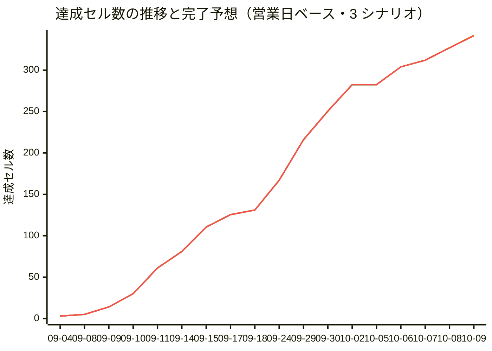

# 進捗一覧

- 生成: 2026-10-08（14:30 再実行）/ `/progress-report`
- 分母: **モックリポジトリ** `../premarket-order-202609`（FastAPI + Jinja2。`python_app/templates/`）
- モック差分: 2026-10-08 まで確認済み / `fa99f65`（モックのコミット日 2026-10-08）
- 判定基準: [.claude/skills/progress-report/criteria.md](../.claude/skills/progress-report/criteria.md)

**このファイルは `/progress-report` の出力。** 手で直してもよいが、次の実行で
完了日・更新日・`## 進捗の履歴` 以外は上書きされる。

## モックと開発環境の食い違い（分母はモック）

モックのサイドバーは **4 区分 22 項目**（2026-09-29 に `仮計算マスタ` が増えた）で、`src/components/layout/navigation.js` の
**4 区分 22 項目**と次の差がある（2026-10-07 に手数料優遇マスタを足し、項目の差は無くなった）。

| 種別 | 対象 |
|---|---|
| モックにあり `navigation.js` に無い | なし（`仮計算マスタ` は 2026-10-05、`手数料優遇マスタ` は 2026-10-07 に追加済み） |
| モックのサイドバーに無いがモックに画面がある | `新規注文`（`/orders/new`）/ `顧客詳細`（`/customers/{id}/summary`・`/customers/{id}/orders`）/ `仮計算`（顧客詳細のタブ）/ 注文の確認・完了・訂正・取消（`/orders/{id}/amend` ほか）/ CSV の確認・完了 |
| `navigation.js` にありモックに無い | なし（`新規注文` は 2026-09-29 にサイドメニューから外した。注文照会などの画面内から遷移する） |
| パスがずれている | 受注不可日マスタ: モック `/masters/blocked-dates` / 実装 `/masters/blackout-dates`（API の命名に合わせた）。約定照会: モック `/executions/` / 実装 `/executions` |

分母から外している 2 区分（`## 認証` / `## レスポンシブ対応`）は 2026-09-17 と同じ理由で外したまま。
サイドメニューの押し出し式開閉は `共通レイアウト / サイドメニュー` に取り込んであるので達成は失われていない。

## モック差分（前回確認以降）

**14:30 の再実行: 前回確認以降の変更なし（BASE = HEAD = `fa99f65`。`pull --ff-only` は Already up to date）。**
以下は 13:05 の回に検出した差分（`9eeb794` → `fa99f65`）で、追随状況だけ更新している。

`9eeb794` → `fa99f65`（9 コミット・09-29〜10-08）。ローカル HEAD は `ls-remote` の HEAD と一致。
**10-08 13:05 の再実行で初めて差分が見えた**（10-02〜10-08 の回はいずれも「BASE = HEAD」と書いていた。pull 漏れか
後からの push かは判らない）。**サイドバーの項目は変化なし**で、変わったのは既存画面だけ。分母は増減なし。
`✅` 行の判定は下げず、補足列に「モック更新あり・追随未確認」と書くにとどめた。

| 変更 | 画面 | モックでの変更内容 | いまの判定 | 対応 |
|---|---|---|---|---|
| 変更 | 共通レイアウト / サイドメニュー | 見出し左の三本線ボタンでサイドバー全体を開閉し、状態をブラウザに保持（`bde4ae4`） | ✅ | 注記のみ（押し出し式の開閉は実装済み。ボタン位置の追随は未確認） |
| 変更 | 新規注文（外株注文入力） | 市場区分 → 注文区分の 4 区分（Ph.1 は 2 区分だけ選択可）・ティッカー／銘柄コードのどちらでも検索・期間指定は当日〜14 営業日後の営業日プルダウン・預り売買区分は横並びトグルで新規は未選択（`c315165` / `bd794e9` / `eb67ff8` / `a50e5b5` / `8f6442d`） | 実装 ✅ | 注記のみ。ティッカー／銘柄コード両対応は `e931f15`（10-08 13:30 マージ）で追随済み。ほかの項目は追随未確認 |
| 変更 | 注文照会 / 顧客詳細の注文照会タブ | 「強制」列を追加し、強制発注は非操作の状態ラベルだけを出す（`d9b1bd3` で追加、`fa99f65` でモーダル・ホバーを撤去） | ✅ / 実装 🟡 | 注記のみ |
| 変更 | 注文訂正 | 読み上げ部品（`_order_readback.html`）と注文区分の追随 | ✅ | 注記のみ |
| 変更 | 顧客詳細 / 仮計算タブ・預り検索 / 仮計算導線 | 現地手数料区分（通常／ネゴレート／NET）を削除。現地手数料①が未入力なら仮計算マスタの率で自動計算（`18ed9d1`） | 3 軸 ✅ | 注記のみ（requests #47 の現地手数料区分に関係） |
| 変更 | 顧客検索・顧客詳細ほかの顧客カード | 「特定口座」列（源徴あり／源徴なし／未登録／一般）を追加（`a50e5b5`） | ✅ | 注記のみ |

## 凡例

| 記号 | 意味 | 集計での重み |
|---|---|---|
| `✅` | 完了。シナリオが全て `実装済` で、対応するテストがある | 1.0 |
| `🟡` | 一部のみ。機能の一部だけ実装、またはシナリオの一部が未着手 / 保留 | 0.5 |
| `❌` | 未着手。シナリオ文書もテストも無い | 0 |
| `—` | 対象外。分母から除外する | — |

完了日は `—` を除く 4 軸が全て `✅` になった最初の日。更新日はその後の改修で再び全軸が揃った日。

## 顧客

| 画面 | 機能名 | 実装 | UnitTest | E2E(MSW) | E2E(実API) | 完了日 | 更新日 | 補足 |
|---|---|---|---|---|---|---|---|---|
| 顧客検索 | 検索・結果一覧 | ✅ | ✅ | ✅ | ✅ | 2026-10-02 | - | **モック更新あり・追随未確認**（特定口座列・`a50e5b5`）。`8aca399` / `11e3240`（2026-10-02・`40f5a4f` でマージ）。`/customers/search`（`GET /masters/customers`）。`CSE-01〜16` / `CSW` / `CSS` / `CUA`。実 API `CSER-01〜04` `実装済`（`ea511a6`）。**実 API に接続済み** |
| 預り検索 | 検索・結果一覧 | ✅ | ✅ | ✅ | ✅ | 2026-10-08 | - | `9a35dfc` / `19ae4d1`（2026-10-02・`4b74295` でマージ）。`/customers/holdings`（`GET /holdings`）。`HSE-01〜22` / `HSV` / `HLA`。実 API `HSR-01〜08` `実装済`（`HSR-03/04/08` の保留は 10-08 に #32 の再現手順を流した DB で解除・`9af31b5`） |
| 預り検索 | 直接発注導線（買い / 売り） | ✅ | ✅ | ✅ | ✅ | 2026-10-08 | - | `9a35dfc`。操作列から顧客詳細の注文入力タブへクエリで渡す（`HSE-17〜19`）。売りは売却可能株数を数量に引き継ぐ（`d60ed3d`）。実 API `HSR-09〜11` が 10-08 に `実装済`（#32 の再現手順を流した DB・`9af31b5`） |
| 預り検索 | 仮計算の導線 | ✅ | ✅ | ✅ | ❌ | - | - | **モック更新あり・追随未確認**（現地手数料区分の削除・`18ed9d1`）。`97d6b13` / `464dd24`（2026-10-06・`a988157` でマージ）。操作列の「仮計算」が `GET /masters/customers` で顧客を引いてから仮計算タブへクエリで渡す。`HSE-23` / `HSV-27〜29` / `CQY`。**実 API のシナリオが無い**（`holding-search-real-api.md` に行なし） |
| 顧客詳細 | 資産状況サマリ | ✅ | ✅ | ✅ | ✅ | 2026-10-02 | 2026-10-06 | `8aca399`（2026-10-02）。`/customers/:customerId/summary`。顧客情報バー（`CustomerInfoBar` / `CIB`）と評価額・評価損益（`PFL`）。`CDT-01/02/05〜09/11〜13` / `CDV` / `CSM` / `CDE`。実 API `CDTR-01/03` `実装済`（`ea511a6`・404 の出し分けを含む） |
| 顧客詳細 | 外株預りタブ（保有一覧） | ✅ | ✅ | ✅ | ✅ | 2026-10-02 | 2026-10-08 | `8aca399`。`GET /holdings`（`api/holdings.js` / `HLA`）。CA 発生中の警告（`CCA`）と行の買い / 売り / 新規注文の導線（`CDT-03/04/10/14〜21` / `OEQ`）。実 API `CDTR-01/05〜07` `実装済`（行の買い / 売り `CDTR-05/06` は 10-08 に #32 の再現手順を流した DB で通過・`9af31b5`）。10-07 に一度 `🟡` へ訂正していた |
| 顧客詳細 | 注文入力タブ | ✅ | ✅ | ✅ | ✅ | 2026-10-06 | 2026-10-08 | **10-08 に `CDTR-04` を再検証し `実装済`**（`9af31b5`。10-07 の `63022c1` で期待値が変わり一度 `未着手` に戻っていた）。**モック更新あり・追随未確認**（注文入力の注文区分・ティッカー／銘柄コード・期間指定ほか）。`8aca399`。2026-10-06 に注文入力をタブの中に描く形へ変えた（`bb05fb1`・`/customers/:customerId/order-entry`。部店・口座番号をクエリで引き継ぐ）。`CDT-22/33` / `OEQ` / `NOV`。実 API `CDTR-04` `実装済`（10-05 `ece1e36` で検証済み。前回は「シナリオが無い」と誤って `❌` にしていた） |
| 顧客詳細 | 注文照会タブ | ✅ | ✅ | ✅ | ✅ | 2026-10-02 | 2026-10-06 | **モック更新あり・追随未確認**（「強制」列・`d9b1bd3` / `fa99f65`）。`8aca399`。`/customers/:customerId/orders`（`GET /orders` を顧客で絞る）。`CDT-23〜35` / `COV` / `COR` / `OIT`。実 API `CDTR-02` `実装済`（`ea511a6`） |
| 顧客詳細 | 仮計算タブ | ✅ | ✅ | ✅ | ❌ | - | - | `97d6b13` / `464dd24`（2026-10-06）で見た目、`605542f` / `1703530`（2026-10-07・`b3e9a63` でマージ）で `POST /calculations` に接続（入力検証・4 状態・結果の表示）。`/customers/:customerId/calculations`。`CCV` / `CQY` / `CDT-36〜44` と契約テスト。**モック更新あり・追随未確認**（現地手数料区分の削除・`18ed9d1`）。**実 API のシナリオが無い**（`customer-detail-real-api.md` に行なし）。国内約定日・現地手数料区分の項目は requests #47 |

## 注文・照会

| 画面 | 機能名 | 実装 | UnitTest | E2E(MSW) | E2E(実API) | 完了日 | 更新日 | 補足 |
|---|---|---|---|---|---|---|---|---|
| 新規注文（外株注文入力） | 注文入力フォーム | ✅ | ✅ | ✅ | ❌ | - | 2026-10-08 | **モック更新あり・一部追随**（ティッカー／銘柄コード両対応は `e931f15` で追随・`NO-35` / `NOS-17` 追加。注文区分 4 区分・期間指定の営業日プルダウン・預り売買区分のトグルは追随未確認）。`3be651e`（2026-09-30）。`/orders/new`。`docs/e2e/order-entry.md` 31 件 `実装済`・`OEV` / `OES` / `OEA` ほか。実 API スモーク `NR-01/02` は起票済み・`未着手` |
| 新規注文（外株注文入力） | 注文の送信 | ✅ | ✅ | ✅ | ❌ | - | - | 同上。確認 → 完了の 2 段階 |
| CSV一括注文 | CSV ファイルの取込 | ✅ | ✅ | ✅ | ✅ | 2026-10-08 | - | `1330f47`（2026-09-30）で事前検証を接続し `OC-11/12` の保留を解除。実 API `OCR-01〜03` `実装済`（`OCR-02` の保留は 10-08 に解除・`9af31b5`） |
| CSV一括注文 | 取込内容の確認 | ✅ | ✅ | ✅ | ✅ | 2026-10-08 | - | `1330f47`。`/orders/csv/preview` → `/orders/csv/complete`。`OCP` / `OCC`。実 API `OCR-04〜06` `実装済`（`OCR-05` の保留は 10-08 に解除・`9af31b5`） |
| CSV一括注文 | テンプレートのダウンロード | 🟡 | 🟡 | ❌ | ❌ | - | - | `fetchOrderCsvTemplate()` は実装（`OCA-10〜12`）。`OCA-09` / `OC-10` が保留 |
| 注文照会 | 検索・結果一覧 | 🟡 | ✅ | ✅ | 🟡 | - | - | **モック更新あり・追随未確認**（「強制」列・`d9b1bd3` / `fa99f65`）。`f539af3`（2026-09-30）。出来状況の絞り込み・発注権限の出し分け。`OI` 23 件 `実装済`。`OrderInquiryTable.vue` に `TODO(処理実装)`（スライス判定の出所）が残る。実 API `OIR-01/03〜08` `実装済`・`OIR-02` `保留`（試験用の注文が作れない） |
| 注文照会 | 注文訂正 | ✅ | ✅ | ✅ | 🟡 | - | 2026-10-08 | **モック更新あり・追随未確認**（読み上げ部品と注文区分）。`f539af3`。`/orders/:id/amend`。`OAM-07/11`・`OAS-12` は `985023f`（10-08 13:10 マージ）で `実装済`。実 API `OIR-09/10` `実装済`・`OIR-12` `保留` |
| 注文照会 | 注文取消 | ✅ | ✅ | ✅ | 🟡 | - | - | `f539af3`。`/orders/:id/cancel`。`OCN` 10 件 `実装済`。実 API `OIR-11`（取消の導線）`実装済`・取消の実行は `OIR-12` と同じ理由で `保留` |
| Dream登録状況 | 検索・一覧 | ✅ | ✅ | ✅ | ✅ | 2026-10-05 | - | `467e11d`（2026-09-29）。`/orders/dream-status`。`DS` / `DSV` / `DSA` / `DSS` / `DEP`。実 API `DSR-01/03〜13` `実装済`（`ece1e36`） |
| Dream登録状況 | STS変更 | ✅ | ✅ | ✅ | 🟡 | - | - | 同上。`581c557` / `7e2e88a`（2026-09-30）で送信まで接続。実 API `DSR-02` `保留`（STS変更可の行が無い） |
| 約定照会 | 検索・結果一覧 | ✅ | ✅ | ✅ | 🟡 | - | - | `f5a2171`（2026-09-28）。`EX` / `EXV` / `EXA` / `EXS`。API は `A`。実 API `EXR-01〜06/08/10` `実装済`（`EXR-02〜06/08/10` は 10-08・`9af31b5`）・`EXR-07`（ページ送り。51 件以上が要る）`未着手` |
| 約定照会 | CSV 出力 | ✅ | ✅ | ✅ | ✅ | 2026-10-08 | - | 2026-09-30（`674dfd4` ほか）。`EX-14〜20`。`GET /executions/export-csv`。実 API `EXR-09/11/12` `実装済`（`EXR-11/12` は 10-08・`9af31b5`） |
| みずほ注文締 | 検索・結果一覧 | ✅ | ✅ | ✅ | 🟡 | - | 2026-10-08 | `a469a0d` / `7496531`（2026-09-28）。`MZ-17` は 10-06 に `実装済`（`status` の複数指定の回答で保留を外した。10-08 に表を訂正）。検索は `GET /executions`。実 API `MZR-01/04〜09/11` `実装済`（`MZR-04〜09/11` は 10-08・`9af31b5`）・`MZR-10`（ページ送り。51 件以上が要る）`未着手` |
| みずほ注文締 | 注文締め・締め解除 | ✅ | ✅ | ✅ | ✅ | 2026-10-05 | - | `75eb153`（2026-09-30）。締め・締め解除・注文ファイル作成。実 API `MZR-02` `実装済`（`665cef5`） |
| みずほ注文締 | CSV 出力 | ✅ | ✅ | ✅ | ✅ | 2026-10-08 | - | `fe5d1d9`（2026-09-30）。`MZ-23〜25`。`GET /executions/export-csv` を使う。実 API `MZR-03` `実装済`（10-08・`9af31b5`） |

## マスタメンテ

| 画面 | 機能名 | 実装 | UnitTest | E2E(MSW) | E2E(実API) | 完了日 | 更新日 | 補足 |
|---|---|---|---|---|---|---|---|---|
| 顧客マスタ | 一覧・検索 | ✅ | ✅ | ✅ | ✅ | 2026-10-05 | - | `CU` / `CLV` / `CUS` / `CUA` / `CDA` / `CDS`。実 API `CUR-01/03〜07` `実装済`（`1a301dd`）。米国株評価額 / 評価損益の列は 2026-09-28 に外した（`cca3016`） |
| 顧客マスタ | 新規登録 | ✅ | ✅ | ✅ | ✅ | 2026-10-07 | - | `cca3016` / `e7223c2`（2026-09-28）。`docs/e2e/customers.md` 22 件すべて `実装済`・`utils/customerFields.js`。実 API `CUR-02` は 10-07 に `実装済`（validate が `valid:true` を返すようになった・`bf11ac4`） |
| 顧客マスタ | 編集 | ✅ | ✅ | ✅ | 🟡 | - | - | 同上。業務キーは読み取り専用。削除の導線はモックに無い。実 API `CUR-08〜11` は 10-07 に `実装済`、`CUR-12/13`（取消済み口座の再有効化）は 10-08 に `実装済`（#55 の改修後）。既存の個人顧客の編集はテストデータの顧客名が半角スペース区切りで事前検証に落ちる（requests #56・待ち） |
| 権限マスタ | ロール別権限一覧 | ✅ | ✅ | ✅ | ✅ | 2026-10-05 | - | 2026-09-17 に実装（`3ff4bac`）。単体 `PMA` / `AUA` / `PMS` / `PMV`、E2E `PM-01〜08`。2026-09-25 に仕様の形（`RolePermissionItem`・日本語キー・4 権限）へ張り替えた（`feat/permission-master-save`。requests #4 解消・`KNOWN_GAPS` から外した）。モックの「操作ログ閲覧」「管理者機能」は仕様に無いので列から外した。編集可否は `GET /auth/me` のロールで決める。実 API `PMR-01〜04` `実装済`（`fc5cb4f`） |
| 権限マスタ | 権限の編集・保存 | ✅ | ✅ | ✅ | ✅ | 2026-10-05 | - | E2E `PM-09〜16`。2026-09-25 に `PUT /masters/permissions/{role_code}` へ繋いだ（`feat/permission-master-save`）。保存中・失敗（404 / 409）をダイアログに出し、成功はサーバの文言で通知する。実 API `PMR-05〜08` `実装済` |
| 銘柄マスタ | 一覧・検索 | ✅ | ✅ | ✅ | 🟡 | - | - | 実 API `SMR-01/03〜05` `実装済`・`SMR-06`（ページ送り）`未着手`（`e6efdb4`）。`SM-01〜12` / `STV` / `STS` / `STA` / `STT`。実 API E2E のシナリオが未作成。モックが「有効開始時間」を追加（requests #40 に起票）。2026-10-05 に VWAP対象の一括対象外化と銘柄名検索を追加（`c2e768a`・3 軸） |
| 銘柄マスタ | 新規追加 | ✅ | ✅ | ✅ | ✅ | 2026-10-02 | - | 実 API `SMR` `実装済`（`e6efdb4`）。`SM-13〜20` / `STV`。2026-09-15 に実装。実 API E2E のシナリオが未作成 |
| 銘柄マスタ | 編集 | ✅ | ✅ | ✅ | ✅ | 2026-10-02 | - | 実 API `SMR` `実装済`（`e6efdb4`）。`SM-21〜27`。2026-09-16 に実装。主キーは `id`。実 API E2E のシナリオが未作成 |
| 銘柄マスタ | 削除 | ✅ | ✅ | ✅ | ✅ | 2026-10-02 | - | 実 API `SMR` `実装済`（`e6efdb4`）。`SM-30〜34`。2026-09-16 に実装。実 API E2E のシナリオが未作成 |
| 為替マスタ | 現在レートの表示 | ✅ | ✅ | ✅ | ✅ | 2026-10-01 | 2026-10-06 | `fedbe96` / `14ebab9`（2026-09-30）。`/masters/fx`。`FX` / `FXV` / `FXS` / `FXA`。実 API `FXR-01/03`（`443277c`・2026-10-01）。**実 API に接続済み**。**2026-10-05 の源泉レート追加（`a309af2`）で `FXR-01〜08` を `未着手` に戻した**（再検証待ち。完了日は記録として残す）。**2026-10-06 に FXR-01〜08 を実 API で再検証し全件通過（`実装済`）** |
| 為替マスタ | レート更新 | ✅ | ✅ | ✅ | ✅ | 2026-10-01 | 2026-10-06 | 同上。当日レートの更新。実 API `FXR-02/04〜07`（楽観的ロックの 409 を含む）。**`a309af2` で `未着手` に戻した（再検証待ち）**。**2026-10-06 に FXR-01〜08 を実 API で再検証し全件通過（`実装済`）** |
| 為替マスタ | 源泉レートの表示・更新 | ✅ | ✅ | ✅ | ✅ | 2026-10-06 | - | `6b4345a` / `a309af2`（2026-10-05）。モック `7879bd3`（2026-09-29）で追加。公示レートと別カード・別適用日。実 API 側は `FXR-08` を起票済み・**保留**（今日の行に `源泉レート` が無い。requests #34）。**2026-10-06 に FXR-01〜08 を実 API で再検証し全件通過（`実装済`）** |
| 仮計算マスタ | 現在設定の表示 | ✅ | ✅ | ✅ | ✅ | 2026-10-07 | - | `c978dba` / `82396c5`（2026-10-05・`8135834` でマージ）。モック `b9d023e`。`/masters/calculation-settings`。実 API `PCR-01〜06` `実装済`（`7cdf1f5`・`ca49a16` でマージ） |
| 仮計算マスタ | 設定の保存 | ✅ | ✅ | ✅ | ✅ | 2026-10-07 | - | 同上。消費税率のずらし幅を実 API の丸めに合わせた（`7e99562`）。取引所税・スプレッド・現地手数料率・NISA 仮計算用為替上乗せ率を画面内で直接入力して保存 |
| 手数料優遇マスタ | 一覧の表示枠 | ✅ | ✅ | ✅ | ✅ | 2026-10-07 | - | `c5ba1c5` / `3ef4318` / `6744bee`（2026-10-07・`21b658c` でマージ）。`/masters/fee-preferences`（`navigation.js` にも追加）。`FP` ほか・依頼 #11 の追随。実 API スモーク `FPR-01/02` `実装済`（`dbceafd`）。モックは表示枠だけだが、実装は追加・編集まで持つ（行は増やさない） |
| スライス基準マスタ | 現在値の表示 | ✅ | ✅ | ✅ | ✅ | 2026-09-11 | - | `SC-01/02` / `SCV` / `SCS` / `SCR-01/02`。**実 API に接続済み** |
| スライス基準マスタ | 設定の保存 | ✅ | ✅ | ✅ | ✅ | 2026-09-11 | - | `SC-03/04` / `SCR-03〜07`。**実 API に接続済み** |
| CAマスタ | 一覧・検索 | ✅ | ✅ | ✅ | ✅ | 2026-09-25 | - | `CA-01〜10` / `CAV` / `CAS` / `CAA` / `CAT` / `CAR-01・03・04`。**実 API に接続済み** |
| CAマスタ | 新規追加 | ✅ | ✅ | ✅ | ✅ | 2026-09-25 | - | `CA-11〜17` / `CAR-02・05`。**実 API に接続済み** |
| CAマスタ | 編集 | ✅ | ✅ | ✅ | ✅ | 2026-09-25 | - | `CA-18〜21` / `CAR-06〜08`。銘柄コードは読み取り専用（10-06 `df46fd0`）、更新日時による楽観的ロック付き（ISO の合札が実 API に通り、古い合札は 409）。**実 API に接続済み** |
| CAマスタ | 削除 | ✅ | ✅ | ✅ | ✅ | 2026-09-25 | - | `CA-22〜27` / `CAR-09`。論理削除（取消区分）。**実 API に接続済み** |
| 受注不可日マスタ | 一覧・検索 | ✅ | ✅ | ✅ | ✅ | 2026-09-11 | - | `BD-01〜10` / `BDL` / `BDS` / `BDR-01〜03`。**実 API に接続済み**。**モックが期間登録を日付 1 件ごとに変更（追随未確認・`61c456b`）** |
| 受注不可日マスタ | 新規追加 | ✅ | ✅ | ✅ | ✅ | 2026-09-11 | 2026-09-25 | `BD-11〜18` / `BDR-04/05/09`。2026-09-25 に行 ID のパスキーへ追随し保留を解除（`358e9f3` / `4dfe7bb`）。モック更新あり・追随未確認 |
| 受注不可日マスタ | 編集 | ✅ | ✅ | ✅ | ✅ | 2026-10-07 | - | `BD-24〜30`。実 API `BDR-07`（日付の変更）を 10-07 に `実装済`（`810a3ed` / `bf11ac4`。日付の上書きがバックエンドで直った） |
| 受注不可日マスタ | 削除 | ✅ | ✅ | ✅ | ✅ | 2026-09-11 | 2026-09-25 | `BD-19〜23` / `BDR-08`。2026-09-25 に保留を解除 |
| 海外休場日マスタ | 一覧・検索 | ✅ | ✅ | ✅ | ✅ | 2026-09-10 | - | `MH-01〜07/17〜21` / `MR-01〜03` / `MHT`。**実 API に接続済み**。モックの「短縮取引日」の見せかた（`a164927`）と検索日付の 1 欄化（`932c377`）は 10-06 に追随。期間登録の日付 1 件化は追随未確認 |
| 海外休場日マスタ | 新規追加（再有効化を含む） | ✅ | ✅ | ✅ | ✅ | 2026-09-10 | 2026-09-25 | `MH-08〜11/22/23` / `MR-04/05/07/08`。`docs/e2e/market-holidays-real-api.md` 8 件すべて `実装済`。モック更新あり・追随未確認 |
| 海外休場日マスタ | 削除 | ✅ | ✅ | ✅ | ✅ | 2026-09-10 | 2026-09-25 | `MH-12〜16` / `MR-06` |
| 残高マスタ | 保有残高の一覧・検索 | ✅ | ✅ | ✅ | 🟡 | - | - | `BA-01〜10` / `BLV-01〜13` / `BLA-01〜12`。検索 5 項目のうち銘柄名は MSW だけが解釈する（`symbol_name` は仕様に無いまま）。モックが「成長投資枠」を追加（追随未確認）。実 API `BAR-01/03/04/06` `実装済`・`BAR-05/07` `保留`・`BAR-08` `未着手`（`06f7495`。`BAR-05` は 10-08 の検証で `保留` に戻った・`9af31b5`） |
| 残高マスタ | 残高を補正（数量の加算） | ✅ | ✅ | ✅ | ✅ | 2026-10-05 | - | `BA-11〜18` / `BLV-14〜26` / `BLA-16〜18`。確認 → 確定の 2 段階。送るのは補正後の絶対値。実 API `BAR-10〜12` `実装済` |
| 残高マスタ | 新規保有を追加 | ✅ | ✅ | ✅ | 🟡 | - | - | `BA-19〜27` / `BLV-27〜35` / `BLA-13〜15`。顧客・ティッカー・銘柄名・口座区分・加算数量を指定。実 API `BAR-09` `実装済`・`BAR-13` `保留` |
| 残高マスタ | 売却不可区分の切替 | ✅ | ✅ | ✅ | ✅ | 2026-10-05 | - | `BA-28〜33` / `BLV-36〜43` / `BLA-19〜21`。2026-09-25 に専用の `PUT .../{balance_id}/sell-prohibited` へ張り替えた（`768cb5d`）。実 API `BAR-02` `実装済` |

## 運用管理

モックのサイドバーにある区分。**`navigation.js` に 4 項目がそろい、4 画面とも `main` に入った**
（滞留注文抽出は 2026-09-24 に `13db964` でマージ）。

| 画面 | 機能名 | 実装 | UnitTest | E2E(MSW) | E2E(実API) | 完了日 | 更新日 | 補足 |
|---|---|---|---|---|---|---|---|---|
| お知らせ管理 | お知らせの更新（表示切替・本文） | ✅ | ✅ | ✅ | ✅ | 2026-09-30 | 2026-09-24 | `AN-01〜13/16〜18` / `ANA` / `ANS` / `ANV` / `BNA` / `BTX`。実 API スモーク `ANR-01/02` `実装済` |
| お知らせ管理 | 更新履歴 | ✅ | ✅ | ✅ | 🟡 | - | 2026-09-24 | `AN-04/05/14/15` / `ANS` / `ANV`。操作区分名のバッジ・`limit` / `offset` のページング |
| 滞留注文抽出 | 検索・一覧 | ✅ | ✅ | ✅ | ❌ | - | 2026-09-28 | `/operations/stalled-orders` / `StalledOrderListView.vue`。`SO-01〜10/13/14` / `SOA` `SOS` `SOV` `SOC` `SOT`。一覧は requests #1① が 09-30 に「`GET /orders` を拡張」で決着済み（`?status=101,003`）。**10-08 に `src/api/stalledOrders.js` を `GET /orders` の 2 回呼び（`101,103` / `003`）へ書き直し**、MSW の専用ハンドラと `KNOWN_GAPS` の行を外した（残るのは実 API のシナリオ）。`確認状況` だけ #1② 待ち |
| 滞留注文抽出 | 滞留注文の CSV 出力 | ✅ | ✅ | ✅ | — | 2026-09-28 | 2026-10-08 | `5205251`。フロントで組み立て（`utils/stalledOrderCsv.js`）。`SO-17〜19` / `SOV` / CSV の単体。**10-08 に実 API の軸を対象外にした**（フロントで組み立て・API を呼ばない） |
| 滞留注文抽出 | TWS投入CSV サンプルのダウンロード | ✅ | ✅ | ✅ | — | 2026-09-28 | 2026-10-08 | `5205251`。`SO-15` / CSV の単体。**10-08 に実 API の軸を対象外にした**（フロントで組み立て・API を呼ばない） |
| 滞留注文抽出 | コンファメーションCSV の取込 | ✅ | ✅ | ✅ | ❌ | - | 2026-09-28 | `1830b3d`。10-07 の取り込みで `POST /operations/stalled-orders/confirmation-import` が提案どおり仕様に入った（`01b5d04`・`KNOWN_GAPS` から外した）。実 API のシナリオは未作成。`SO-20〜24` / `SOA` / `SOS` / `SOV` |
| 滞留注文抽出 | コンファメーションCSV サンプルのダウンロード | ✅ | ✅ | ✅ | — | 2026-09-28 | 2026-10-08 | `5205251`。`SO-16` / CSV の単体。**10-08 に実 API の軸を対象外にした**（フロントで組み立て・API を呼ばない） |
| 操作ログ | 一覧・検索 | ✅ | ✅ | ✅ | ✅ | 2026-09-30 | - | 2026-09-24 に `ActivityLogItem` の形へ張り替え。単体 `ALV` `ALS` `ALT` `ALU` `ALD`・E2E `AL`・実 API `ALR-01/02` |
| 障害管理 | IB送信制御 | ✅ | ✅ | ✅ | ✅ | 2026-09-30 | 2026-10-06 | 実仕様（`/operations/order-suspensions` の停止・再開）に合わせて実装。モックの 2 区画は捨て、**停止対象（`ALL` + ルート 5 種）の表**にした。この行は IB（`'1'`）ほかルート行の停止・再開。`IN-07/13〜19/21〜23` / `INA` / `INS` / `IND` / `INV` / `SUS`。実 API `IR-01/02/06/07`（`443277c`・2026-10-01。別経路の更新と 409・停止時の記録の再開確認まで）。2026-09-25 にモック `08986d1` 追随（操作をスライド式トグル `BaseSwitch` に、確定まで切り替えない。`IN-24` / `INV-22` / `BSW`）。2026-10-01 に停止対象を表からモックと同じカード表示へ（`ce4d246`）。2026-10-06 に運用状態の枠と履歴の表示をモックに揃えた（`ee0a6f8`） |
| 障害管理 | 注文入力制御 | ✅ | ✅ | ✅ | ✅ | 2026-10-05 | 2026-10-06 | 全体（`ALL`）の停止・再開にあたる（新規受付・取消も止まる）。`IN-04/06/12/20/23`。実 API は `IR-03`（現在の運用状態と全体停止中の抑止が API のフラグどおり）で表示側だけ確認。全体行の停止・再開は `IR-08/09` で検証済み（`3d8f0f8`・2026-10-05）。全体停止中はルート行の操作を塞ぐ（仕様は問合せ中・requests #14）。2026-09-25 にモック `08986d1` 追随（全体行もトグル。見出し「障害時の運用制御」） |
| 障害管理 | 障害対応履歴 | ✅ | ✅ | ✅ | ✅ | 2026-10-01 | 2026-10-06 | 停止・再開の操作履歴（`/operations/order-suspensions/history`・`limit=50`）。実 API `IR-04/05`（各列の一致と 2 ページ目。`443277c`）。`変更前 / 変更後` は仕様の型が any のため出さない（requests #15）。`IN-08/09/16`。2026-09-25 にモック `08986d1` 追随（変更日時 / 制御内容 / 停止理由 / 更新者 の 4 列。停止理由はモックに無い意図的なずれ） |

## 共通基盤

画面を持たない区分。画面列には区分名を入れている。

| 画面 | 機能名 | 実装 | UnitTest | E2E(MSW) | E2E(実API) | 完了日 | 更新日 | 補足 |
|---|---|---|---|---|---|---|---|---|
| 共通レイアウト | サイドメニュー | ✅ | ✅ | ✅ | — | 2026-09-09 | 2026-09-16 | `LAY-01/03〜09` / `ASB` / `UST`。押し出し式の開閉を 2026-09-16 に追加。モック更新あり（区分の開閉式・見出し左の三本線で全体を開閉 `bde4ae4`）・追随未確認 |
| 共通レイアウト | ヘッダの画面見出し | ✅ | ✅ | ✅ | — | 2026-09-09 | - | `LAY-02` / `AHD`。`router` の `meta.title` 由来 |
| 共通レイアウト | 市場ステータス表示 | ✅ | ✅ | ✅ | — | 2026-09-09 | 2026-09-18 | `AHD` / `MKS` / `UMS` / `MSA` / `MSS`。判定の出所を `GET /market-status` に移した |
| 共通レイアウト | 市場取引時間の表示 | ✅ | ✅ | ✅ | — | 2026-09-18 | 2026-09-18 | ヘッダに 3 セッション × JST / ET の時間帯グリッド。休場・短縮取引・取得失敗を出し分ける。要件指示（モック外） |
| アクセス制御 | 権限によるアクセス制限 | ✅ | ✅ | ✅ | ✅ | 2026-10-05 | - | `b22d312` / `610903d` / `b6a1942`（2026-09-28）、`850bb11`（09-29・`VITE_USER_CODE` で操作者切替）。`AC` / `RPG` / `CUO` ほか。実 API `ACR-01〜04` `実装済`（`ece1e36`・10-05）。**前回まで「スモーク未作成」と誤って `❌` にしていた**（10-08 に訂正）。要件指示（モック外） |
| 共通レイアウト | 読み込みオーバーレイ | ✅ | ✅ | ✅ | — | 2026-09-17 | - | `AppLoadingOverlay.vue` / `ALO` / `LAY-10〜12` |
| UI 部品 | `components/ui/` の 15 部品 | ✅ | ✅ | ✅ | — | 2026-09-04 | 2026-09-16 | 15 本すべてに spec と `docs/unit/` があり 4 軸の状態が同じなので 1 行に畳んである |
| マスタ共通部品 | 検索カード（`MasterSearchCard`） | ✅ | ✅ | — | — | 2026-09-17 | - | `MSC` |
| マスタ共通部品 | 一覧カード（`MasterListCard`） | ✅ | ✅ | — | — | 2026-09-17 | - | `MLC` |
| マスタ共通部品 | 追加・編集ダイアログ（`MasterFormDialog`） | ✅ | ✅ | — | — | 2026-09-17 | - | `MFD` |
| マスタ共通部品 | 削除確認（`ConfirmDeleteDialog`） | ✅ | ✅ | — | — | 2026-09-17 | - | `CDD-01〜13` |
| 共通ロジック | `useAsync` | ✅ | ✅ | — | — | 2026-09-14 | - | `UAS-01〜17` |
| 共通ロジック | `useCrudList` | ✅ | ✅ | — | — | 2026-09-14 | - | `UCL-01〜43`。受注不可日・海外休場日・CA・銘柄の 4 画面で共用 |
| 共通ロジック | `useListQuery` | ✅ | ✅ | — | — | 2026-09-14 | - | `ULQ-01〜19`。URL クエリと一覧状態の同期 |
| 共通ロジック | `useMarketStatus` | ✅ | ✅ | — | — | 2026-09-15 | - | `UMS-01〜07` |
| 共通ロジック | `useSidebarToggle` | ✅ | ✅ | — | — | 2026-09-16 | - | `UST-01〜07`。開閉状態の保持 |
| ユーティリティ | `utils/format.js` | ✅ | ✅ | — | — | 2026-09-14 | - | `FMT-01〜11` |
| ユーティリティ | `utils/marketStatus.js` | ✅ | ✅ | — | — | 2026-09-08 | - | `MKS-01〜13` |
| ユーティリティ | `utils/queryParams.js` | ✅ | ✅ | — | — | 2026-09-11 | - | `QRY-01〜08` |
| ユーティリティ | `utils/marketHolidayTypes.js` | ✅ | ✅ | — | — | 2026-09-10 | - | `MHT-01〜07` |
| ユーティリティ | `utils/caTypes.js` | ✅ | ✅ | — | — | 2026-09-11 | - | `CAT` |
| ユーティリティ | `utils/symbolTypes.js` | ✅ | ✅ | — | — | 2026-09-14 | - | `STT-01〜05` |
| ユーティリティ | `utils/apiEnums.js` | ✅ | ✅ | — | — | 2026-09-15 | - | OpenAPI の区分値 21 種の写し。`openapi.json` と突き合わせるテスト付き |
| API クライアント層 | `api/client.js` | ✅ | ✅ | — | — | 2026-09-14 | - | `CLA-01〜16`。`normalizeError` を含む |
| API クライアント層 | `api/orders.js` | ✅ | ✅ | — | — | 2026-09-14 | - | `ORA-01〜10`。`toOrder()` の変換を担保 |
| API クライアント層 | `api/blackoutDates.js` | ✅ | ✅ | — | — | 2026-09-11 | - | `BDA` |
| API クライアント層 | `api/sliceCriteria.js` | ✅ | ✅ | — | — | 2026-09-11 | - | `SCA` |
| API クライアント層 | `api/marketHolidays.js` | ✅ | ✅ | — | — | 2026-09-10 | - | `MHA` |
| API クライアント層 | `api/ca.js` | ✅ | ✅ | — | — | 2026-09-11 | - | `CAA` |
| API クライアント層 | `api/codes.js` | ✅ | ✅ | — | — | 2026-09-14 | - | `CDA-01〜07` |
| API クライアント層 | `api/customers.js` | ✅ | ✅ | — | — | 2026-09-14 | - | `CUA-01〜14` |
| API クライアント層 | `api/symbols.js` | ✅ | ✅ | — | — | 2026-09-14 | 2026-09-16 | `STA-01〜12`。`symbol` クエリ名と `id` 主キーへの追随を含む |
| API クライアント層 | `api/permissions.js` | ✅ | ✅ | — | — | 2026-09-25 | - | `PMA`（`0ef423c`） |
| API クライアント層 | `api/activityLogs.js` | ✅ | ✅ | — | — | 2026-09-24 | - | `ALA` |
| MSW モック基盤 | handlers / fixtures | ✅ | — | — | — | 2026-09-11 | 2026-09-16 | ブラウザ・単体・E2E で共用。単体・E2E の直接の対象ではないため `—` で、実装のみで完了とみなす |

2026-09-18 以降に増えた `api/*.js`（お知らせ・バナー・障害管理・残高・市場ステータス・滞留注文）と
`utils/*.js`（`activityLogTypes` / `suspensionState` ほか）は、**各画面の行の UnitTest に数えている**
（補足列の `ANA` / `BNA` / `INA` / `BLA` / `MSA` / `ALT` / `SUS`）。共通基盤に別行を立てると二重計上になる。

## 対象外の画面（集計に含めない）

**モックに無い画面。納品対象ではないので進捗の分母から外す。**

| 画面 | 機能名 | 実装 | UnitTest | E2E(MSW) | E2E(実API) | 完了日 | 更新日 | 補足 |
|---|---|---|---|---|---|---|---|---|
| 注文一覧（`/`） | 一覧表示 | ✅ | ✅ | ✅ | ❌ | - | - | 縦串の参考実装で、実仕様が来たら差し替える前提のため対象外。`OL` / `OLV` / `OST` |
| UI カタログ（`/dev/ui-catalog`） | 部品の一覧表示 | ✅ | ❌ | ✅ | — | - | - | 開発用ページ（業務画面ではない）のため対象外。`UC-01/02` |

## 集計

**進捗は行ではなく「行 × 軸のセル」で数える。**

- **有効セル** = その行の 4 軸のうち `—`（対象外）でないセルの数
- **達成セル** = `✅` 1.0 + `🟡` 0.5（`❌` は 0）
- **残セル** = 有効セル − 達成セル、**進捗率** = 達成セル ÷ 有効セル
- **完了行** = `—` を除く全軸が `✅` の行

「対象外の画面」の 2 行は行ごと数えない。

| 区分 | 行数 | 実装 `✅` | UnitTest `✅` | E2E(MSW) `✅` | E2E(実API) `✅` | 有効セル | 達成セル | 残セル | 進捗率 | 完了行 |
|---|---|---|---|---|---|---|---|---|---|---|
| 顧客 | 9 | 9 | 9 | 9 | 7 | 36 | 34.0 | 2.0 | 94% | 7 |
| 注文・照会 | 15 | 13 | 14 | 14 | 6 | 60 | 51.5 | 8.5 | 86% | 6 |
| マスタメンテ | 32 | 32 | 32 | 32 | 28 | 128 | 126.0 | 2.0 | 98% | 28 |
| 運用管理 | 11 | 11 | 11 | 11 | 5 | 41 | 38.5 | 2.5 | 94% | 8 |
| 共通基盤 | 35 | 35 | 34 | 7 | 1 | 77 | 77.0 | 0.0 | 100% | 35 |
| **合計** | **102** | **100** | **100** | **73** | **47** | **342** | **327.0** | **15.0** | **96%** | **84** |

軸ごとの進捗率。**分母はその軸が `—` の行を除いた数**、`達成` = `✅` + 0.5 × `🟡`。

| 軸 | 分母 | `✅` | `🟡` | 達成 | 残 | 進捗率 |
|---|---|---|---|---|---|---|
| 実装 | 102 | 100 | 2 | 101.0 | 1.0 | 99% |
| UnitTest | 101 | 100 | 1 | 100.5 | 0.5 | 100% |
| E2E(MSW) | 74 | 73 | 0 | 73.0 | 1.0 | 99% |
| E2E(実API) | 65 | 47 | 11 | 52.5 | 12.5 | 81% |

4 軸の分母の和 = 102 + 101 + 74 + 65 = 342、達成の和 = 101.0 + 100.5 + 73.0 + 52.5 = 327.0。
**10-08 14:30 の再実行で +1.0**: `985023f`（13:10 マージ・注文訂正の `OAM-07/11`・`OAS-12` を実装済）で注文訂正の UnitTest / E2E(MSW) が `🟡` → `✅`。
`e931f15`（13:30 マージ・注文入力のティッカー／銘柄コード両対応）は `✅` 行の追随でセルは不変。
**10-08 13:05 の再実行で +5.5**: `9af31b5`（10:27 マージ・#32 の再現手順を流した DB での検証モード）が前回の集計に入っていなかった。
顧客 +3.0（預り検索 2 行・外株預りタブ・注文入力タブ）、注文・照会 +2.5（CSV一括の取込・確認・約定 CSV・みずほ CSV）。
残高マスタの一覧は `BAR-05` が `保留` に戻ったが、もとから `🟡` なのでセルは不変。

## 残作業の内訳

成熟度は `A` 確定 / `B` 型のみ / `C` 中身が未定義 / `D` パス無し / `—` API 不要。
`C` `D`・要件未確定・`## バックエンド待ち` に載っている行が**ブロック残**。

**仮定系の類型は 0 のまま**（全類型を 1 本以上作り終えている）。

| 画面 / 機能 | 残セル | 類型 | 根拠 | 成熟度 | 引き当てたパス | ブロック理由 |
|---|---|---|---|---|---|---|
| 預り検索 / 仮計算導線の実 API | 1.0 | 実API追加 | 実測 | B | `/masters/customers` | - |
| 顧客詳細 / 仮計算タブの実 API E2E | 1.0 | 実API追加 | 実測 | B | `POST /calculations` | - |
| 新規注文 / 2 行の実 API E2E | 2.0 | 実API追加 | 実測 | B | `POST /orders`・`/orders/validate` | - |
| CSV一括注文 / テンプレートのダウンロード | 3.0 | ファイル取込 | 実測 | B | `/orders/csv-template` | - |
| 注文照会 / 検索（実装の TODO・`OIR-02`） | 1.0 | 検索一覧 | 実測 | B | `GET /orders` | - |
| 注文照会 / 注文訂正・取消の実 API（2 行・`OIR-12`） | 1.0 | 実API追加 | 実測 | B | `/orders/{order_id}/amend`・`/orders/{order_id}/cancel` | - |
| Dream登録状況 / STS変更の `DSR-02` | 0.5 | 実API追加 | 実測 | B | `/orders/dream-status/{order_id}` | - |
| 約定照会 / 検索のページ送り（`EXR-07`） | 0.5 | 実API追加 | 実測 | A | `GET /executions` | - （約定 51 件以上が要る） |
| みずほ注文締 / 検索のページ送り（`MZR-10`） | 0.5 | 実API追加 | 実測 | A | `GET /executions` | - （みずほ約定 51 件以上の投入待ち・#32 ②） |
| 顧客マスタ / 編集の実 API（`CUR-12/13`） | 0.5 | 実API追加 | 実測 | A | `/masters/customers`・`/masters/customers/{account_id}` | **バックエンド待ち**（取消済み口座の再有効化で警告が出ない） |
| 銘柄マスタ / 一覧のページ送りの実 API E2E（`SMR-06`） | 0.5 | 実API追加 | 実測 | A | `/masters/symbols` | - |
| 残高マスタ / 一覧・新規保有の実 API 残り | 1.0 | 実API追加 | 実測 | A | `/masters/balance-adjustments` 配下 | - |
| お知らせ管理 / 更新履歴の実 API E2E（`ANR-05`） | 0.5 | 実API追加 | 実測 | A | `/operations/announcements/history` | - |
| 滞留注文抽出 / コンファメーションCSV 取込の実 API E2E | 1.0 | 実API追加 | 実測 | B | `/operations/stalled-orders/confirmation-import` | - （10-07 に仕様入り） |
| 滞留注文抽出 / 検索・一覧の実 API E2E（CSV 出力・サンプル 2 種は 10-08 に対象外） | 1.0 | 実API追加 | 実測 | B | `GET /orders`（`status` の複数指定） | - （api 層の `GET /orders` への書き直しは 10-08 に済んだ。`確認状況` は #1② 待ち） |

### 2 通りの割り方

どちらの合計も `## 集計` の残セル **15.0** と一致する。

| 割り方 | 内訳 | セル | 割合 |
|---|---|---|---|
| 着手可能残 | `A` / `B` / `—` かつ 要件確定・待ち無し | **14.5** | 97% |
| ブロック残 | `C` / `D` + 要件未確定 + バックエンド待ち | **0.5** | **3%** |
| 実測系 | 全類型 | 15.0 | 100% |
| 仮定系 | （なし） | 0.0 | 0% |

ブロック残は顧客マスタ 0.5（再有効化・#55）だけ。
**14:30 の再実行で 1.0 セルが外れた**（注文訂正の UnitTest / E2E(MSW)・`985023f`）。
**13:05 の再実行で 5.5 セルが外れた**（`9af31b5` の検証。預り検索 1.5・顧客詳細 1.5・CSV一括 1.0・約定 0.5・みずほ 1.0）。
**10-08 の生成後に判定を訂正**: 滞留注文抽出 4.0 は一覧のパスが #1① で決着済み（`GET /orders` の拡張）で、フロントの api 層の書き直し待ち。
みずほ注文締は検索が `GET /executions` で、`/mizuho/orders` を引き当てたのが誤り（残りは #32 のデータ待ち）。
前回のブロック残 11.5 から、手数料優遇（要件未確定 4.0 → 完了）・受注不可日（日付の上書き 0.5）・顧客マスタの validate（0.5）・
滞留注文の取込（パス入り 1.0）の計 6.0 が外れた。

### 手戻りの実測（予想には足さない）

| 取り込み | 追随コミット | 作り直したセル | その時の達成セル | 手戻り率 |
|---|---|---|---|---|
| 2026-09-15（`/masters/` パス移行・クエリ名の日本語→英語） | `f7ed2c5` / `d9f191b` / `ac3a924` / `b20c24a` | 約 33.0 | 110.5 | **約 30%** |
| 2026-09-16（`stock_code` → `symbol`・CA ステータス項目の取り消し） | `13184a6` / `073dead` | 7.0 | 約 123.5 | **約 6%** |
| 2026-09-17（主キーの id 化） | `baabd84` / `91467de` | 判定が下がったのは 2.0 セルだが、**作り直しは 6 画面ぶん** | 127.5 | 計測中 |
| 2026-09-18 / 24（操作ログを `ActivityLogItem` の形へ） | `a53485a` | 1.0（実装） | 131.0 | **約 1%** |
| 2026-09-24 / 25（`売却不可区分` の専用 API・権限マスタの形・受注不可日のパスキー） | `768cb5d` / `561930e` / `358e9f3` | 約 5.0（残高 1 行・権限 2 行・受注不可日 1 行の張り替え） | 167.0 | **約 3%** |
| 2026-09-30（区分値 23 種・障害管理の停止対象から自己取引 / OTC を廃止） | `88913d8` / `1f79fd4` | 約 1.0（障害管理の表の張り替え） | 250.5 | **1% 未満** |
| 2026-10-07（バックエンドの 10-06 回答への追随・預りの新項目） | `c19712d` / `1a5678b` / `242670e` / `d60ed3d` / `63022c1` | 約 1.5（実 API の再検証待ち 2 行。`✅` 行の追随は多数だが判定は不変） | 312.0 | **約 0.5%** |

**この量を完了予想に別枠で足していない。** 速度 `v` の期間にこの手戻りが含まれている。

## 進捗の履歴

実行ごとのスナップショット。**過去行は書き換えない**（次の実行はここに 1 行足すだけ）。

| 生成日 | 行数 | 有効セル | 達成セル | 進捗率 | 備考 |
|---|---|---|---|---|---|
| 2026-09-04 | - | - | 3.0 | - | 推定（完了日から遡って算出） |
| 2026-09-08 | - | - | 5.0 | - | 推定 |
| 2026-09-09 | - | - | 14.0 | - | 推定 |
| 2026-09-10 | - | - | 30.0 | - | 推定 |
| 2026-09-11 | - | - | 61.0 | - | 推定 |
| 2026-09-14 | 91 | - | 81.0 | - | 推定（当時の集計は行ベース 21/91 行） |
| 2026-09-15 | 95 | 321 | 110.5 | 34% | 実測（セル単位の集計を導入した初回） |
| 2026-09-17 | 97 | 329 | 125.5 | 38% | 実測。モックの `aeda755` まで取り込み。実 API E2E の書き込み系 11 本が一斉に保留になり 127.5 → 125.5 へ後退 |
| 2026-09-18 | 99 | 333 | 131.0 | 39% | 実測。**API クライアント層に 2 行追加**（`api/permissions.js` / `api/activityLogs.js`）で有効セル +4。権限マスタ（実装 +1.5）・操作ログ（実装 +1.0）・読み込みオーバーレイの E2E(MSW)（+1.0）が進んだ |
| 2026-09-24 | 99 | 333 | 167.0 | 50% | 実測。分母は増減なし（モック `61c456b` は既存画面の変更のみ）。**1 日で +36.0**: 残高マスタ 3 軸 × 4 行（+12.0）・障害管理 3 軸 × 3 行（+9.0）・お知らせ管理 3 軸 × 2 行（+6.0）・滞留注文抽出の実装（+3.0）・操作ログの単体 / E2E（+2.0）・`api/activityLogs.js` の単体（+1.0）ほか。並行セッション 6 本ぶんのマージが同じ日に集中した |
| 2026-09-29 | 99 | 333 | 216.0 | 65% | 実測。分母は増減なし（モック `08986d1` は障害管理の変更のみ）。**3 営業日で +49.0**: 注文・照会 5 画面の着手（+16.5）・滞留注文抽出の単体 / E2E と CSV 4 行（+12.0）・CA 実 API（+4.0）・顧客マスタ登録 / 編集（+6.0）・権限マスタ（+1.5）・アクセス制御（+3.0）・受注不可日 / 海外休場日の実 API 保留解除（+2.0）ほか |
| 2026-09-30 | 102 | 345 | 250.5 | 73% | 実測。**分母 +3 行 / +12 セル**（モック `9eeb794`: 仮計算マスタ 2 行・為替マスタの源泉レート 1 行）。**1 営業日で +34.5**: 外株注文入力 2 行（+6.0）・CSV 一括注文（+5.0）・注文照会 3 行（+6.5）・約定照会 CSV（+3.0）・みずほ注文締（+4.0）・為替マスタ（+6.0）・実 API スモーク 3 画面（+4.0） |
| 2026-10-02 | 102 | 345 | 282.5 | 82% | 実測。分母は増減なし（モック差分なし）。**2 営業日で +32.0**: 預り検索 2 行の 3 軸と実 API の一部（+6.5・`4b74295` / `0a30587`）・銘柄マスタの実 API 4 行（+3.5・`e6efdb4`）・顧客検索 1 行・顧客詳細 4 行の 3 軸（+15.0・`40f5a4f`）・顧客検索 / 顧客詳細の実 API 4 行（+4.0・`ea511a6`）・為替マスタの実 API 2 行（+2.0）・障害管理の履歴と注文入力制御（+1.0）。10/01 は実 API E2E の基盤（`/real-api-e2e`・共通部品）・依頼書 10/01 版・再読み込みボタンの撤去が中心 |
| 2026-10-05 | 102 | 345 | 282.5 | 82% | 実測。分母は増減なし（モック差分なし）。**1 営業日で +0.0**: 10-02 の前回生成以降 main へのコミットなし。10-05 朝の openapi.json 再取り込み（追加のみ）は未コミットのため数えない。実 API E2E 全件の約 22 件の落ちは負荷下の 5 秒タイムアウトで、再実行で全通過のため判定は据え置き |
| 2026-10-06 | 102 | 345 | 304.0 | 88% | 実測。分母は増減なし（モック差分なし）。**1 営業日で +21.5**（10-05 08:39 の前回生成以降のマージ 44 コミット）: 仮計算マスタ 2 行の 3 軸（+6.0・`8135834`）・為替マスタの源泉レート 3 軸（+3.0・`b276e11`）・実 API の検証モード 8 画面（顧客マスタ・権限・残高・CSV・注文照会・Dream・約定・みずほ・障害管理で +14.5）。**為替マスタの実 API 2 行が `✅` → `❌`**（`a309af2` で再検証待ちへ戻した・−2.0）。同日 10:30 の再実行で 08:35 以降のマージ（CA 銘柄コード読み取り専用・休場日の日付 1 欄化と短縮取引日・約定 / みずほの一部出来件数・残高マスタの配置・OAV の flaky 対策）を確認したが、いずれも `✅` 行の追随でセルは不変 |
| 2026-10-07 | 102 | 345 | 312.0 | 90% | 実測。分母は増減なし（モック差分なし）。**1 営業日で +8.0**（10-06 11:03 以降のマージ 5 本）: 預り検索の仮計算導線 3 軸（+3.0）・顧客詳細の仮計算タブ（見た目だけの 3 軸 `🟡`。+1.5）（`a988157`）。**訂正 2 件**: 10-06 の為替マスタ 3 行の再検証が集計に入っていなかった分（+3.0）・顧客詳細の注文入力タブ `CDTR-04` を `❌` と誤判定していた分（+1.0）と外株預りタブ `CDTR-05/06` の `未着手` の見落とし（−0.5）。障害管理のモック追随（`ee0a6f8`）・注文入力のタブ内描画（`bb05fb1`）は `✅` 行の追随でセルは不変 |
| 2026-10-08 | 102 | 342 | 327.0 | 96% | 実測。**14:30 の再実行で上書き**（326.0 → 327.0）: `985023f`（注文訂正の `OAM-07/11`・`OAS-12`）の +1.0。`e931f15`（注文入力のティッカー／銘柄コード両対応・モック `8f6442d` への追随）は `✅` 行でセル不変。モック差分なし（BASE = HEAD = `fa99f65`）。以下は 13:05 時点の記述。**13:05 の再実行で上書き**（320.0 / 345 → 326.0 / 342）: 11:01 の訂正 +0.5（`MZ-17`）と分母 −3（滞留注文抽出の CSV 3 行の実 API を対象外）、`9af31b5`（#32 の再現手順を流した DB での実 API 検証）の +5.5（預り検索 2 行・顧客詳細 2 行・CSV一括 2 行・約定 / みずほの CSV）。モックの差分 `9eeb794` → `fa99f65`（9 コミット）を初めて検出したが既存画面の変更のみで分母は不変。以下は 10:35 時点の記述。分母は増減なし（モック差分なし）。**1 営業日で +8.0**（10-07 09:01 の前回生成以降のマージ約 20 本）: 手数料優遇マスタ 4 軸（+4.0・`21b658c`）・仮計算マスタの実 API 2 行（+2.0・`ca49a16`）・顧客詳細の仮計算タブの計算接続（3 軸 `🟡` → `✅`。+1.5・`b3e9a63`）・顧客マスタ新規登録 / 受注不可日編集の実 API（+1.0・`25c1e9a`）。**後退 2 件**: 預り検索の直接発注導線（`HSR-09/10` が保留・−0.5）・顧客詳細の注文入力タブ（`CDTR-04` が `63022c1` で未着手へ・−1.0）。**訂正 1 件**: アクセス制御の実 API（`ACR` は 10-05 から実装済・+1.0）。**10:10 再実行**: 08:20 以降のマージは docs のみ 5 本（`f360844`〜`5ada90e`・依頼書の更新）でセル変化なし。バックエンド待ちに #56 を 1 件追加 |

**`推定` の行は完了日から遡って作った種で、部分達成を数えていないため過小。**
速度は実測行（2026-09-15 以降）だけで取る。

## バックエンド待ち

**フロントの手では動かせない依存。** 過去行は書き換えない（解消日だけ入れる）。

| 発生日 | 解消日 | 影響する行 | 内容 | 状態 |
|---|---|---|---|---|
| 2026-09-11 | 2026-10-07 | 受注不可日マスタ / 編集 | 編集で日付を変えても API 側が元の `受注不可日` を上書きするため、備考しか変更できない（`BDR-07` 保留）。10-07 に `BDR-07` が通り `実装済`（`bf11ac4`） | 解消 |
| 2026-09-16 | 2026-09-18 | 銘柄マスタ / 編集・削除 | 主キーが `id` になったが実 API の詳細照会・更新履歴は `/masters/symbols/{symbol}` のまま。`id` が空の行を編集・削除できない。09-18 の取り込みで `/masters/symbols/{symbol_id}`（行 ID）になった（requests #5 解消済み）。**解消の記録を 10-02 に追記**（前回まで引き継ぎ漏れ） | 解消 |
| 2026-09-16 | 2026-09-25 | 銘柄マスタ / 編集 | 更新で送らなかった項目（`市場名` / `前日出来高` / `Pre区分`）を保つかがバックエンドで確認中だった。09-25 に「保つ」と実測で確定（requests #9 解消済み・部分更新）。**解消の記録を 10-02 に追記** | 解消 |
| 2026-09-17 | 2026-09-25 | 受注不可日マスタ / 新規追加・編集・削除・海外休場日マスタ / 新規追加・削除 | 実 API が id を返さず行を特定できない。`BDR-04〜09` / `MR-04〜08` の 11 本を保留にした（`91467de`）。09-25 に行 ID のパスキーへ追随して解除（`358e9f3` / `4dfe7bb`） | 解消 |
| 2026-09-18 | 2026-09-25 | 権限マスタ / 権限の編集・保存 | 保存が通信できない（`3ff4bac`）。09-25 に `PUT /masters/permissions/{role_code}` へ接続（`561930e`・requests #4） | 解消 |
| 2026-09-24 | - | 残高マスタ / 売却不可区分の切替・一覧・検索 | 売却可否は 09-25 に専用 API へ追随済み（`768cb5d`）。**検索の銘柄名（`symbol_name`）は仕様に無いまま**（requests #13） | 待ち |
| 2026-10-05 | 2026-10-07 | 顧客マスタ / 新規登録・編集 | 実 API の `/masters/customers/validate` が 500・試験用口座が無く `CUR-02・08〜13` を保留（`0fb8223`）。10-07 に validate が `valid:true` を返し `CUR-02・08〜11` が `実装済`（`bf11ac4`）。残る `CUR-12/13` は下の別件 | 解消 |
| 2026-10-05 | 2026-10-06 | 為替マスタ / 源泉レート | 実 API の今日の行に源泉レートが無く `FXR-08` を検証できない（requests #34） | 解消 |
| 2026-10-07 | 2026-10-08 | 顧客マスタ / 編集 | 取消済みの口座番号で「追加」しても再有効化の警告が出ずに追加が通る（`CUR-12/13` 保留・spec は `test.fixme`。`bf11ac4`）。10-08 に #55 の改修後で 13 本通過し `実装済` | 解消 |
| 2026-10-08 | - | 顧客マスタ / 編集 | 個人顧客 100 件の顧客名が半角スペース区切りで、全角スペース区切りを求める事前検証に落ち、既存の個人顧客の編集が保存できない（requests #56。テストデータ側の問題） | 待ち |

**往復リードタイムの実測 7 件: 2 営業日（09-16 → 09-18）/ 7 営業日（09-16 → 09-25）/ 3 営業日（09-17 → 09-25）/ 2 営業日（09-18 → 09-25）/
1 営業日（10-05 → 10-06）/ 2 営業日（10-05 → 10-07）/ 15 営業日（09-11 → 10-07）。**
09-11 → 10-07 の 15 営業日が最長の実測（holidays.md の祝日 09-21〜23 を除いて数える）。中央値は 2 営業日。
未解消は 3 件・最長 10 営業日経過（09-24 から 10-08 まで）。

## 進捗の推移と完了予想

**速度も予想も営業日で数える**（土日祝は作業しない）。営業日の定義と祝日表は
[.claude/skills/progress-report/holidays.md](../.claude/skills/progress-report/holidays.md)。

```mermaid
%%{init: {"themeVariables": {"xyChart": {"plotColorPalette": "#2f6feb, #3fb950, #d29922, #f85149"}}}}%%
xychart-beta
    title "達成セル数の推移と完了予想（営業日ベース・3 シナリオ）"
    x-axis ["09-04", "09-08", "09-09", "09-10", "09-11", "09-14", "09-15", "09-17", "09-18", "09-24", "09-29", "09-30", "10-02", "10-05", "10-06", "10-07", "10-08", "10-09"]
    y-axis "達成セル数" 0 --> 342
    line [3, 5, 14, 30, 61, 81, 110.5, 125.5, 131, 167, 216, 250.5, 282.5, 282.5, 304, 312, 327]
    line [3, 5, 14, 30, 61, 81, 110.5, 125.5, 131, 167, 216, 250.5, 282.5, 282.5, 304, 312, 327, 342]
    line [3, 5, 14, 30, 61, 81, 110.5, 125.5, 131, 167, 216, 250.5, 282.5, 282.5, 304, 312, 327, 342]
    line [3, 5, 14, 30, 61, 81, 110.5, 125.5, 131, 167, 216, 250.5, 282.5, 282.5, 304, 312, 327, 341.5]
```

| `line` の順 | 色 | 中身 |
|---|---|---|
| 1 本目 | 青 `#2f6feb` | 実績（`## 進捗の履歴` の達成セル） |
| 2 本目 | 緑 `#3fb950` | 予想・楽観 |
| 3 本目 | 橙 `#d29922` | 予想・中央 |
| 4 本目 | 赤 `#f85149` | 予想・悲観 |

**赤が 10-09 に 341.5 で止まる。** ブロック残は顧客マスタの 0.5 だけで、バックエンドが埋まらなくても 341.5 セル（99.9%）まで届く。
楽観と中央は仮定系が 0 なので同じ線になる。残り 15.0 セルが速度 15.5 を下回り、所要は 1 営業日。

- 現在: **327.0 / 342 セル**（96%）。うち完了行は 84 / 102 行
- 内訳: **着手可能残 14.5 セル / ブロック残 0.5 セル**（残りの **3%** がバックエンド待ち）
- 平均速度: **15.5 セル/営業日 ≒ 77.3 セル/週**（起点 2026-09-15(火) から 14 営業日で 216.5 セル）。
  参考: 全期間平均は **11.7 セル/営業日**（08-27 から 28 営業日で 327.0 セル）
- 到達予想: 楽観 **2026-10-09（金）** / 中央 **2026-10-09（金）** /
  悲観 **到達不能（バックエンド律速）** — 2026-10-09（金）に 341.5 / 342 セル（99.9%）で頭打ち

| シナリオ | 仮定類型の倍率 | ブロック残 | 換算工数 | 所要 | 到達 |
|---|---|---|---|---|---|
| 楽観 | 1.0 | 作業に追いつく速さで解消 | 15.0 + 0.0 × 1.0 = 15.0 | 1 営業日 | 2026-10-09（金） |
| 中央 | 1.5 | 解消するが作業順の制約になる | 15.0 + 0.0 × 1.5 = 15.0 | 1 営業日 | 2026-10-09（金） |
| 悲観 | 2.5 | **解消しない** | 14.5 + 0.0 × 2.5 = 14.5 | 1 営業日 | **到達不能** — 10-09 に 99.9% で頭打ち |

前提は 3 つ。

- **分母が増えれば後ろへ動く。** 今回のモック差分（9 コミット）は既存画面の変更だけで分母は不変。ただし `✅` 行の追随は数えていない
- **仮定類型の倍率 1.0 / 1.5 / 2.5 は実績ではない。** ただし仮定系の残セルは 0
- **土日祝は作業しない前提で数えている。**

## 予想の検証

**予想が当たったかを残す唯一の場所。** 過去行は書き換えない。
3 回続けて実測が予想線（中央）より下なら、仮定類型の倍率が小さすぎるので上げる。

| 生成日 | 予想（中央）の到達日 | その時の残セル | その時の v | 次回実測の達成セル | 予想線との差 |
|---|---|---|---|---|---|
| 2026-09-17 | 2026-11-12 | 203.5 | 7.5 | 131.0（09-18） | **−0.3 セル**（中央線は 1 営業日で 131.3 を見込んでいた。ほぼ一致） |
| 2026-09-18 | 2026-11-18 | 202.0 | 6.8 | 167.0（09-24） | **+30.7 セル**（中央線は 1 営業日で 136.3 を見込んでいた。並行マージの集中で大きく上振れ） |
| 2026-09-24 | 2026-10-15 | 166.0 | 14.1 | 216.0（09-29） | **+13.4 セル**（中央線は 3 営業日で 202.6 を見込んでいた） |
| 2026-09-29 | 2026-10-13 | 117.0 | 15.1 | 250.5（09-30） | **+21.5 セル**（中央線は 1 営業日で 229.0 を見込んでいた。並行マージ 10 本超が同じ日に集中） |
| 2026-09-30 | 2026-10-08 | 94.5 | 17.5 | 282.5（10-02） | **+0.5 セル**（中央線は 2 営業日で 282.0 を見込んでいた。ほぼ一致） |
| 2026-10-02 | 2026-10-08 | 62.5 | 17.2 | 282.5（10-05） | **−17.2 セル**（中央線は 1 営業日で 299.7 を見込んでいた。10-02 以降 main へのコミットなし） |
| 2026-10-05 | 2026-10-13 | 62.5 | 15.6 | 304.0（10-06） | **+5.9 セル**（中央線は 1 営業日で 298.1 を見込んでいた） |
| 2026-10-06 | 2026-10-09 | 41.0 | 16.1 | 312.0（10-07） | **−5.7 セル**（中央線は 1 営業日で 317.7 を見込んでいた。10-07 は朝 9 時前の生成で、実質 10-06 午後の半日ぶん。312.0 には訂正 +3.5 を含む） |
| 2026-10-07 | 2026-10-13 | 33.0 | 15.5 | 326.0（10-08） | **+3.0 セル**（中央線は 1 営業日で 323.0 を見込んでいた。10-08 の行を 13:05 に上書きしたのに合わせて更新。10:35 時点は 320.0・−3.0） |
| 2026-10-08 | 2026-10-09 | 15.0 | 15.5 | - | - （次回の実行で実測を入れる。14:30 の上書き後の値。13:05 時点は 10-13・16.0・15.4） |

10-07 の予想は 13:05 の再実行で上振れに転じ、下振れの連続は 10-06 の 1 回で止まった（仮定系は 0 なので倍率は据え置き）。

## 次に安く埋まるところ

材料の有無だけで見た順。実装の要否はここでは判断しない。

1. **外株注文入力の実 API スモーク** — `NR-01/02` は起票済みでテストが無い（2.0 セル。`test/order-entry-real-api` で書きかけ・未コミット 2 件。13:30 の `e931f15` で銘柄欄が変わったので main を取り込んでから）
2. **仮計算タブ・預り検索の仮計算導線の実 API シナリオ** — 3 軸は揃っていて実 API の行が無い（2.0 セル。`real-api-e2e-author` の作成モード）
3. **滞留注文抽出のコンファメーションCSV 取込の実 API** — パスは 10-07 に仕様入り（1.0 セル）

仕掛かり中（main 未マージのため数えていない。2026-10-08 13:05 時点）: `feat/order-entry-symbol-code`（未コミット 12 件・モックの注文入力変更の追随）/
`feat/calc-symbol-datalist`（未コミット 8 件）/ `test/order-entry-real-api`（未コミット 2 件）/
`feat/backend-phase62-followup`（8 コミット先行・main から 186 遅れ）/ `fix/duplicate-request-38`（1 コミット先行）/
`fix/order-amend-pending`（1 コミット先行）/ `fix/oav-19-flaky`（差分なし）/ `docs/request-50-after-phase1`（マージ済み・撤収待ち）。
本体の未コミットは `.claude/settings.json`・`docs/project-schedule-2026-10-02.xlsx`（と、この `docs/progress.md`）。
