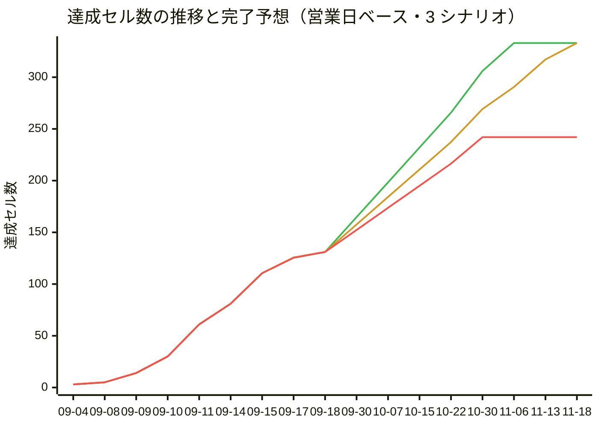

# 進捗一覧

- 生成: 2026-09-18 / `/progress-report`
- 分母: **モックリポジトリ** `../premarket-order-202609`（FastAPI + Jinja2。`python_app/templates/`）
- モック差分: 2026-09-18 まで確認済み / `2c359a2`（モックのコミット日 2026-09-17）
- 判定基準: [.claude/skills/progress-report/criteria.md](../.claude/skills/progress-report/criteria.md)

**このファイルは `/progress-report` の出力。** 手で直してもよいが、次の実行で
完了日・更新日・`## 進捗の履歴` 以外は上書きされる。

## モックと開発環境の食い違い（分母はモック）

モックのサイドバーは **4 区分 21 項目**で、`src/components/layout/navigation.js` の
**4 区分 17 項目**（2026-09-17 に `権限マスタ` と区分「運用管理 / 操作ログ」が入った）と次の差がある。

| 種別 | 対象 |
|---|---|
| モックにあり `navigation.js` に無い | `手数料優遇マスタ` / `みずほ注文締` / 運用管理の 3 項目（`お知らせ管理` / `滞留注文抽出` / `障害管理`） |
| モックのサイドバーに無いがモックに画面がある | `新規注文`（`/orders/new`）/ `顧客詳細`（`/customers/{id}/summary`・`/customers/{id}/orders`）/ `仮計算`（顧客詳細のタブ）/ 注文の確認・完了・訂正・取消（`/orders/{id}/amend` ほか）/ CSV の確認・完了 |
| `navigation.js` にありモックに無い | なし（`新規注文` はモックのサイドバー外だが画面はある） |
| パスがずれている | 受注不可日マスタ: モック `/masters/blocked-dates` / 実装 `/masters/blackout-dates`（API の命名に合わせた）。約定照会: モック `/executions/` / 実装 `/executions` |

分母から外している 2 区分（`## 認証` / `## レスポンシブ対応`）は 2026-09-17 と同じ理由で外したまま。
サイドメニューの押し出し式開閉は `共通レイアウト / サイドメニュー` に取り込んであるので達成は失われていない。

## モック差分（前回確認以降）

`aeda755` → `2c359a2`（3 コミット / テンプレート 4 ファイル）。**画面の増減は無く、すべて既存画面の変更。**

| 変更 | 画面 | モックでの変更内容 | いまの判定 | 対応 |
|---|---|---|---|---|
| 変更 | 銘柄マスタ | 「有効開始時間（日本時間）」を追加。一覧・新規登録・編集で `HH:MM` を入出力し、不正形式はサーバ側でも拒否 | ✅ | モック更新あり・追随未確認 |
| 変更 | 海外休場日マスタ | 「短縮取引日」列と登録チェックを追加（13:00 ET 終了。休場日として注文は止めない） | ✅ | モック更新あり・追随未確認 |
| 変更 | Dream登録状況 | エラー内容の検索入力と常設列を削除し、ホバー / フォーカス時のポップアップに変更。登録済みの明細は STS 変更を「変更不可」に | ❌ | 未実装のため注記のみ |
| 変更 | 残高マスタ | 売却不可区分のボタン表記を状態に応じて「売却を停止」「売却停止を解除」に変更 | ✅ | 2026-09-18 の実装で追随済み |

**実装済み（`✅`）の行はモックが変わっていても判定を下げない。** 実装が実際に古いかは
コードを読まないと判らず、自動で下げると進捗率が根拠なく揺れる。

## 凡例

| 記号 | 意味 | 集計での重み |
|---|---|---|
| `✅` | 完了。シナリオが全て `実装済` で、対応するテストがある | 1.0 |
| `🟡` | 一部のみ。機能の一部だけ実装、またはシナリオの一部が未着手 / 保留 | 0.5 |
| `❌` | 未着手。シナリオ文書もテストも無い | 0 |
| `—` | 対象外。分母から除外する | — |

完了日は `—` を除く 4 軸が全て `✅` になった最初の日。更新日はその後の改修で再び全軸が揃った日。

## 顧客

| 画面 | 機能名 | 実装 | UnitTest | E2E(MSW) | E2E(実API) | 完了日 | 更新日 | 補足 |
|---|---|---|---|---|---|---|---|---|
| 顧客検索 | 検索・結果一覧 | ❌ | ❌ | ❌ | ❌ | - | - | ルート未定義（`NotFoundView` に落ちる）。`navigation.js` に項目あり |
| 預り検索 | 検索・結果一覧 | ❌ | ❌ | ❌ | ❌ | - | - | ルート未定義。モックは受領済（`docs/mock/customers-holdings/`） |
| 預り検索 | 直接発注導線（買い / 売り） | ❌ | ❌ | ❌ | ❌ | - | - | 一覧の「操作」列から `/orders/new` へ銘柄・売買区分・口座区分をクエリで渡す |
| 預り検索 | 仮計算の導線 | ❌ | ❌ | ❌ | ❌ | - | - | 同じ「操作」列の 3 つめのボタン。顧客詳細の仮計算タブへ渡る |
| 顧客詳細 | 資産状況サマリ | ❌ | ❌ | ❌ | ❌ | - | - | モックの `/customers/{id}/summary`。サイドバー外（顧客マスタ・顧客検索から到達） |
| 顧客詳細 | 外株預りタブ（保有一覧） | ❌ | ❌ | ❌ | ❌ | - | - | CA 発生中の銘柄がある場合の警告表示を含む |
| 顧客詳細 | 注文入力タブ | ❌ | ❌ | ❌ | ❌ | - | - | 顧客を固定したまま注文入力へ入る |
| 顧客詳細 | 注文照会タブ | ❌ | ❌ | ❌ | ❌ | - | - | モックの `/customers/{id}/orders`。その顧客の注文だけを表示する |
| 顧客詳細 | 仮計算タブ | ❌ | ❌ | ❌ | ❌ | - | - | 発注前の概算（`provisional_calculation.html`）。独立画面ではなくタブ |

## 注文・照会

| 画面 | 機能名 | 実装 | UnitTest | E2E(MSW) | E2E(実API) | 完了日 | 更新日 | 補足 |
|---|---|---|---|---|---|---|---|---|
| 新規注文（外株注文入力） | 注文入力フォーム | ❌ | ❌ | ❌ | ❌ | - | - | ルート未定義。モックは受領済（`docs/mock/orders-new/`）。**モックは項目名を「ティッカーコード」へ変更済み** |
| 新規注文（外株注文入力） | 注文の送信 | ❌ | ❌ | ❌ | ❌ | - | - | 確認（`order_confirm`）→ 完了（`order_complete`）の 2 段階。強制承認フラグを伴う |
| CSV一括注文 | CSV ファイルの取込 | ❌ | ❌ | ❌ | ❌ | - | - | ルート未定義。モックは受領済（`docs/mock/orders-csv-upload/`）。部品の `FileDropZone` は実装・単体済 |
| CSV一括注文 | 取込内容の確認 | ❌ | ❌ | ❌ | ❌ | - | - | `order_csv_preview` → `order_csv_complete` |
| CSV一括注文 | テンプレートのダウンロード | ❌ | ❌ | ❌ | ❌ | - | - | モックは `/orders/csv/template` を返す |
| 注文照会 | 検索・結果一覧 | ❌ | ❌ | ❌ | ❌ | - | - | ルート未定義。出来状況で絞り込み。サイドバーに失敗件数のバッジが出る |
| 注文照会 | 注文訂正 | ❌ | ❌ | ❌ | ❌ | - | - | モックは `/orders/{id}/amend` の別画面 |
| 注文照会 | 注文取消 | ❌ | ❌ | ❌ | ❌ | - | - | モックは `/orders/{id}/cancel` の別画面 |
| Dream登録状況 | 検索・一覧 | ❌ | ❌ | ❌ | ❌ | - | - | ルート未定義。**モックの `2c359a2` でエラー内容の常設列を廃し、ホバー / フォーカスのポップアップに変更** |
| Dream登録状況 | STS変更 | ❌ | ❌ | ❌ | ❌ | - | - | 行ごとのプルダウン。**登録済みの明細はプルダウンを出さず「変更不可」**（`2c359a2`） |
| 約定照会 | 検索・結果一覧 | ❌ | ❌ | ❌ | ❌ | - | - | ルート未定義。一部出来 / 全部出来 / 取消済（出来有）だけを表示する |
| 約定照会 | CSV 出力 | ❌ | ❌ | ❌ | ❌ | - | - | モックは `/executions/export/csv` |
| みずほ注文締 | 検索・結果一覧 | ❌ | ❌ | ❌ | ❌ | - | - | `navigation.js` に項目なし・ルート未定義。約定照会と同じ列を預託先で絞る |
| みずほ注文締 | 注文締め・締め解除 | ❌ | ❌ | ❌ | ❌ | - | - | 受付中／締め済の状態表示・確認ダイアログ・直近 3 件の履歴 |
| みずほ注文締 | CSV 出力 | ❌ | ❌ | ❌ | ❌ | - | - | モックは `/executions/mizuho-operations/export/csv` |

## マスタメンテ

| 画面 | 機能名 | 実装 | UnitTest | E2E(MSW) | E2E(実API) | 完了日 | 更新日 | 補足 |
|---|---|---|---|---|---|---|---|---|
| 顧客マスタ | 一覧・検索 | ✅ | ✅ | ✅ | ❌ | - | - | `CU-01〜15` / `CLV` / `CUS` / `CUA` / `CDA` / `CDS`。実 API E2E のシナリオが未作成。米国株評価額 / 評価損益は API に項目が無く常に `—` |
| 顧客マスタ | 新規登録 | ❌ | ❌ | ❌ | ❌ | - | - | 画面はいま読むだけ（`CU-11`）。モックには導線がある |
| 顧客マスタ | 編集 | ❌ | ❌ | ❌ | ❌ | - | - | 同上。削除の導線はモックに無い |
| 権限マスタ | ロール別権限一覧 | ✅ | ❌ | ❌ | ❌ | - | - | **2026-09-17 に実装**（`3ff4bac`）。`/masters/permissions` / `PermissionListView.vue` / `api/permissions.js`。`docs/unit/` `docs/e2e/` とも未作成 |
| 権限マスタ | 権限の編集・保存 | 🟡 | ❌ | ❌ | ❌ | - | - | 編集ダイアログと「保存」はあるが **通信せず手元の表示だけ変わる**（再読み込みで戻る）。実 API に権限エンドポイントが無いため |
| 銘柄マスタ | 一覧・検索 | ✅ | ✅ | ✅ | ❌ | - | - | `SM-01〜12` / `STV` / `STS` / `STA` / `STT`。実 API E2E のシナリオが未作成。**モックが「有効開始時間」を追加（追随未確認）** |
| 銘柄マスタ | 新規追加 | ✅ | ✅ | ✅ | ❌ | - | - | `SM-13〜20` / `STV`。2026-09-15 に実装。実 API E2E のシナリオが未作成 |
| 銘柄マスタ | 編集 | ✅ | ✅ | ✅ | ❌ | - | - | `SM-21〜27`。2026-09-16 に実装。主キーは `id`。実 API E2E のシナリオが未作成 |
| 銘柄マスタ | 削除 | ✅ | ✅ | ✅ | ❌ | - | - | `SM-30〜34`。2026-09-16 に実装。実 API E2E のシナリオが未作成 |
| 為替マスタ | 現在レートの表示 | ❌ | ❌ | ❌ | ❌ | - | - | ルート未定義。USD/JPY の現在レート・取込日時・適用日 |
| 為替マスタ | レート更新 | ❌ | ❌ | ❌ | ❌ | - | - | ルート未定義。レート / 適用日 / 備考 |
| 手数料優遇マスタ | 一覧の表示枠 | ❌ | ❌ | ❌ | ❌ | - | - | モック自体が「設定内容は要件整理中」。`navigation.js` に項目なし・ルート未定義 |
| スライス基準マスタ | 現在値の表示 | ✅ | ✅ | ✅ | ✅ | 2026-09-11 | - | `SC-01/02` / `SCV` / `SCS` / `SCR-01/02`。**実 API に接続済み** |
| スライス基準マスタ | 設定の保存 | ✅ | ✅ | ✅ | ✅ | 2026-09-11 | - | `SC-03/04` / `SCR-03〜07`。**実 API に接続済み** |
| CAマスタ | 一覧・検索 | ✅ | ✅ | ✅ | ❌ | - | - | `CA-01〜10` / `CAV` / `CAS` / `CAA` / `CAT`。実 API E2E のシナリオが未作成 |
| CAマスタ | 新規追加 | ✅ | ✅ | ✅ | ❌ | - | - | `CA-11〜17`。実 API E2E のシナリオが未作成 |
| CAマスタ | 編集 | ✅ | ✅ | ✅ | ❌ | - | - | `CA-18〜21`。全項目を変更でき、更新日時による楽観的ロック付き。実 API E2E のシナリオが未作成 |
| CAマスタ | 削除 | ✅ | ✅ | ✅ | ❌ | - | - | `CA-22〜27`。論理削除（取消区分）。実 API E2E のシナリオが未作成 |
| 受注不可日マスタ | 一覧・検索 | ✅ | ✅ | ✅ | ✅ | 2026-09-11 | - | `BD-01〜10` / `BDL` / `BDS` / `BDR-01〜03`。**実 API に接続済み** |
| 受注不可日マスタ | 新規追加 | ✅ | ✅ | ✅ | 🟡 | 2026-09-11 | - | `BD-11〜18` / `BDR-04/05/09`。**実 API 側は `BDR-04/05/09` が保留**（API が id を返さず行を特定できない）。完了日は残す |
| 受注不可日マスタ | 編集 | ✅ | ✅ | ✅ | 🟡 | - | - | `BD-24〜30`。実 API 側は `BDR-06/07` とも **保留** |
| 受注不可日マスタ | 削除 | ✅ | ✅ | ✅ | 🟡 | 2026-09-11 | - | `BD-19〜23`。実 API 側は `BDR-08` が **保留**。完了日は残す |
| 海外休場日マスタ | 一覧・検索 | ✅ | ✅ | ✅ | ✅ | 2026-09-10 | - | `MH-01〜07/17〜21` / `MR-01〜03` / `MHT`。**実 API に接続済み**。**モックが「短縮取引日」列を追加（追随未確認）** |
| 海外休場日マスタ | 新規追加（再有効化を含む） | ✅ | ✅ | ✅ | 🟡 | 2026-09-10 | - | `MH-08〜11/22/23`。実 API 側は `MR-04/05/07/08` が **保留**。完了日は残す |
| 海外休場日マスタ | 削除 | ✅ | ✅ | ✅ | 🟡 | 2026-09-10 | - | `MH-12〜16`。実 API 側は `MR-06` が **保留**。完了日は残す |
| 残高マスタ | 保有残高の一覧・検索 | ✅ | ✅ | ✅ | ❌ | - | - | `BA-01〜10` / `BLV-01〜13` / `BLA-01〜12`。2026-09-24 にテスト実装。検索 5 項目のうち銘柄名は MSW だけが解釈する |
| 残高マスタ | 残高を補正（数量の加算） | ✅ | ✅ | ✅ | ❌ | - | - | `BA-11〜18` / `BLV-14〜26` / `BLA-16〜18`。2026-09-24 にテスト実装。確認 → 確定の 2 段階。送るのは補正後の絶対値 |
| 残高マスタ | 新規保有を追加 | ✅ | ✅ | ✅ | ❌ | - | - | `BA-19〜27` / `BLV-27〜35` / `BLA-13〜15`。2026-09-24 にテスト実装。顧客・ティッカー・銘柄名・口座区分・加算数量を指定 |
| 残高マスタ | 売却不可区分の切替 | ✅ | ✅ | ✅ | ❌ | - | - | `BA-28〜33` / `BLV-36〜43` / `BLA-19〜21`。2026-09-24 にテスト実装。ボタン表記は状態で「売却を停止」「売却停止を解除」。**`売却不可区分` は openapi.json に無く MSW だけが解釈する** |

## 運用管理

モックのサイドバーにある区分。**`navigation.js` には 2026-09-17 に `操作ログ` だけが入った。**
残り 3 画面は別 worktree で着手済みだが、**`main` に未マージのため判定は上げていない。**

| 画面 | 機能名 | 実装 | UnitTest | E2E(MSW) | E2E(実API) | 完了日 | 更新日 | 補足 |
|---|---|---|---|---|---|---|---|---|
| お知らせ管理 | お知らせの更新（表示切替・本文） | ✅ | ✅ | ✅ | ❌ | - | 2026-09-24 | `AN-01〜13/16〜18` / `ANA` / `ANS` / `ANV` / `BNA` / `BTX`。`feat/announcements-management` で実仕様（`/operations/announcements`）に合わせて実装。楽観ロック（409）・運用状態は `/operations/banner`。実 API スモーク未着手 |
| お知らせ管理 | 更新履歴 | ✅ | ✅ | ✅ | ❌ | - | 2026-09-24 | `AN-04/05/14/15` / `ANS` / `ANV`。操作区分名のバッジ・`limit` / `offset` のページング |
| 滞留注文抽出 | 検索・一覧 | ❌ | ❌ | ❌ | ❌ | - | - | `claude/stalled-order-extraction-ui-4261c4` が main より +3 コミット（未マージ） |
| 滞留注文抽出 | 滞留注文の CSV 出力 | ❌ | ❌ | ❌ | ❌ | - | - | 検索条件を引き継いで TWS 手動投入用の CSV を出す |
| 滞留注文抽出 | TWS投入CSV サンプルのダウンロード | ❌ | ❌ | ❌ | ❌ | - | - | 書式確認用の固定サンプル |
| 滞留注文抽出 | コンファメーションCSV の取込 | ❌ | ❌ | ❌ | ❌ | - | - | 取込して注文照会へ反映する |
| 滞留注文抽出 | コンファメーションCSV サンプルのダウンロード | ❌ | ❌ | ❌ | ❌ | - | - | 取込側の書式確認用 |
| 操作ログ | 一覧・検索 | ✅ | ❌ | ❌ | ❌ | - | - | **2026-09-17 に main へ入った**。`/operations/activity-logs` / `ActivityLogListView.vue` / `api/activityLogs.js`。`docs/unit/` `docs/e2e/` とも未作成 |
| 障害管理 | IB送信制御 | ❌ | ❌ | ❌ | ❌ | - | - | `claude/incident-management-ui-8d1a06` が main より +3 コミット（未マージ）。現段階では状態遷移を実装しない旨がモックに明記 |
| 障害管理 | 注文入力制御 | ❌ | ❌ | ❌ | ❌ | - | - | 同上。IB送信制御とは別ボタン |
| 障害管理 | 障害対応履歴 | ❌ | ❌ | ❌ | ❌ | - | - | 変更前 / 変更後 / 更新者の履歴表 |

## 共通基盤

画面を持たない区分。画面列には区分名を入れている。

| 画面 | 機能名 | 実装 | UnitTest | E2E(MSW) | E2E(実API) | 完了日 | 更新日 | 補足 |
|---|---|---|---|---|---|---|---|---|
| 共通レイアウト | サイドメニュー | ✅ | ✅ | ✅ | — | 2026-09-09 | 2026-09-16 | `LAY-01/03〜09` / `ASB` / `UST`。押し出し式の開閉を 2026-09-16 に追加 |
| 共通レイアウト | ヘッダの画面見出し | ✅ | ✅ | ✅ | — | 2026-09-09 | - | `LAY-02` / `AHD`。`router` の `meta.title` 由来 |
| 共通レイアウト | 市場ステータス表示 | ✅ | ✅ | ✅ | — | 2026-09-09 | 2026-09-18 | `AHD` / `MKS` / `UMS` / `MSA` / `MSS`。判定の出所を `GET /market-status` に移した（ローカル推定は廃止。祝日・短縮取引を誤らない） |
| 共通レイアウト | 市場取引時間の表示 | ✅ | ✅ | ✅ | — | 2026-09-18 | 2026-09-18 | ヘッダに 3 セッション × JST / ET の時間帯グリッド。現在の列を強調し、休場・短縮取引・取得失敗を出し分ける |
| アクセス制御 | 権限によるアクセス制限 | ❌ | ❌ | ❌ | ❌ | - | - | ロールでメニュー・ルート・操作ボタンを出し分ける。`権限マスタ` の実装と対。いまの権限マスタは**全ロールに暫定付与**で出し分けは未実装。要件指示（モック外） |
| 共通レイアウト | 読み込みオーバーレイ | ✅ | ✅ | ✅ | — | 2026-09-17 | - | `AppLoadingOverlay.vue` / `ALO` / `LAY-10〜12`（`c3e8424` で E2E が入った）。**今回 4 軸が揃った** |
| UI 部品 | `components/ui/` の 15 部品 | ✅ | ✅ | ✅ | — | 2026-09-04 | 2026-09-16 | 15 本すべてに spec と `docs/unit/` があり 4 軸の状態が同じなので 1 行に畳んである |
| マスタ共通部品 | 検索カード（`MasterSearchCard`） | ✅ | ✅ | — | — | 2026-09-17 | - | `MSC` |
| マスタ共通部品 | 一覧カード（`MasterListCard`） | ✅ | ✅ | — | — | 2026-09-17 | - | `MLC` |
| マスタ共通部品 | 追加・編集ダイアログ（`MasterFormDialog`） | ✅ | ✅ | — | — | 2026-09-17 | - | `MFD` |
| マスタ共通部品 | 削除確認（`ConfirmDeleteDialog`） | ✅ | ✅ | — | — | 2026-09-17 | - | `CDD-01〜13` |
| 共通ロジック | `useAsync` | ✅ | ✅ | — | — | 2026-09-14 | - | `UAS-01〜17` |
| 共通ロジック | `useCrudList` | ✅ | ✅ | — | — | 2026-09-14 | - | `UCL-01〜43`。受注不可日・海外休場日・CA・銘柄の 4 画面で共用 |
| 共通ロジック | `useListQuery` | ✅ | ✅ | — | — | 2026-09-14 | - | `ULQ-01〜19`。URL クエリと一覧状態の同期 |
| 共通ロジック | `useMarketStatus` | ✅ | ✅ | — | — | 2026-09-15 | - | `UMS-01〜06` |
| 共通ロジック | `useSidebarToggle` | ✅ | ✅ | — | — | 2026-09-16 | - | `UST-01〜07`。開閉状態の保持 |
| ユーティリティ | `utils/format.js` | ✅ | ✅ | — | — | 2026-09-14 | - | `FMT-01〜11` |
| ユーティリティ | `utils/marketStatus.js` | ✅ | ✅ | — | — | 2026-09-08 | - | `MKS-01〜13` |
| ユーティリティ | `utils/queryParams.js` | ✅ | ✅ | — | — | 2026-09-11 | - | `QRY-01〜08` |
| ユーティリティ | `utils/marketHolidayTypes.js` | ✅ | ✅ | — | — | 2026-09-10 | - | `MHT-01〜07` |
| ユーティリティ | `utils/caTypes.js` | ✅ | ✅ | — | — | 2026-09-11 | - | `CAT` |
| ユーティリティ | `utils/symbolTypes.js` | ✅ | ✅ | — | — | 2026-09-14 | - | `STT-01〜05` |
| ユーティリティ | `utils/apiEnums.js` | ✅ | ✅ | — | — | 2026-09-15 | - | OpenAPI の区分値 21 種の写し。`openapi.json` と突き合わせるテスト付き |
| API クライアント層 | `api/client.js` | ✅ | ✅ | — | — | 2026-09-14 | - | `CLA-01〜16`。`normalizeError` を含む |
| API クライアント層 | `api/orders.js` | ✅ | ✅ | — | — | 2026-09-14 | - | `ORA-01〜10`。`toOrder()` の変換を担保 |
| API クライアント層 | `api/blackoutDates.js` | ✅ | ✅ | — | — | 2026-09-11 | - | `BDA` |
| API クライアント層 | `api/sliceCriteria.js` | ✅ | ✅ | — | — | 2026-09-11 | - | `SCA` |
| API クライアント層 | `api/marketHolidays.js` | ✅ | ✅ | — | — | 2026-09-10 | - | `MHA` |
| API クライアント層 | `api/ca.js` | ✅ | ✅ | — | — | 2026-09-11 | - | `CAA` |
| API クライアント層 | `api/codes.js` | ✅ | ✅ | — | — | 2026-09-14 | - | `CDA-01〜07` |
| API クライアント層 | `api/customers.js` | ✅ | ✅ | — | — | 2026-09-14 | - | `CUA-01〜14` |
| API クライアント層 | `api/symbols.js` | ✅ | ✅ | — | — | 2026-09-14 | 2026-09-16 | `STA-01〜12`。`symbol` クエリ名と `id` 主キーへの追随を含む |
| API クライアント層 | `api/permissions.js` | ✅ | ❌ | — | — | - | - | **今回の新規行**（`3ff4bac`）。`docs/unit/` とテストが未作成 |
| API クライアント層 | `api/activityLogs.js` | ✅ | ❌ | — | — | - | - | **今回の新規行**。`docs/unit/` とテストが未作成 |
| MSW モック基盤 | handlers / fixtures | ✅ | — | — | — | 2026-09-11 | 2026-09-16 | ブラウザ・単体・E2E で共用。単体・E2E の直接の対象ではないため `—` で、実装のみで完了とみなす |

## 対象外の画面（集計に含めない）

**モックに無い画面。納品対象ではないので進捗の分母から外す。**

| 画面 | 機能名 | 実装 | UnitTest | E2E(MSW) | E2E(実API) | 完了日 | 更新日 | 補足 |
|---|---|---|---|---|---|---|---|---|
| 注文一覧（`/`） | 一覧表示 | ✅ | ✅ | ✅ | ❌ | - | - | 縦串の参考実装で、実仕様が来たら差し替える前提のため対象外。`OL` / `OLV` / `OST` |
| UI カタログ（`/dev/ui-catalog`） | 部品の一覧表示 | ✅ | ❌ | ✅ | — | - | - | 開発用ページ（業務画面ではない）のため対象外。`UC-01/02` |

## 集計

**進捗は行ではなく「行 × 軸のセル」で数える。**

- **有効セル** = その行の 4 軸のうち `—`（対象外）でないセルの数
- **達成セル** = `✅` 1.0 + `🟡` 0.5（`❌` は 0）
- **残セル** = 有効セル − 達成セル、**進捗率** = 達成セル ÷ 有効セル
- **完了行** = `—` を除く全軸が `✅` の行

「対象外の画面」の 2 行は行ごと数えない。

| 区分 | 行数 | 実装 `✅` | UnitTest `✅` | E2E(MSW) `✅` | E2E(実API) `✅` | 有効セル | 達成セル | 残セル | 進捗率 | 完了行 |
|---|---|---|---|---|---|---|---|---|---|---|
| 顧客 | 9 | 0 | 0 | 0 | 0 | 36 | 0.0 | 36.0 | 0% | 0 |
| 注文・照会 | 15 | 0 | 0 | 0 | 0 | 60 | 0.0 | 60.0 | 0% | 0 |
| マスタメンテ | 29 | 19 | 18 | 18 | 4 | 116 | 62.0 | 54.0 | 53% | 4 |
| 運用管理 | 11 | 1 | 0 | 0 | 0 | 44 | 1.0 | 43.0 | 2% | 0 |
| 共通基盤 | 35 | 34 | 31 | 6 | 0 | 77 | 71.0 | 6.0 | 92% | 32 |
| **合計** | **99** | **54** | **49** | **24** | **4** | **333** | **134.0** | **199.0** | **40%** | **36** |

軸ごとの進捗率。**分母はその軸が `—` の行を除いた数**、`達成` = `✅` + 0.5 × `🟡`。

| 軸 | 分母 | `✅` | `🟡` | 達成 | 残 | 進捗率 |
|---|---|---|---|---|---|---|
| 実装 | 99 | 54 | 1 | 54.5 | 44.5 | 55% |
| UnitTest | 98 | 49 | 0 | 49.0 | 49.0 | 50% |
| E2E(MSW) | 71 | 24 | 0 | 24.0 | 47.0 | 34% |
| E2E(実API) | 65 | 4 | 5 | 6.5 | 58.5 | 10% |

4 軸の分母を足すと有効セルになる（99 + 98 + 71 + 65 = 333）。**合わない回は
どこかの区分合計が古い。**

## 残作業の内訳

**残セルは 1 つずつ中身が違うので、そのまま速度で割れない。** 残セルを持つ行に
作業類型（過去の実績が使えるか）とバックエンド成熟度（そもそも着手できるか）を付ける。
定義は [criteria.md](../.claude/skills/progress-report/criteria.md) の「残作業の分類」。

成熟度は `A` 確定 / `B` 型のみ / `C` 中身が未定義 / `D` パス無し / `—` API 不要。
`C` `D`・要件未確定・`## バックエンド待ち` に載っている行が**ブロック残**。

| 画面 / 機能 | 残セル | 類型 | 根拠 | 成熟度 | 引き当てたパス | ブロック理由 |
|---|---|---|---|---|---|---|
| 顧客検索 / 検索・結果一覧 | 4.0 | 検索一覧 | 実測 | B | `/masters/customers`・`/branches`・`/handlers` | - |
| 預り検索 / 一覧と操作列の導線（3 行） | 12.0 | 検索一覧 | 実測 | B | `/holdings` | - |
| 顧客詳細 / サマリ・外株預り・仮計算（3 行） | 12.0 | タブ詳細 | **仮定** | B | `/balances/{account_no}`・`/holdings`・`/calculations` | - |
| 顧客詳細 / 注文入力タブ | 4.0 | 入力フォーム | **仮定** | C | `GET /customers`・`/codes` | レスポンス未定義 |
| 顧客詳細 / 注文照会タブ | 4.0 | タブ詳細 | **仮定** | C | `GET /orders/{order_id}` | レスポンス未定義 |
| 新規注文 / 注文入力フォーム | 4.0 | 入力フォーム | **仮定** | C | `GET /customers`・`/codes` | レスポンス未定義 |
| 新規注文 / 注文の送信 | 4.0 | 入力フォーム | **仮定** | B | `POST /orders`・`/orders/validate` | - |
| CSV一括注文 / 取込・確認・テンプレDL（3 行） | 12.0 | ファイル取込 | **仮定** | B | `/orders/validate-csv`・`/orders/bulk-create`・`/orders/csv-template` | - |
| 注文照会 / 検索・結果一覧 | 4.0 | 検索一覧 | 実測 | B | `GET /orders` | - |
| 注文照会 / 注文取消 | 4.0 | 運用操作 | **仮定** | B | `/orders/{order_id}/cancel` | - |
| 注文照会 / 注文訂正 | 4.0 | 運用操作 | **仮定** | D | 該当なし（`/orders/{order_id}/dream-correct` は Dream 用） | パス無し |
| Dream登録状況 / 検索・一覧 | 4.0 | 検索一覧 | 実測 | B | `/orders/dream-status` | - |
| Dream登録状況 / STS変更 | 4.0 | 運用操作 | **仮定** | B | `/orders/dream-status/{order_id}` | - |
| 約定照会 / 検索・結果一覧 | 4.0 | 検索一覧 | 実測 | D | 該当なし（`/executions` 系が無い） | パス無し |
| 約定照会 / CSV 出力 | 4.0 | ファイル取込 | **仮定** | D | 該当なし | パス無し |
| みずほ注文締 / 検索・結果一覧 | 4.0 | 検索一覧 | 実測 | C | `/mizuho/orders` | レスポンス未定義 |
| みずほ注文締 / 注文締め・締め解除 | 4.0 | 運用操作 | **仮定** | B | `/closing/status`・`/closing/mizuho`・`/closing/mizuho/reset` | - |
| みずほ注文締 / CSV 出力 | 4.0 | ファイル取込 | **仮定** | C | `/mizuho/export-orders` | レスポンス未定義 |
| 顧客マスタ / 一覧・検索の実 API E2E | 1.0 | 実API追加 | 実測 | A | `/masters/customers` | - |
| CAマスタ / 実 API E2E（4 行） | 4.0 | 実API追加 | 実測 | A | `/masters/ca` | - |
| 銘柄マスタ / 一覧・新規追加の実 API E2E（2 行） | 2.0 | 実API追加 | 実測 | A | `/masters/symbols` | - |
| 銘柄マスタ / 編集・削除の実 API E2E（2 行） | 2.0 | 実API追加 | 実測 | B | `/masters/symbols/{symbol}` | **バックエンド待ち**（id 主キー・部分更新） |
| 受注不可日マスタ / 新規追加・編集・削除の実 API E2E（3 行） | 1.5 | 実API追加 | 実測 | B | `/masters/blackout-dates` 配下 | **バックエンド待ち**（id 未返却・`BDR-04〜09`） |
| 海外休場日マスタ / 新規追加・削除の実 API E2E（2 行） | 1.0 | 実API追加 | 実測 | B | `/masters/market-holidays` 配下 | **バックエンド待ち**（id 未返却・`MR-04〜08`） |
| 顧客マスタ / 新規登録・編集（2 行） | 8.0 | CRUDマスタ | 実測 | A | `POST /masters/customers`・`PUT /masters/customers/{account_no}` | - |
| 為替マスタ / 表示・更新（2 行） | 8.0 | CRUDマスタ | 実測 | A | `/masters/fx`・`/masters/fx/latest` | - |
| 残高マスタ / 一覧・補正・新規の実 API E2E（3 行） | 3.0 | 実API追加 | 実測 | A | `/masters/balance-adjustments` | - |
| 残高マスタ / 売却不可区分の切替の実 API E2E | 1.0 | 実API追加 | 実測 | B | `PUT /masters/balance-adjustments/{balance_id}` | **バックエンド待ち**（`売却不可区分` が仕様に無い。`docs/api/requests.md` #13） |
| 権限マスタ / 一覧・編集（2 行） | 6.5 | CRUDマスタ | 実測 | D | 該当なし（権限・ロールのパスが無い） | パス無し（保存が通信できない） |
| 手数料優遇マスタ / 一覧の表示枠 | 4.0 | CRUDマスタ | 実測 | A | `/masters/fee-preferences` | **要件未確定**（モックが「要件整理中」） |
| 操作ログ / 一覧・検索 | 3.0 | 検索一覧 | 実測 | B | `/operations/activity-logs`・`/operations/activity-logs/targets` | - |
| 滞留注文抽出 / コンファメーションCSV の取込 | 4.0 | ファイル取込 | **仮定** | C | `/mizuho/import-confirmation`・`/mizuho/validate-confirmation` | レスポンス未定義 |
| 滞留注文抽出 / 検索・一覧 | 4.0 | 検索一覧 | 実測 | D | 該当なし | パス無し |
| 滞留注文抽出 / CSV 出力・サンプル 2 種（3 行） | 12.0 | ファイル取込 | **仮定** | D | 該当なし | パス無し |
| お知らせ管理 / 更新・履歴（2 行） | 8.0 | 運用操作 | **仮定** | A | `GET` / `PUT /operations/announcements`・`/operations/announcements/history`・`/operations/banner` | - |
| 障害管理 / IB送信制御・注文入力制御・履歴（3 行） | 12.0 | 運用操作 | **仮定** | D | 該当なし（発注停止のパスが無い） | パス無し |
| API クライアント層 / `api/permissions.js`・`api/activityLogs.js` の UnitTest | 2.0 | 共通部品 | 実測 | — | API 不要（クライアント層のテスト） | - |
| 共通レイアウト / 市場取引時間の表示 | 0 | 共通部品 | 実測 | — | 完了（`GET /market-status` で実装。2026-09-18） | - |
| アクセス制御 / 権限によるアクセス制限 | 4.0 | 運用操作 | **仮定** | D | 該当なし（権限 API が無い） | パス無し |

### 2 通りの割り方

どちらの合計も `## 集計` の残セル **199.0** と一致する。

| 割り方 | 内訳 | セル | 割合 |
|---|---|---|---|
| 着手可能残 | `A` / `B` / `—` かつ 要件確定・待ち無し | **108.0** | 54% |
| ブロック残 | `C` / `D` + 要件未確定 + バックエンド待ち | **91.0** | **46%** |
| 実測系 | 根拠が `実測` の類型（実API追加 / CRUDマスタ / 検索一覧 / 共通部品） | 98.0 | 49% |
| 仮定系 | 根拠が `仮定` の類型（入力フォーム / タブ詳細 / ファイル取込 / 運用操作） | 104.0 | 51% |

**残りの 45% はいま人を増やしても消化できない。** ブロック残 91.0 セルの最大は
運用管理 40.0（障害管理・滞留注文の API が `openapi.json` に無い。お知らせ管理の 8.0 は 2026-09-24 の取り込みで `A` に移り、次回の集計で着手可能残へ移る）、
次が 注文・照会 24.0、マスタメンテ 15.0、顧客 8.0、アクセス制御 4.0。

**マスタメンテのブロック残 15.0 のうち 4.5 は「一度 `✅` にした行が待ちで戻ったぶん」**
（受注不可日 1.5 / 海外休場日 1.0 / 銘柄 2.0）。いずれも id 未返却という**同じ 1 つの原因**。

**権限マスタは画面が入っても 6.5 セルがブロックのまま。** `openapi.json` に権限・ロールの
パスが無く、保存が通信できない（手元の表示だけが変わる実装になっている）。

### 手戻りの実測（予想には足さない）

仕様の取り込みで**既に `✅` のセルを作り直した**量。行の粒度で数えた概算。

| 取り込み | 追随コミット | 作り直したセル | その時の達成セル | 手戻り率 |
|---|---|---|---|---|
| 2026-09-15（`/masters/` パス移行・クエリ名の日本語→英語） | `f7ed2c5` / `d9f191b` / `ac3a924` / `b20c24a` | 約 33.0 | 110.5 | **約 30%** |
| 2026-09-16（`stock_code` → `symbol`・CA ステータス項目の取り消し） | `13184a6` / `073dead` | 7.0 | 約 123.5 | **約 6%** |
| 2026-09-17（主キーの id 化） | `baabd84` / `91467de` | 判定が下がったのは 2.0 セルだが、**作り直しは 6 画面ぶん** | 127.5 | 計測中 |

**この量を完了予想に別枠で足していない。** 下の速度 `v` は 2026-09-15 → 09-18 の実績で、
この期間に上の手戻りが含まれている。足すと二重計上になる。

## 進捗の履歴

実行ごとのスナップショット。**過去行は書き換えない**（次の実行はここに 1 行足すだけ）。
下の折れ線はこの表だけを実績データにしている。

| 生成日 | 行数 | 有効セル | 達成セル | 進捗率 | 備考 |
|---|---|---|---|---|---|
| 2026-09-04 | - | - | 3.0 | - | 推定（完了日から遡って算出） |
| 2026-09-08 | - | - | 5.0 | - | 推定 |
| 2026-09-09 | - | - | 14.0 | - | 推定 |
| 2026-09-10 | - | - | 30.0 | - | 推定 |
| 2026-09-11 | - | - | 61.0 | - | 推定 |
| 2026-09-14 | 91 | - | 81.0 | - | 推定（当時の集計は行ベース 21/91 行） |
| 2026-09-15 | 95 | 321 | 110.5 | 34% | 実測（セル単位の集計を導入した初回） |
| 2026-09-17 | 97 | 329 | 125.5 | 38% | 実測。モックの `aeda755` まで取り込み。実 API E2E の書き込み系 11 本が一斉に保留になり 127.5 → 125.5 へ後退 |
| 2026-09-18 | 99 | 333 | 131.0 | 39% | 実測。**API クライアント層に 2 行追加**（`api/permissions.js` / `api/activityLogs.js`）で有効セル +4。権限マスタ（実装 +1.5）・操作ログ（実装 +1.0）・読み込みオーバーレイの E2E(MSW)（+1.0）が進んだ |

**`推定` の行は完了日から遡って作った種で、部分達成を数えていないため過小。**
速度は実測行（2026-09-15 以降）だけで取る。

## バックエンド待ち

**フロントの手では動かせない依存。** 発生日・解消日は完了日と同じ引き継ぎ規律で、
過去行は書き換えない。ここに載っている行は `## 残作業の内訳` で**ブロック残**に入れる。

| 発生日 | 解消日 | 影響する行 | 内容 | 状態 |
|---|---|---|---|---|
| 2026-09-11 | - | 受注不可日マスタ / 編集 | 編集で日付を変えても API 側が元の `受注不可日` を上書きするため、備考しか変更できない（`BDR-07` 保留） | 待ち |
| 2026-09-16 | - | 銘柄マスタ / 編集・削除 | 主キーが `id` になったが実 API の詳細照会・更新履歴は `/masters/symbols/{symbol}` のまま。`id` が空の行を編集・削除できない | 待ち |
| 2026-09-16 | - | 銘柄マスタ / 編集 | 更新で送らなかった項目（`市場名` / `前日出来高` / `Pre区分`）を保つかがバックエンドで**確認中**（`docs/e2e/symbols.md`） | 待ち |
| 2026-09-17 | - | 受注不可日マスタ / 新規追加・編集・削除・海外休場日マスタ / 新規追加・削除 | 実 API が `BlackoutDateItem` / `HolidayItem` に **id を返さない**ため、id に寄せたフロントから行を `data-testid` で特定できない。`BDR-04〜09` / `MR-04〜08` の 11 本を保留にした（`91467de`） | 待ち |
| 2026-09-18 | - | 権限マスタ / 権限の編集・保存 | `openapi.json` に権限・ロールのエンドポイントが無く、保存が通信できない。画面は手元の表示だけを変える実装になっている（`3ff4bac`） | 待ち |
| 2026-09-24 | - | 残高マスタ / 売却不可区分の切替・一覧・検索 | `売却不可区分` が `BalanceAdjustmentItem` / `BalanceAdjustmentUpdateRequest` に無く（更新は `残高` が required）、売却可否だけの PUT は 422 になる見込み。検索の銘柄名にも対応するクエリが無い。どちらも MSW だけが解釈する（`docs/api/requests.md` #13・契約テストの `KNOWN_GAPS`） | 待ち |

**未解消 6 件・最長 5 営業日経過（上限不明）。** 解消した行が 1 つも無いので、
**1 往復あたりのリードタイムはまだ実測できていない**（推測値は置かない）。
最初の解消が入った回に、`発生日 → 解消日` の営業日数をここに書く。

**5 件のうち 3 件が「主キーを id に寄せたが API が id を返さない」という同じ原因。**
この 1 件が解けると 4.5 セルが即座に戻る。

## 進捗の推移と完了予想

**速度も予想も営業日で数える**（土日祝は作業しない）。営業日の定義と祝日表は
[.claude/skills/progress-report/holidays.md](../.claude/skills/progress-report/holidays.md)。
x 軸の未来側の点はすべて営業日で、9/21・9/22・9/23・10/12・11/3 は飛ばしてある。

```mermaid
%%{init: {"themeVariables": {"xyChart": {"plotColorPalette": "#2f6feb, #3fb950, #d29922, #f85149"}}}}%%
xychart-beta
    title "達成セル数の推移と完了予想（営業日ベース・3 シナリオ）"
    x-axis ["09-04", "09-08", "09-09", "09-10", "09-11", "09-14", "09-15", "09-17", "09-18", "09-30", "10-07", "10-15", "10-22", "10-30", "11-06", "11-13", "11-18"]
    y-axis "達成セル数" 0 --> 333
    line [3, 5, 14, 30, 61, 81, 110.5, 125.5, 131]
    line [3, 5, 14, 30, 61, 81, 110.5, 125.5, 131, 164.7, 198.3, 232, 265.7, 306, 333, 333, 333]
    line [3, 5, 14, 30, 61, 81, 110.5, 125.5, 131, 157.6, 184.2, 210.7, 237.3, 269.2, 290.5, 317.1, 333]
    line [3, 5, 14, 30, 61, 81, 110.5, 125.5, 131, 152.3, 173.7, 195, 216.4, 242, 242, 242, 242]
```

| `line` の順 | 色 | 中身 |
|---|---|---|
| 1 本目 | 青 `#2f6feb` | 実績（`## 進捗の履歴` の達成セル） |
| 2 本目 | 緑 `#3fb950` | 予想・楽観 |
| 3 本目 | 橙 `#d29922` | 予想・中央 |
| 4 本目 | 赤 `#f85149` | 予想・悲観 |

予想の 3 本は 09-18 までは実績と重なっており、外挿はそれ以降だけ。

**赤が 10-30 で寝ているのがこの図の要点。** バックエンドの穴が埋まらなければ、
こちらがどれだけ手を動かしても 242.0 セル（73%）で頭打ちになる。

- 現在: **131.0 / 333 セル**（39%）。うち完了行は 35 / 99 行
- 内訳: **着手可能残 108.0 セル / ブロック残 91.0 セル**（残りの **46%** がバックエンド待ち）
- 平均速度: **6.8 セル/営業日 ≒ 34.2 セル/週**（起点 2026-09-15(火) から 3 営業日で 20.5 セル）。
  参考: 全期間平均は **7.71 セル/営業日**（08-27 から 17 営業日で 131.0 セル）
- 到達予想: 楽観 **2026-11-06（金）** / 中央 **2026-11-18（水）** /
  悲観 **到達不能（バックエンド律速）** — 2026-10-30（金）に 242.0 / 333 セル（73%）で頭打ち

| シナリオ | 仮定類型の倍率 | ブロック残 | 換算工数 | 所要 | 到達 |
|---|---|---|---|---|---|
| 楽観 | 1.0 | 作業に追いつく速さで解消 | 98.0 + 104.0 × 1.0 = 202.0 | 30 営業日 | 2026-11-06（金） |
| 中央 | 1.5 | 解消するが作業順の制約になる | 98.0 + 104.0 × 1.5 = 254.0 | 38 営業日 | 2026-11-18（水） |
| 悲観 | 2.5 | **解消しない** | 71.0 + 40.0 × 2.5 = 171.0 | 26 営業日 | **到達不能** — 10-30 に 73% で頭打ち |

幅の根拠は**日次のばらつきではなく、未経験類型の単価とバックエンドの穴**。

前提は 3 つ。

- **分母が増えれば後ろへ動く。** 今回は API クライアント層の 2 行（4 セル）で増えた
- **仮定類型の倍率 1.0 / 1.5 / 2.5 は実績ではない。** 入力フォーム・タブ詳細・ファイル取込・
  運用操作は 1 本も作り終えていないので観測がゼロで、較正できない
- **土日祝は作業しない前提で数えている。** 9/21・9/22・9/23・10/12・11/3 は飛ばしてある

## 予想の検証

**予想が当たったかを残す唯一の場所。** 過去行は書き換えない。
3 回続けて実測が予想線（中央）より下なら、仮定類型の倍率が小さすぎるので上げる。

| 生成日 | 予想（中央）の到達日 | その時の残セル | その時の v | 次回実測の達成セル | 予想線との差 |
|---|---|---|---|---|---|
| 2026-09-17 | 2026-11-12 | 203.5 | 7.5 | 131.0（09-18） | **−0.3 セル**（中央線は 1 営業日で 131.3 を見込んでいた。ほぼ一致） |
| 2026-09-18 | 2026-11-18 | 202.0 | 6.8 | - | - （次回の実行で実測を入れる） |

## 次に安く埋まるところ

材料の有無だけで見た順。実装の要否はここでは判断しない。

1. **CAマスタの実 API E2E** — `docs/e2e/ca-real-api.md` を書けば **4 行**が完了へ動く。
   画面・単体・MSW E2E はすべて揃っていて、`/masters/ca` は成熟度 `A`
2. **`api/permissions.js` / `api/activityLogs.js` の単体テスト** — 2 セル。既存の
   `docs/unit/api-*.md` と同じ形で書ける。共通基盤で残った軸はここだけ
3. **操作ログの単体・E2E(MSW)** — 画面は main に入っているのにシナリオ文書が無い。
   3 セルが着手可能（成熟度 `B`）
4. **顧客マスタの実 API E2E（一覧・検索）** — 1 セル。`/masters/customers` は成熟度 `A`

**実 API E2E の書き込み系はどの画面でも今は書けない。** 銘柄・受注不可日・海外休場日は
id 未返却で止まっており（`## バックエンド待ち`）、いま書いても保留にしかならない。

### 予想の精度を上げたいなら

見積もりの不確実性は **仮定類型 104.0 セル**に集中している。
**類型の 1 本目を先に通すと、その類型が `仮定` から `実測` に変わる。**

| 類型 | 代表 | いまの状態 |
|---|---|---|
| 運用操作 | 障害管理 / IB送信制御 | `claude/incident-management-ui-8d1a06` で着手済（main へ未マージ）。API が無く成熟度 `D` |
| ファイル取込 | CSV一括注文 / CSV ファイルの取込 | 未着手。成熟度 `B` で着手可能。`FileDropZone` は実装・単体済 |
| 入力フォーム | 新規注文 / 注文の送信 | 未着手。成熟度 `B` で着手可能 |
| タブ詳細 | 顧客詳細 / 資産状況サマリ | 未着手。成熟度 `B` で着手可能 |

**着手可能かつ未実測の類型は CSV一括注文 / 新規注文 / 顧客詳細 の 3 つ**。
このどれか 1 本を通すと倍率が実測に変わり、予想の幅が目に見えて縮む。

**実 API 接続を先にやると数字が早く動き、類型の 1 本目を先にやると予想が締まる。**
意味が違うので、どちらを優先するかは意識して選ぶ。
